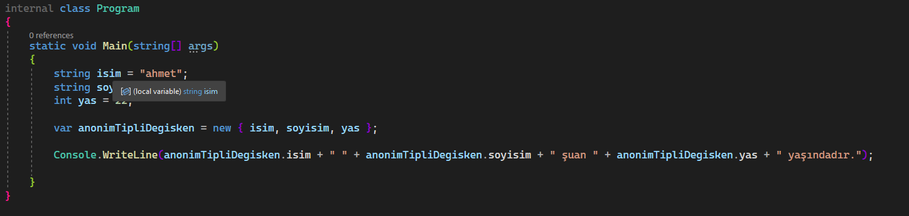
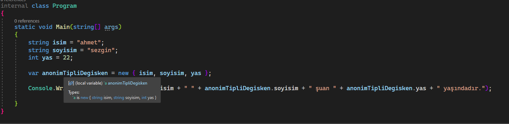
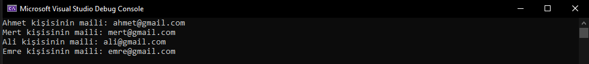

# Anonymous Tpyes - Anonim Türler

- Anonim bir tür kullanılacağı zaman compiler `object` sınıfından bir class yaratır.
- Anonim türler, bir veya birden fazla property'i `readonly` olarak, manuel olarak yeni bir class tanımlamadan, tek bir nesne olarak tutmamızı sağlar.  


- **Anonim tip** olarak veri çekeceğimiz zamanlarda, gelecek olan veriyi tutacak değişkeni `var` tanımlayarak karşılayabiliriz. Çünkü anonim tipe sadece compiler direkt erişebiliyor.

- Anonim tip oluşturmak için, bir class'tan nesne üretirken kullandığımız gibi `new` anahtar kelimesini kullanırız. Ama farklı olarak `new`'den sonra bir class ismini belirtmeden direkt olarak `{}` parantezlerinin içerisine property'leri yerleştiririz.  

    ```csharp
    string isim = "ahmet";
    string soyisim = "sezgin";
    int yas = 22;

    var anonimTipliDegisken = new {isim, soyisim, yas};
    ```

- Normalde tanımladığımız property'lerin tiplerini, üzerlerine gelip baktığımızda görebiliriz ve bu tipleri daha sonra başka property'ler oluştururken kullanabiliriz. 

    Anonim tipi,yazdığımız kod içerisinde bir property oluştururken kullanamayız. Örnek olarak: 

    

    


- Oluşturulan anonim tipin içerisindeki property'lere, bir class'tan türetilmiş nesnenin property'lerine ulaştığımız gibi ulaşabiliriz. Örnek olarak:

    ```csharp
    string isim = "ahmet";
    string soyisim = "sezgin";
    int yas = 22;

    var anonimTipliDegisken = new {isim, soyisim, yas};
    
    Console.WriteLine(anonimTipliDegisken.isim + " " + anonimTipliDegisken.soyisim + " şuan " + anonimTipliDegisken.yas + " yaşındadır.");
    ```

- Anonim tipleri genellikle LINQ sorguları ile verileri çekerken kullanırız. Console projesi içerisinde bir örneğe bakabiliriz.

    Öncelikle db içerisinde bir `Kullanici` tablomuzun olduğunu ve bu tablonun içerisinde *Ad, Soyad, Email, Yas* kolonlarının bulunduğunu düşünelim. 

    Proje içerisinde bir yerde `Kullanici` tablosundan, kullanıcıların sadece *Ad* ve *Email* bilgilerini bize veren bir rapor çıkartmamız isteniyor olsun. Böyle bir durumda `Linq` sorguları işimizi görecektir. 

    İlk olarak `Kullanici` sınıfımızı oluşturalım:

    ```csharp
    public class Kullanici
    {
        public string Ad { get; set; }
        public string Soyad { get; set; }
        public string Email { get; set; }
        public int Yas { get; set; }
    }
    ```  

    Sonraki kısımda db içerisinden örnek vermek yerine `List` yapısı üzerinden örnek verebilmek için db'de tablo olarak düşünebileceğimiz bir kullanıcı listesi oluşturalım:

    ```csharp
    List<Kullanici> kullanicilar = new()
    {
        new Kullanici { Ad = "Ahmet", Soyad = "Sezgin", Email = "ahmet@gmail.com", Yas = 22 },
        new Kullanici { Ad = "Mert", Soyad = "Kaya", Email = "mert@gmail.com", Yas = 25 },
        new Kullanici { Ad = "Ali", Soyad = "Gül", Email = "ali@gmail.com", Yas = 19 },
        new Kullanici { Ad = "Emre", Soyad = "Altın", Email = "emre@gmail.com", Yas = 33 }
    };
    ```

    Artık raporu oluşturmak için hazırız. Elimizdeki kullanıcı listesinden bir `Linq` sorgusu ile istediğimiz verileri çekmeliyiz. 

    ```csharp
    var kullaniciBilgileri = (
                from kullanici in kullanicilar
                select new { kullanici.Ad, kullanici.Email } // anonymous type kullanımı
                );
    ```

    Yukarıdan görüldüğü gibi `select` işleminde **anonim tip** kullanarak raporda istenilen kolonları seçiyoruz.
    
    Artık rapor için uygun veriler olduğuna göre, konsol ekranına raporumuzu yazdırabiliriz.

    ```csharp
    foreach (var item in kullaniciBilgileri)
    {
        Console.WriteLine(item.Ad + " kişisinin maili: " + item.Email);
    }
    ```

    Yukarıdaki alan çalıştırıldığında artık bizden istenen raporu ekrana veriyor olacağız:

    

 -   Buraya bir dipnot atmak istiyorum. İstenen rapor farklı tabloların birleştirilmesi ile hazırlanabiliyor olsaydı, yukarıdaki `Linq` sorgusunda `join`'ler devreye girecekti. Böyle bir durumda **anonim tipler** yine kullanılabilir. Bu durumda select içerisinde, `join` edilen tabloların kolonlarından da alt kısımdaki gibi veri çekebiliyor olacaktık. 

        ```csharp
        select new { aTablosu.kolon1, bTablosu.kolon5, cTablosu.kolon2 }
        ```

- İkinci dipnot olarak, yukarıdaki *Kullanıcı Raporu*  örneğinde `select` işlemini
    ```csharp
    select new { kullanici.Ad, kullanici.Email }
    ```
    şeklinde yapmıştık. Burada isteseydik oluşturduğumuz **anonim tip** içerisinde de property'ler oluşturup verileri onların içerisinde tutabilirdik. Örnek olarak:

    ```csharp
    var kullaniciBilgileri = (
                    from kullanici in kullanicilar
                    select new { KullanicininAdi = kullanici.Ad, KullanicininMaili = kullanici.Email }
                    );
    ```

    **anonim tip** yukarıdaki gibi property'ler ile kullanılsaydı çıktıyı alt kısımdaki gibi yazdıracaktık.
    ```csharp
    foreach (var item in kullaniciBilgileri)
    {
        Console.WriteLine(item.KullanicininAdi + " kişisinin maili: " + item.KullanicininMaili);
    }
    ```

    Biz örnekte **anonim tip** içerisinde property'ler tanımlamadığımız için, compiler otomatik olarak seçilen kolonların isimleri ile verilere erişebilmemizi sağladı. Bu işlemi otomatik yapıp yapmamasını ayarlamanın yolları var fakat şuan değinmiyorum.

- `C# 10` ile birlikte anonim tipli bir değişken, başka bir anonim tipli değişkenden `with` anahtar kelimesini kullanarak miras alabilir. Örnek olarak:

    ```csharp
    var araba1 = new { marka = "ford", model = "connect", yil = "2009", fiyat = 100000 };
    var araba2 = araba1 with { fiyat = "125000" };
    ```

<br>

# Kaynaklar
[Microsoft](https://docs.microsoft.com/en-us/dotnet/csharp/fundamentals/types/anonymous-types)

[Gençay Yıldız](https://www.gencayyildiz.com/blog/cta-anonymous-type/)
