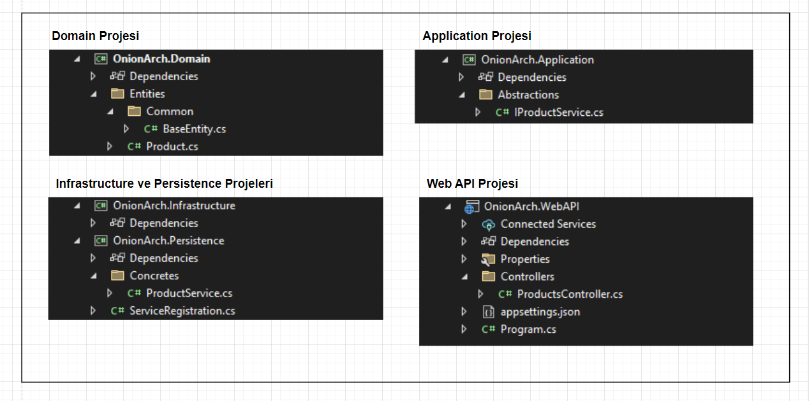

# Selamlar

Selamlar, alt kısımdaki notlar Gençay Yıldız hocanın [şu](https://youtube.com/playlist?list=PLQVXoXFVVtp1DFmoTL4cPTWEWiqndKexZ) eğitim serisinden çıkartılmıştır. 

<br>

# 1.Ders

<br>

# 2.Ders

## Onion Architecture vs N Layer Architecture

- **N Layer Architecture:**

    

    - Bu mimariyi kullanmamak için sebeplere baktığımızda karşımıza ilk çıkan şey değişikliğe dirençli bir yapıda olmasıdır.
    - Katmanlar arasında sıkı bağımlılık mevcuttur.
    - Büyük ölçekli ve karmaşık projeler için yetersizdir.
    - *Data Access Katmanı* merkezidir. Bu da uygulamada verilerin geliş tarzına bir bağımlılık oluşturur. Eğer verinin gelişi ile ilgili bir değişikliğe gidilmek istenirse oldukça masraflı bir durum ortaya çıkar.

<br>

- **Onion Architecture:**

    

    -  Her katman sadece bir iç dairedeki katmana bağımlıdır.
    -  Bağımlılık tek yönlüdür ve içeriye doğrudur.
    -  Herhangi bir katmanda yapılan değişiklikten, katmanın içerisindeki katmanlar değil dışarısındaki katmanlar etkilenirler.
    -  *Veri Katmanı* (*Persistence Katmanı*) en iç katman olarak değil, özellikle en dış katman olarak belirlenmiştir. Bu özellik uygulamada verinin nereden geldiğinden bağımsız olarak geliştirme yapılabilmesini sağlar. Geleneksel *N Layer Architecture*'da *Veri Katmanı (DAL)* en iç katmandır, *Onion Architecture*'da ise bu durum tam tersidir.
    - *Onion Architecture* bir *Clean Architecture* pattern'ıdır.
    - *Onion Architecture* gevşek bağımlılığı şu şekilde sağlar:

        Dış kısımdaki 3 katmanın birbirleri ile bir bağlantısı yoktur. Hepsi bir içerideki katmanı referans ederler. Eğer dışarıdaki 3 katmandan bir tanesi, kendisi ile aynı seviyedeki diğer 2 katmandan bazı servisleri kullanmak zorunda kalırsa bir içerideki Application katmanı üzerinden ilgili servisin interface'ini DI ile kullanır (IoC container'dan kullanmak istediği servisin interface'ini belirterek talep eder).

<br>

## Onion Architecture Katmanları

- **Domain (Domain Entities) (Core) Katmanı:** 
  - En merkezdeki katmandır.
  - İçerisinde domain ile ilgili nesneler bulunur (enum'lar, entity'ler, value object'ler, entity ile ilgili exception'lar vb.).

<br>

- **Repository & Service Interfaces (Application) (Core) Katmanı:**
  - *Domain Katmanı* ile iş katmanı arasındaki (*Domain Katmanı* ile Persistence veya *Infrastructure Katmanı* arasında) soyutlamayı yapan katmandır.
  - Tüm service interface'leri (soyutlamaları) bu katman içerisinde yer alır. 
   
    Örnek olarak: `IXRepository`, `IYService` 
  - Bu katman *Domain Katmanını* referans eder ve dikey bir bağımlılık ile *Domain katmanı*'nın içerisindekileri kullanır.
  - Bu katmanın amacı veri erişiminde `loose coupling (gevşek bağımlılık)` sağlamaktır.
  - DTO'lar, ViewModel'ler, Interface'ler, Mapping Operasyonlarını yapan sınıflar, Validator'ler, CQRS Pattern için gerekli sınıflar bu katman içerisinde tanımlanır.

<br>

- **Persistence Katmanı:**
  - Veri tabanı operasyonlarını/veri erişim işlemlerini yürüten katmandır.
  - *Application Katmanı*'ndaki repository interface'lerinin concrete nesneleri (Repository interface'lerini implement eden class'lar) bu katmanda yer alır.
  - DbContext, migration'lar, veri tabanı ile ilgili configuration'lar, seeding data'ları vb. yapılar bu katman içerisinde tanımlanır.

<br>

- **Infrastructure Katmanı:**
  - *Persistence Katmanı* ile benzer yapıdaki bir katmandır. Bu katman da iş katmanı olarak sınıflandırılır fakat veri tabanı ile ilgili işlemler *Persistence Katmanı*'nda yapılırken, veri tabanı dışında yapılması gereken diğer işlemler/operasyonlar/servisler bu katmanda (*Infrastructure Katmanı*'nda) yapılır.  
  - Email/Sms servisleri, Notification servisleri, Payment işlemleri vb. işlevler bu katmanda gerçekleştirilir.

<br>

- **Presentation Katmanı:**
  - Son kullanıcının uygulama ile iletişime geçtiği katmandır.
  - Örnek olarak Web App, Web API, MVC vb. bir tiptedir.


<br>

# 3.Ders

## IoC Container İçin Katman Referansları

- Bir önceki kısımda en dışarıdaki 3 katmanın birbirleri arasında bir ilişkisi olmadığını belirtmiştik. Aslında *Presentation Katmanı* bu durumu biraz çiğneyebilir. Sonuç olarak *Presentation Katmanı* içerisinde bir *IoC Container* oluşturup bu container'da interface'leri ve servis class'larını tanımlamamız gerekeceğinden ve bu container'da *Presentation Katmanı*'nda oluşturulacağından *Presentation Katmanı* *Infrastructure Katmanı*'nı ve *Persistence Katmanı*'nı referans edebilir.

<br>

## Onion Architecture Temel Solution Düzeni

 

<br>

## Projelerin Örnek Klasör Düzenleri

 

<br>

## Onion Architecture Temel Olarak Akış Düzeni Örneği

 


<br>

# 4.Ders

- Projelerimizde konfigürasyon değerlerini direkt olarak kodun içerisine eklemek doğru bir yaklaşım değildir. Best practise olarak bu konfigürasyon değerleri dış kaynaktan (json,xml dosyaları, environments vb.) okunmalıdır. Bunun sebebi ilerleyen zamanda bu konfigürasyon değerlerinde bir değişiklik gerekiğinde projenin etkilenmesini önlemektir.

- Migration ekleme işlemi sırasında **Persistence** (migration eklenen proje) dışında bir de startup olarak seçtiğimiz projede de ilgili EF paketlerinin olması gerekir. Bunun nedeni migration ekleme işlemi için arka planda projeler derlenir, derleme işlemine de startup projesinden başlanır. Bu nedenle ilgili EF paketlerinin startup olarak seçilen projede de eklenmesi gerekecektir.

<br>

# 5.Ders

## Generic Repository Design Pattern

- Orta büyüklükteki veya daha küçük projelerde bu pattern'i uygulamanın getirisi çok fazla olmayabilir. Fakat birden fazla veri tabanı ile çalışan uygulamalar için bu durum değişebilir.

  Birden fazla veri tabanı kullanırken bunları tek bir noktada, özelleştirerek toplayabilmek faydalı olabilir.

  Ayrıca bu veri tabanları farklı tiplerde veri tabanları da olabilir, böyle bir durumda da bu farklı yapıdaki veri tabanlarını yapısal olarak tek bir arayüzde birleştirebilmek avantaj sağlayabilir.

- Pattern'ı uygulamaya başlarken interface'lerden başlanır ve sonrasında bu interface'lerin concrete'leri oluşturulur (varsa base interface'in concrete class'ı hariç).

- Bu pattern'ın SOLID'e aykırı olduğunun savunulmasındaki sebeplerden birisi şudur: Query'ler (sorgulama işlemleri) ve Command'lar (veri manipülasyonu yapan işlemler) bir arada aynı interface içerisinde tanımlanır ve aynı class içerisinde kullanılırlar.

  Yukarıdaki durumu önleyebilmek için şu yöntem kullanılabilir: Command'lar ayrı bir interface içerisinde (örn: `IWriteRepository<T>`), Query'ler ayrı bir interface (örn: `IReadRepository<T>`) içerisinde tanımlanırsa artık farklı işlevdeki fonksiyonlar farklı yerlerde bulunmuş olur. Ek olarak bu iki repository de ortak interface'den türetilir (örn: `IRepository<T>`) ve bunun içerisinde bu iki interface'in ortak olarak kullandığı yapılar tanımlanır.

  Bu adımlar ile pattern sağlıklı bir şekilde kullanılmış olur.

  

  - `IReadRepository<T>:`
    - Burada tanımlanan ve geriye çoğul veri döndürecek olan operasyonların `IQueryable<T>` olarak tanımlanması önemlidir. Bu sayede verileri memory'e çekmeden sorgulamış oluruz (Yazdığımız where vb. komutlar veri tabanı sorgusuna eklenir).
  
- Read ve Write repository'ler hazırlandıktan sonra (concrete ve abstract) sonraki adım olarak entity'ler ile ilgili olan repository'lerin interface'lerini ve bu interface'lerin concrete class'larını oluşturabiliriz.

  Örnek olarak proje içerisinde **Product** ve **Order** entitiy'leri bulunuyor olsun. Bu iki entity için de Read interface'leri ve Write interface'leri oluşturulur, ardından da bu interface'lerin concrete class'ları oluşturulur.

  

- Entitiy'lerin concrete class'larına bir örnek: 

  ```cs
  public class ProductReadRepository : ReadRepository<Product>, IProductReadRepository
  {
      public ProductReadRepository(MyDbContext context) : base(context) {}
  }
  ```

  Yukarıdaki örnekte bazı önemli noktalara dikkat etmeliyiz.

  1. Eğer sadece `IProductReadRepository` implemente edilseydi, generic repository hazırlamamızın pek bir anlamı kalmayacaktı, her entity'nin repository'si içerisinde aynı fonksiyonlar tekrar tekrar yazılacaktı. Bunu önlemek için bu concrete class (**ProductReadRepository**) `ReadRepository<Product>` class'ından türetildi.
  2. `IProductReadRepository` interface'inin, `ReadRepository`'e rağmen implement edilmesinin amaçlarından bir tanesi, IoC container'ı içerisinden **ProductReadRepository** concrete class'ını bu interface ile talep edilebilir duruma getirmektir.
  3. Ayrıca generic interface'lerde bulunmayan özel operasyonları da bu interface içerisinde tanımlayarak ekstra işlevler eklenebilir.
  4. Son olarak `ReadRepository` içerisinde bir context beklendiğinden, `ProductReadRepository` içerisinden base ctor'a bir context gönderilmesi gerekir. Bu context de DI ile talep edilir.

<br>
