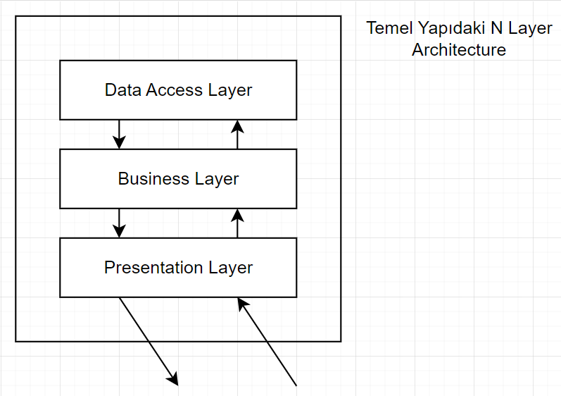
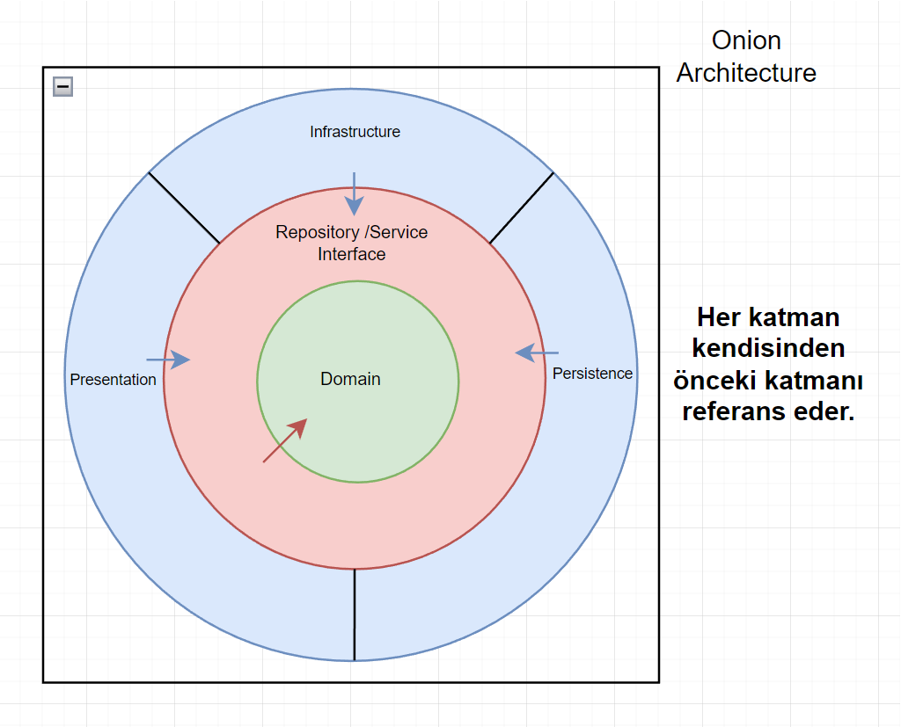
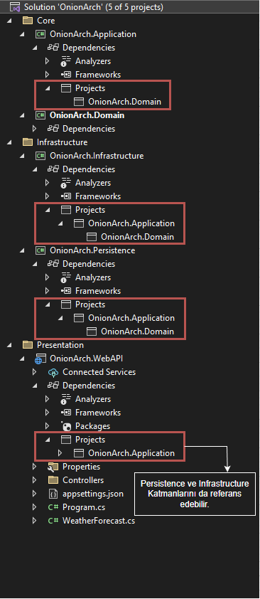
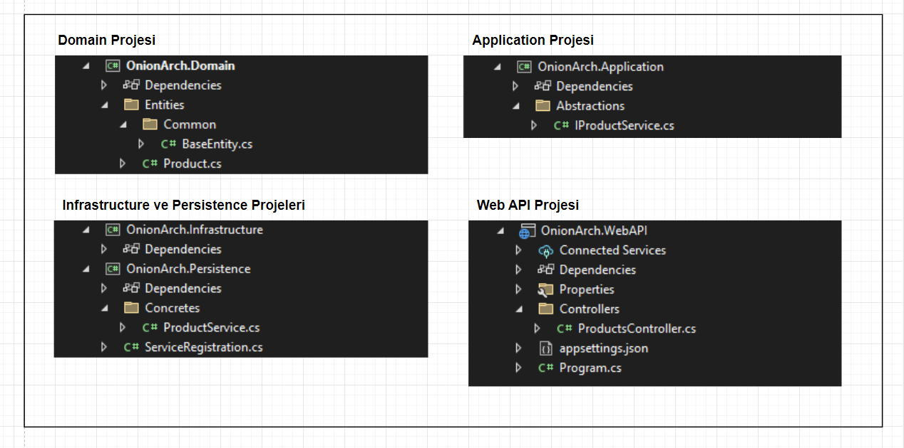
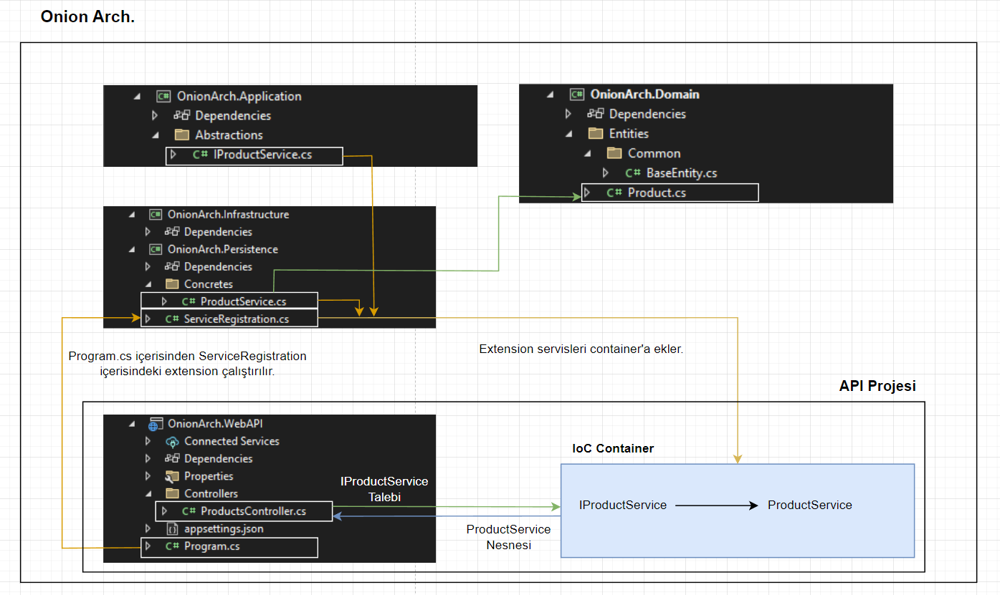

# Selamlar

Selamlar, alt kısımdaki notlar Gençay Yıldız hocanın [şu](https://youtube.com/playlist?list=PLQVXoXFVVtp1DFmoTL4cPTWEWiqndKexZ) eğitim serisinden çıkartılmıştır. 

 

# 1.Ders

 

# 2.Ders

## Onion Architecture vs N Layer Architecture

- **N Layer Architecture:**

    

    - Bu mimariyi kullanmamak için sebeplere baktığımızda karşımıza ilk çıkan şey değişikliğe dirençli bir yapıda olmasıdır.
    - Katmanlar arasında sıkı bağımlılık mevcuttur.
    - Büyük ölçekli ve karmaşık projeler için yetersizdir.
    - *Data Access Katmanı* merkezidir. Bu da uygulamada verilerin geliş tarzına bir bağımlılık oluşturur. Eğer verinin gelişi ile ilgili bir değişikliğe gidilmek istenirse oldukça masraflı bir durum ortaya çıkar.

 

- **Onion Architecture:**

    

    -  Her katman sadece bir iç dairedeki katmana bağımlıdır.
    -  Bağımlılık tek yönlüdür ve içeriye doğrudur.
    -  Herhangi bir katmanda yapılan değişiklikten, katmanın içerisindeki katmanlar değil dışarısındaki katmanlar etkilenirler.
    -  *Veri Katmanı* (*Persistence Katmanı*) en iç katman olarak değil, özellikle en dış katman olarak belirlenmiştir. Bu özellik uygulamada verinin nereden geldiğinden bağımsız olarak geliştirme yapılabilmesini sağlar. Geleneksel *N Layer Architecture*'da *Veri Katmanı (DAL)* en iç katmandır, *Onion Architecture*'da ise bu durum tam tersidir.
    - *Onion Architecture* bir *Clean Architecture* pattern'ıdır.
    - *Onion Architecture* gevşek bağımlılığı şu şekilde sağlar:

        Dış kısımdaki 3 katmanın birbirleri ile bir bağlantısı yoktur. Hepsi bir içerideki katmanı referans ederler. Eğer dışarıdaki 3 katmandan bir tanesi, kendisi ile aynı seviyedeki diğer 2 katmandan bazı servisleri kullanmak zorunda kalırsa bir içerideki Application katmanı üzerinden ilgili servisin interface'ini DI ile kullanır (IoC container'dan kullanmak istediği servisin interface'ini belirterek talep eder).

 

## Onion Architecture Katmanları

- **Domain (Domain Entities) (Core) Katmanı:** 
  - En merkezdeki katmandır.
  - İçerisinde domain ile ilgili nesneler bulunur (enum'lar, entity'ler, value object'ler, entity ile ilgili exception'lar vb.).

 

- **Repository & Service Interfaces (Application) (Core) Katmanı:**
  - *Domain Katmanı* ile iş katmanı arasındaki (*Domain Katmanı* ile Persistence veya *Infrastructure Katmanı* arasında) soyutlamayı yapan katmandır.
  - Tüm service interface'leri (soyutlamaları) bu katman içerisinde yer alır. 
   
    Örnek olarak: `IXRepository`, `IYService` 
  - Bu katman *Domain Katmanını* referans eder ve dikey bir bağımlılık ile *Domain katmanı*'nın içerisindekileri kullanır.
  - Bu katmanın amacı veri erişiminde `loose coupling (gevşek bağımlılık)` sağlamaktır.
  - DTO'lar, ViewModel'ler, Interface'ler, Mapping Operasyonlarını yapan sınıflar, Validator'ler, CQRS Pattern için gerekli sınıflar bu katman içerisinde tanımlanır.

 

- **Persistence Katmanı:**
  - Veri tabanı operasyonlarını/veri erişim işlemlerini yürüten katmandır.
  - *Application Katmanı*'ndaki repository interface'lerinin concrete nesneleri (Repository interface'lerini implement eden class'lar) bu katmanda yer alır.
  - DbContext, migration'lar, veri tabanı ile ilgili configuration'lar, seeding data'ları vb. yapılar bu katman içerisinde tanımlanır.

 

- **Infrastructure Katmanı:**
  - *Persistence Katmanı* ile benzer yapıdaki bir katmandır. Bu katman da iş katmanı olarak sınıflandırılır fakat veri tabanı ile ilgili işlemler *Persistence Katmanı*'nda yapılırken, veri tabanı dışında yapılması gereken diğer işlemler/operasyonlar/servisler bu katmanda (*Infrastructure Katmanı*'nda) yapılır.  
  - Email/Sms servisleri, Notification servisleri, Payment işlemleri vb. işlevler bu katmanda gerçekleştirilir.

 

- **Presentation Katmanı:**
  - Son kullanıcının uygulama ile iletişime geçtiği katmandır.
  - Örnek olarak Web App, Web API, MVC vb. bir tiptedir.

 

# 3.Ders

## IoC Container İçin Katman Referansları

- Bir önceki kısımda en dışarıdaki 3 katmanın birbirleri arasında bir ilişkisi olmadığını belirtmiştik. Aslında *Presentation Katmanı* bu durumu biraz çiğneyebilir. Sonuç olarak *Presentation Katmanı* içerisinde bir *IoC Container* oluşturup bu container'da interface'leri ve servis class'larını tanımlamamız gerekeceğinden ve bu container'da *Presentation Katmanı*'nda oluşturulacağından *Presentation Katmanı* *Infrastructure Katmanı*'nı ve *Persistence Katmanı*'nı referans edebilir.

 

## Onion Architecture Temel Solution Düzeni

 

 

## Projelerin Örnek Klasör Düzenleri

 

 

## Onion Architecture Temel Olarak Akış Düzeni Örneği

 

 

# 4.Ders

- 