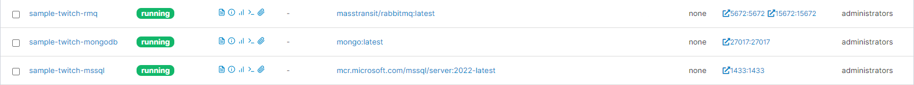

# Kaynak

- [Chris Patterson](https://www.youtube.com/watch?v=dxHNAn69x6w&list=PLx8uyNNs1ri2MBx6BjPum5j9_MMdIfM9C)

# Notlar

- Projeyi mesajlaşmayı yapabilmek için `Sample.Quartz` projesini çalıştırmış olmamız gerekiyor. `Sample.Quartz` projesi için bir **MSSQL Server**  içerisinde **quartznet** isimli bir database oluşturduktan sonra [şu script'i](https://github.com/MassTransit/Sample-Quartz/blob/master/create_quartz_tables.sql) çalıştırmalıyız.    

- Batch consume işlemlerinde çoklu istek göndermek için `Client.Console` projesini kullanabilirsiniz.

- Gerekli olan container'ların bilgileri alt kısımdadır:
  
    

