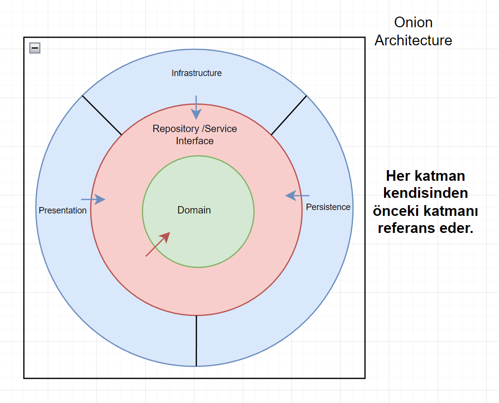
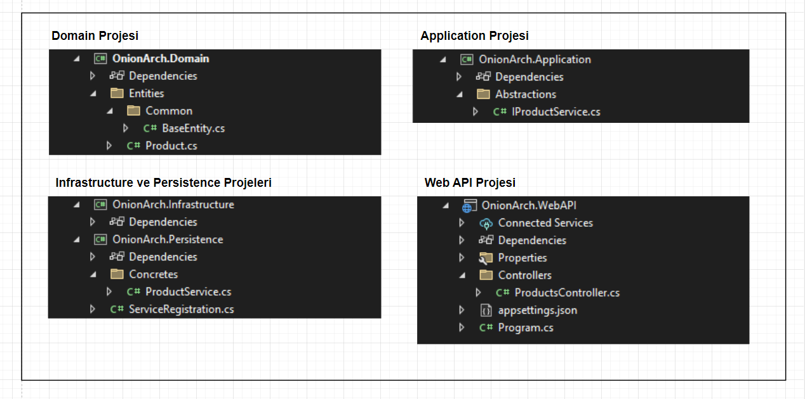
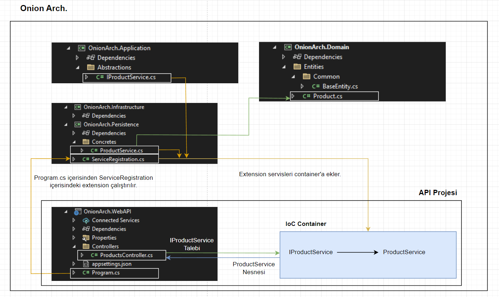
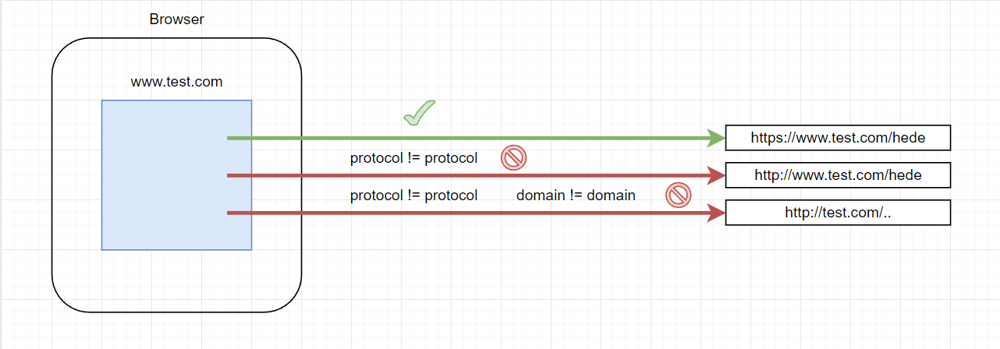

# Selamlar

Selamlar, alt kısımdaki notlar Gençay Yıldız hocanın [Mini E-Ticaret Uygulama Serisi](https://youtube.com/playlist?list=PLQVXoXFVVtp1DFmoTL4cPTWEWiqndKexZ)'ni takip ederek oluşturulmuştur. 

<br>

# 1.Ders

<br>

# 2.Ders

## Onion Architecture vs N Layer Architecture

- **N Layer Architecture:**

    

    - Bu mimariyi kullanmamak için sebeplere baktığımızda karşımıza ilk çıkan şey değişikliğe dirençli bir yapıda olmasıdır.
    - Katmanlar arasında sıkı bağımlılık mevcuttur.
    - Büyük ölçekli ve karmaşık projeler için yetersizdir.
    - *Data Access Katmanı* merkezidir. Bu da uygulamada verilerin geliş tarzına bir bağımlılık oluşturur. Eğer verinin gelişi ile ilgili bir değişikliğe gidilmek istenirse oldukça masraflı bir durum ortaya çıkar.

<br>

- **Onion Architecture:**

    

    -  Her katman sadece bir iç dairedeki katmana bağımlıdır.
    -  Bağımlılık tek yönlüdür ve içeriye doğrudur.
    -  Herhangi bir katmanda yapılan değişiklikten, katmanın içerisindeki katmanlar değil dışarısındaki katmanlar etkilenirler.
    -  *Veri Katmanı* (*Persistence Katmanı*) en iç katman olarak değil, özellikle en dış katman olarak belirlenmiştir. Bu özellik uygulamada verinin nereden geldiğinden bağımsız olarak geliştirme yapılabilmesini sağlar. Geleneksel *N Layer Architecture*'da *Veri Katmanı (DAL)* en iç katmandır, *Onion Architecture*'da ise bu durum tam tersidir.
    - *Onion Architecture* bir *Clean Architecture* pattern'ıdır.
    - *Onion Architecture* gevşek bağımlılığı şu şekilde sağlar:

        Dış kısımdaki 3 katmanın birbirleri ile bir bağlantısı yoktur. Hepsi bir içerideki katmanı referans ederler. Eğer dışarıdaki 3 katmandan bir tanesi, kendisi ile aynı seviyedeki diğer 2 katmandan bazı servisleri kullanmak zorunda kalırsa bir içerideki Application katmanı üzerinden ilgili servisin interface'ini DI ile kullanır (IoC container'dan kullanmak istediği servisin interface'ini belirterek talep eder).

<br>

## Onion Architecture Katmanları

- **Domain (Domain Entities) (Core) Katmanı:** 
  - En merkezdeki katmandır.
  - İçerisinde domain ile ilgili nesneler bulunur (enum'lar, entity'ler, value object'ler, entity ile ilgili exception'lar vb.).

<br>

- **Repository & Service Interfaces (Application) (Core) Katmanı:**
  - *Domain Katmanı* ile iş katmanı arasındaki (*Domain Katmanı* ile Persistence veya *Infrastructure Katmanı* arasında) soyutlamayı yapan katmandır.
  - Tüm service interface'leri (soyutlamaları) bu katman içerisinde yer alır. 
   
    Örnek olarak: `IXRepository`, `IYService` 
  - Bu katman *Domain Katmanını* referans eder ve dikey bir bağımlılık ile *Domain katmanı*'nın içerisindekileri kullanır.
  - Bu katmanın amacı veri erişiminde `loose coupling (gevşek bağımlılık)` sağlamaktır.
  - DTO'lar, ViewModel'ler, Interface'ler, Mapping Operasyonlarını yapan sınıflar, Validator'ler, CQRS Pattern için gerekli sınıflar bu katman içerisinde tanımlanır.

<br>

- **Persistence Katmanı:**
  - Veri tabanı operasyonlarını/veri erişim işlemlerini yürüten katmandır.
  - *Application Katmanı*'ndaki repository interface'lerinin concrete nesneleri (Repository interface'lerini implement eden class'lar) bu katmanda yer alır.
  - DbContext, migration'lar, veri tabanı ile ilgili configuration'lar, seeding data'ları vb. yapılar bu katman içerisinde tanımlanır.

<br>

- **Infrastructure Katmanı:**
  - *Persistence Katmanı* ile benzer yapıdaki bir katmandır. Bu katman da iş katmanı olarak sınıflandırılır fakat veri tabanı ile ilgili işlemler *Persistence Katmanı*'nda yapılırken, veri tabanı dışında yapılması gereken diğer işlemler/operasyonlar/servisler bu katmanda (*Infrastructure Katmanı*'nda) yapılır.  
  - Email/Sms servisleri, Notification servisleri, Payment işlemleri vb. işlevler bu katmanda gerçekleştirilir.

<br>

- **Presentation Katmanı:**
  - Son kullanıcının uygulama ile iletişime geçtiği katmandır.
  - Örnek olarak Web App, Web API, MVC vb. bir tiptedir.


<br>

# 3.Ders

## IoC Container İçin Katman Referansları

- Bir önceki kısımda en dışarıdaki 3 katmanın birbirleri arasında bir ilişkisi olmadığını belirtmiştik. Aslında *Presentation Katmanı* bu durumu biraz çiğneyebilir. Sonuç olarak *Presentation Katmanı* içerisinde bir *IoC Container* oluşturup bu container'da interface'leri ve servis class'larını tanımlamamız gerekeceğinden ve bu container'da *Presentation Katmanı*'nda oluşturulacağından *Presentation Katmanı* *Infrastructure Katmanı*'nı ve *Persistence Katmanı*'nı referans edebilir.

<br>

## Onion Architecture Temel Solution Düzeni

 

<br>

## Projelerin Örnek Klasör Düzenleri

 

<br>

## Onion Architecture Temel Olarak Akış Düzeni Örneği

 


<br>

# 4.Ders

- Projelerimizde konfigürasyon değerlerini direkt olarak kodun içerisine eklemek doğru bir yaklaşım değildir. Best practise olarak bu konfigürasyon değerleri dış kaynaktan (json,xml dosyaları, environments vb.) okunmalıdır. Bunun sebebi ilerleyen zamanda bu konfigürasyon değerlerinde bir değişiklik gerekiğinde projenin etkilenmesini önlemektir.

- Migration ekleme işlemi sırasında **Persistence** (migration eklenen proje) dışında bir de startup olarak seçtiğimiz projede de ilgili EF paketlerinin olması gerekir. Bunun nedeni migration ekleme işlemi için arka planda projeler derlenir, derleme işlemine de startup projesinden başlanır. Bu nedenle ilgili EF paketlerinin startup olarak seçilen projede de eklenmesi gerekecektir.

<br>

# 5.Ders

## Generic Repository Design Pattern

- Orta büyüklükteki veya daha küçük projelerde bu pattern'i uygulamanın getirisi çok fazla olmayabilir. Fakat birden fazla veri tabanı ile çalışan uygulamalar için bu durum değişebilir.

  Birden fazla veri tabanı kullanırken bunları tek bir noktada, özelleştirerek toplayabilmek faydalı olabilir.

  Ayrıca bu veri tabanları farklı tiplerde veri tabanları da olabilir, böyle bir durumda da bu farklı yapıdaki veri tabanlarını yapısal olarak tek bir arayüzde birleştirebilmek avantaj sağlayabilir.

- Pattern'ı uygulamaya başlarken interface'lerden başlanır ve sonrasında bu interface'lerin concrete'leri oluşturulur (varsa base interface'in concrete class'ı hariç).

- Bu pattern'ın SOLID'e aykırı olduğunun savunulmasındaki sebeplerden birisi şudur: Query'ler (sorgulama işlemleri) ve Command'lar (veri manipülasyonu yapan işlemler) bir arada aynı interface içerisinde tanımlanır ve aynı class içerisinde kullanılırlar.

  Yukarıdaki durumu önleyebilmek için şu yöntem kullanılabilir: Command'lar ayrı bir interface içerisinde (örn: `IWriteRepository<T>`), Query'ler ayrı bir interface (örn: `IReadRepository<T>`) içerisinde tanımlanırsa artık farklı işlevdeki fonksiyonlar farklı yerlerde bulunmuş olur. Ek olarak bu iki repository de ortak interface'den türetilir (örn: `IRepository<T>`) ve bunun içerisinde bu iki interface'in ortak olarak kullandığı yapılar tanımlanır.

  Bu adımlar ile pattern sağlıklı bir şekilde kullanılmış olur.

  

  - `IReadRepository<T>:`
    - Burada tanımlanan ve geriye çoğul veri döndürecek olan operasyonların `IQueryable<T>` olarak tanımlanması önemlidir. Bu sayede verileri memory'e çekmeden sorgulamış oluruz (Yazdığımız where vb. komutlar veri tabanı sorgusuna eklenir).
  
- Read ve Write repository'ler hazırlandıktan sonra (concrete ve abstract) sonraki adım olarak entity'ler ile ilgili olan repository'lerin interface'lerini ve bu interface'lerin concrete class'larını oluşturabiliriz.

  Örnek olarak proje içerisinde **Product** ve **Order** entitiy'leri bulunuyor olsun. Bu iki entity için de Read interface'leri ve Write interface'leri oluşturulur, ardından da bu interface'lerin concrete class'ları oluşturulur.

  

- Entitiy'lerin concrete class'larına bir örnek: 

  ```cs
  public class ProductReadRepository : ReadRepository<Product>, IProductReadRepository
  {
      public ProductReadRepository(MyDbContext context) : base(context) {}
  }
  ```

  Yukarıdaki örnekte bazı önemli noktalara dikkat etmeliyiz.

  1. Eğer sadece `IProductReadRepository` implemente edilseydi, generic repository hazırlamamızın pek bir anlamı kalmayacaktı, her entity'nin repository'si içerisinde aynı fonksiyonlar tekrar tekrar yazılacaktı. Bunu önlemek için bu concrete class (**ProductReadRepository**) `ReadRepository<Product>` class'ından türetildi.
  2. `IProductReadRepository` interface'inin, `ReadRepository`'e rağmen implement edilmesinin amaçlarından bir tanesi, IoC container'ı içerisinden **ProductReadRepository** concrete class'ını bu interface ile talep edilebilir duruma getirmektir.
  3. Ayrıca generic interface'lerde bulunmayan özel operasyonları da bu interface içerisinde tanımlayarak ekstra işlevler eklenebilir.
  4. Son olarak `ReadRepository` içerisinde bir context beklendiğinden, `ProductReadRepository` içerisinden base ctor'a bir context gönderilmesi gerekir. Bu context de DI ile talep edilir.

<br>

# 6.Ders

<br>

# 7.Ders
## EF Tracking

- EF kullanılarak veri tabanındaki verilere eriştiğimiz zaman, EF'nin `Tracking` mekanizması default olarak aktif edilir.

  Daha optimize edilmiş bir şekilde çalışabilmek için bu Tracking mekanizmasını gerekli olmayan operasyonlar için (read operasyonları) kapatabiliriz.

  Örnek olarak **Product** verilerini sadece listelemek için kullandığımız bir fonksiyon örneğine bakalım:

  ```cs
  public DbSet<T> Table => _context.Set<T>();

  public IQueryable<T> GetProducts(bool isTrackingActive = true)
  {
    var query = Table.AsQueryable();

    return isTrackingActive ? query : query.AsNoTracking(); 
  }
  ```

<br>

# 8.Ders
  
## Interceptors

- `Interceptor`: Yaptığımız işin başlangıcı ile bitişi arasına giren yapıdır.

  

- Interceptor dediğimiz şeyin sabit bir tipi yoktur. Bir fonksiyon, bir class, bir attribute vb. tip olabilir. Interceptor olarak tanımlanması için bir operasyonun başlangıcı ile bitişi arasında o operasyona müdahale etmesi yeterlidir.

- Bir context class'ı içerisinden örneği inceleyelim:

  ```cs
  public override async Task<int> SaveChangesAsync(CancellationToken cancellationToken = default)
  {
      // BaseEntity tipindeki track edilen bütün objeler yakalandı.
      var datas = ChangeTracker.Entries<BaseEntity>();

      foreach(var data in datas)
      {
        // obje üzerinde yapılan işlem ne ise, o işlem ile ilgili olan değer set edildi.
        _ = data.State switch
        {
          EntityState.Added => data.Entity.CreatedDate = DateTime.UtcNow,
          EntityState.Modified => data.Entity.UpdatedDate = DateTime.UtcNow,
          _ => DateTime.UtcNow
        };
      }

      return await base.SaveChangesAsync(cancellationToken);
  }
  ```

  `SaveChangesAsync` fonksiyonunu override ederek bir interceptor oluşturmuş olduk. Artık eklenen veya güncellenen objelerin ilgili property'lerine değerler otomatik olarak eklenecek. Oluşturulan her obje için veya güncellenen her obje için tek tek değer atamaktan kurtulduk.

- Bu arada yukarıdaki örnekte önemli bir detay var:

  ```cs
  _ = data.State switch
    {
      EntityState.Added => data.Entity.CreatedDate = DateTime.UtcNow,
      EntityState.Modified => data.Entity.UpdatedDate = DateTime.UtcNow,
    };
  ```

  Yaptığımız işlem geriye bir şey döndürüyorsa ve biz bu değeri kullanmayacaksak, bu değere ihtiyacımız yoksa `_ =` ataması yaparak döndürülen değer için bir allocate işleminin yapılmaması gerektiğini belirtmiş oluruz.

<br>

# 9.Ders (Angular)

<br>

# 10.Ders (Angular)

<br>

# 11.Ders (Angular)

<br>

# 12.Ders (Angular)

<br>

# 13.Ders (Angular)

<br>

# 14.Ders (Angular)

<br>

# 15.Ders (Angular)

<br>

# 16.Ders (Angular)

<br>

# 17. Ders 

## CORS

- CORS politikaları uygulamanın server kısmı ile **browser tabanlı client**'ları arasında uygulanan politikalardır.

- İlk olarak biraz hikayeleştirmeye çalışalım. Bizim bir web sitemiz olsun ve bu siteye gelen kullanıcılarımız olsun. Kullanıcılar sitemize kendi cihazlarındaki browser'ları kullanarak erişecekler. Yani bizim sitemizde oturum açtıklarında kullanıcın cihazındaki browser'da kullanıcının bazı bilgileri tutulmaya başlanır.

  Eğer biz kötü niyetli bir geliştirici isek uygulamamızın içerisinden, kullanıcının browser'da tutulan bu verilerini kullanarak başka bir uygulamaya/siteye istek atabiliriz, eğer bu veriler karşı uygulamada da geçerli ise de başarılı yanıtlar alabiliriz. 
  
  Yani bir güvenlik açığı oluşmuş olur. Kullanıcı adına, kullanıcının haberi olmadan farklı sitelere erişim sağlanmaya çalışılabilir.

  

- Bu güvenlik açığını önleyebilmek adına ilk güvenlik tedbiri browser'ların kendileri tarafından yapılır. 

  Bir browser sitenin kendi domain'inden farklı bir domain'e istek yapılırsa güvenlik amacıyla bu istek engellenir.

  Eğer browser üzerinden yapılan istek ile isteğin gönderildiği yerin: `protocol`'ü veya `host`'u veya `port`'u farklı ise browser bu isteği henüz API'a gitmeden otomatik olarak durduracaktır.

  
  
  Browser'ların bu davranışı `Same-Origin Policy` olarak isimlendirilir. Bu policy zararlı sitelerin diğer sitelerden browser tabanlı veri okunmasını engelleyen önemli bir güvenlik tedbiridir.

- Kötü amaçlı olmadan, gerçekten gerektiği için başka bir uygulamaya istek atıp veri almamız gerektiğinde ise, tarayıcı hedef adresten/siteden/origin'den/api'den bu site için onay aldıktan sonra isteği gerçekleştirir.

- CORS politikaları dediğimiz kavram da bu ``Same-Origin Policy`'nin hafifletilmesini sağlayan yapıdır. API'ların içerisinde uygulamamıza hangi sitelerin istek yapabileceğini tanımlarız, browser API'dan onay almak için geldiğinde, eğer istek yapılan site kabul edilebilir site olarak tanımlandıysa isteğin gerçekleşmesine izin verir.

- API içerisinde CORS politikalarını alt kısımdaki örnek gibi yönetebiliriz:

  ```cs
  // program.cs
  builder.Services.AddCors(opt => opt.AddDefaultPolicy(policy => 
  {
      // gerekli policy'ler tanımlanır.

      //policy.AllowAnyHeader().AllowAnyMethod().AllowAnyOrigin(); // gelen bütün istekleri onaylar.
      policy.WithOrigins("http://wwww.test.com/","http://test.com/").AllowAnyHeader().AllowAnyMethod(); // belirtilen adreslerden gelen bütün istekleri kabul ediyoruz.
  }));

  // diğer kısımlar

  app.UseCors(); // tanımladığımız policy'i devreye alan middleware.
  ```

<br>

# 18. Ders

## Contract 

- Client ile Server arasında bir veri transferi yapılırken best practise olarak kabul edebileceğimiz bir yaklaşım vardır. Client tarafında, istekten gelecek olan cevabı karşılayacak bir model/class tanımlanır ve gelen json response bu model ile karşılanır. 

  Bu yaklaşım ile tip güvenli ve daha anlaşılabilir bir geliştirme yapmış oluruz.

<br>

# 19.Ders (Angular)

<br>

# 20.Ders

## Validation

- Validation işlemlerini ViewModel'lerimiz üzerinde uygulayacağımız için, Create işlemi için ayrı, Update işlemi için ayrı olacak şekilde kaç tane farklı operasyonumuz ve modelimiz varsa bunların hepsinin validation sınıflarının ayrı ayrı tanımlanması doğru olan yaklaşımdır.
  
- Core altyapısında default olarak gelen bir filter mekanizması vardır. İstekler geldiğinde, henüz controller'a düşmeden bu filter'lar tetiklenir ve hatalı bir durum var ise client'a direkt olarak gerekli mesaj geri döndürülür.

  Biz bu default filter'ı iptal edip bu validation işlemlerini kendimiz yönetmek isteyebiliriz ve bunun için custom bir filter tanımlayabiliriz. İlk olarak bu default gelen filter'ı kapatmak için alt kısımdaki örneği inceleyebiliriz:

  ```cs
  // program.cs

  builder.Services.AddControllers().ConfigureApiBehaviorOptions(opt => opt.SuppressModelStateInvalidFilter = true);
  ```

  Yukarıdaki işlem sonrasında artık gelen veri belirlediğimiz validation kurallarına uygun olmasa bile controller'a düşecek ve bunun kontrolünü kendimiz yapabiliyor olacağız.

- Validation'ları filter kullanarak yönetebilmek için alt kısımdaki gibi bir filter tanımlayabiliriz:

  ```cs
  public class ValidationFilter : IAsyncActionFilter
  {
      public Task OnActionExecutionAsync(ActionExecutingContext context, ActionExecutionDelegate next)
      {
          if(!context.ModelState.IsValid)
          {
              var errors = context.ModelState
                .Where(x => x.Value.Errors.Any())
                .ToDictionary(e => e.Key, e => e.Value.Errors.Select(e => e.ErrorMessage))
                .ToArray();

              context.Result = new BadRequestObjectResult(errors);
              return;
          }

          await next();
      }
  }

  // program.cs

  builder.Services
      .AddControllers(options => options.Filters.Add<ValidationFilter>())
      .ConfigureApiBehaviorOptions(opt => opt.SuppressModelStateInvalidFilter = true);
  ```

<br>

# 21.Ders (Angular)

<br>

# 22.Ders (Angular)

<br>

# 23.Ders (Angular)

<br>

# 24.Ders (Angular)

<br>

# 25.Ders

## File Upload

- Sunucu içerisinde dosyaları tutmak istiyorsak bunun güvenli yollarından birisi `wwwroot` klasörüdür. Core ile birlikte bu klasöre dışarıdan erişemez fakat kod ile erişilebilir.

- wwwroot içerisindeki dosyalara erişebilmek için **Program.cs** içerisinde `UseStaticFiles();` middleware'ini kullanmamız gerekir.

- Dosyaları request içerisinden alabilmek için `Request.Form.Files` property'si kullanılabilir.

 <br>

# 26.Ders (Angular)

<br>

# 27.Ders

## File Upload

- Uygulama içerisindeki dosyaların isimlerinin anlamlı olması genel olarak gereksiz gibi görünebilir fakat SEO için durum biraz daha farklı. Yüklenen dosyaları uygun formata getirerek server'da tutmamız ekstra fayda sağlayacaktır.

<br/>

# 28. Ders

<br/>

# 29. Ders

## Virtual Keyword

- Ef ile çalışırken bir base class içerisindeki bir öğenin alt class'lar tarafından override edilebilir olmasını istiyorsak `virtual` keyword'ünü kullanırız.
  Örnek olarak alt kısımdaki gibi bir base class'ımız olsun:

  ```csharp
  public class BaseEntity
  {
    public int Id { get; set; }
    public DateTime CreatedDate { get; set; }
    public DateTime UpdatedDate { get; set; }
  }
  ```

  Yukarıdaki base class'tan türettiğimiz bir **File** class'ımız olsun. Biz **File** class'ı içerisinde base'den gelen **UpdatedDate** property'sinin olmasını istemiyoruz diyelim. Bu tarz durumlarda base entity'deki bu alanı `virtual` olarak işaretleyip, alt class'içerisine override ederek **NotMapped** olarak belirtebiliriz.

   ```csharp
  public class BaseEntity
  {
    public int Id { get; set; }
    public DateTime CreatedDate { get; set; }
    virtual public DateTime UpdatedDate { get; set; }
  }

  public class File : BaseEntity
  {
    [NotMapped]
    public override DateTime UpdatedDate { get => base.UpdatedDate; set => base.UpdatedDate = value; }
  }
  ```

<br/>

# 30. Ders

<br/>

# 31. Ders

<br/>

# 32. Ders (Angular)

<br/>


