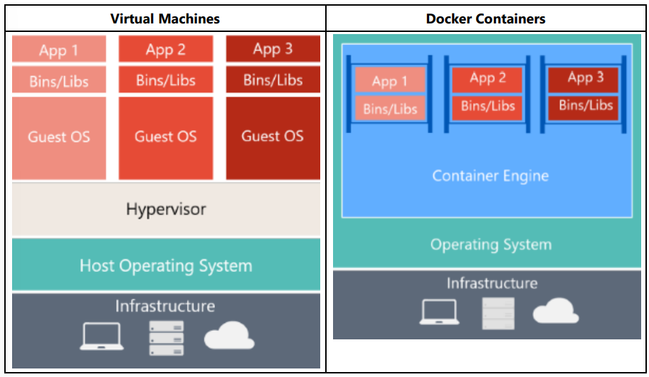

# Kaynaklar

- https://learn.microsoft.com/en-us/dotnet/architecture/microservices/
- https://learn.microsoft.com/en-us/training/modules/dotnet-microservices/
 
# Mikroservis Mimarisi

- Bu mimarinin hedefi, büyük yapıları daha küçük modülleri birleştirerek oluşturmaktır.

- Monolitik mimariler bir bütün olarak ölçeklendirilebilirken, mikroservis mimarisinde bütün modüller kendi içerlerinde bağımsız olarak ölçeklendirilebilir olurlar.

    Örnek olarak uygulamada çok fazla talep gelen bir modülün işlem gücünü ve ağ bant genişliğini arttırıp, beklenen boyutta talep gelen modüllerinkileri arttırmayabiliriz.

- Her modül kendi başına çalışabilir haldedir. Ayrıca modüller HTTP/HTTPS, WebSockets, AMQP gibi protokoller üzerinden birbirleri ile iletişim kurabilirler. Burada güzel tasarlanan API'ler de kullanılır.

- Her modül otomatik bir şekilde geliştirilebilmeli ve birbirlerinden bağımsız olarak deploy edilebilmelidir, birbirlerinden ayrı test edilebilmelidir, birbirlerinden ayrı olarka yönetilebilmelidir. 

    Bir modül güncellediğinde bütün uygulamayı rebuild ve redeploy etmek yerine sadece ilgili modül rebuild ve redeploy edilir.

- Her modülün codebase'i farklıdır. Böylece küçük takımlar tarafından yönetilebilirler.

- Her modül kendi verilerinin ve harici durumların sürdürülebilirliğinden sorumludur. Monolitik mimaride bütün modüllerin veritabanı ortak iken, mikroservis mimarisinde (ihtiyacı olan) her modülün kendi veritabanı vardır.

- Bu mimarinin en önemli bir özelliği de farklı diller ile geliştirmeler yapmaya olanak sağlamasıdır. Örnek olarka bazı modüller Java ile bazı modüller C# ile geliştirilebilir. Burada önemli olan bu modüller arasındaki iletişimleri düzgün kurabilmektir. 

 

# Mikroservisler ve Docker

- Hazırlanan modülleri mikroservis olarak kullanmamızı sağlayan teknoloji Docker'dır. Docker image ve container'ları sayesinde servisleri ayağa kaldırıp çalışır duruma getiririz.

- Hazırladığımız modülleri dockerize edebilmek için modüllerin içerisinde bir `Dockerfile` olmalıdır. Örnek bir `Dockerfile` dosyası hazırlama aşaması alt kısımdadır:

    

     

    1. `mcr.microsoft.com/dotnet/sdk:6.0` image'ini çek ve `build` olarak adlandır.
    2. image içerisindeki çalışma klasörünü `/src` olarak ayarla.
    3. Yerelde bulunan `backend.csproj` dosyasını `/src` içerisine kopyala.
    4. Projede `dotnet restore` komutunu çalıştır.
    5. Yerel çalışma klasöründeki her şeyi image içerisine kopyala.
    6. Projede `dotnet publish` komutunu çalıştır.

     

    
    
     

    7. `mcr.microsoft.com/dotnet/aspnet:6.0` image'ini çek.
    8. Image içerisindeki çalışma klasörünü `/app` olarak ayarla.
    9. 80 port'unu aç (expose et).
    10. 443 port'unu aç.
    11. Build image'inin `/app` klasörü içerisindeki her şeyi bu image'in `/app` klasörüne kopyala.
    12. Image'in giriş entrypoint'i olarak `dotnet`'i ayarlar. Bu entrypoint'e bağımsız değişken olarak `backend.dll`'i iletir.

     

    Dockerfile dosyaysının son hali alt kısımdaki gibi olur.
     

    

     

    Sonraki adımda Dockerfile dosyası ile aynı dizin içerisinde alt kısımdaki kodu çalıştırırız. Buradaki önemli nokta, proje üzerinde bir değişiklik yaptığımızda bu image'i tekrar build etmemiz gerekecektir.

     

    

     

    Build işleminden sonra `docker images` komutu ile bilgisayarımızda bulunan image'leri listeleyebiliriz. Bu liste içerisinde az önce build ettiğimiz image'in de yer aldığını görebiliriz.

    Backend projesini docker image'ı olarak çalıştırmak için yapmamız gereken son şey alt kısımdaki komutu çalıştırmaktır.
    
     

    

     

    Artık `http://localhost:5200/pizzainfo` adresi üzerinden projenin ayakta olduğunu test edebiliriz.
    
     Burada görüldüğü üzere Dockerfile dosyası içerisinde expose edilen 80 portunu, dışarıya 5200 portu ile açmak istediğimizi `--p` parametresi ile belirtmiş olduk.

 

# Bölüm 1 - Introduction to Containers and Docker (Konteynırlar ve Docker'a Giriş)

- `Containerization` dediğimiz şey bir uygulamanın, bu uygulamanının bağımlılıklarının ve konfigürasyonlarının bir araya toplanıp bir paket haline getirilmesi diyebiliriz.

    Container haline getirilen bir uygulama kendi başına test edilebilir ve kendi başına deploy edilebilir.

    Gerçek hayattan örnek vermek istersek, yük gemilerinin taşıdığı konteynırlara bakabiliriz. Bir yerden bir yere, içerisi değişmeden taşınıyorlar. Yazılımda da benzer mantıkta konteynır hale getirilen bir uygulama farklı ortamlara, içerisi değişmeden taşınır ve çalıştırılır.

- Konteynırlar bizlere uygulamanın yaşam döngüsü boyunca izolasyon, taşınabilirlik, çeviklik, ölçeklenebilirlik ve kolay kontrol edilebilirliği sağlar. En önemli faydası olarak Dev. ve Ops. arasında sağlanan ortam izolasyonudur.

 

### Docker Containers vs Virtual Machines

- Docker Container'lar ile Virtual Machine'ler arasındaki farklar için alt kısımdaki görüntüyü inceleyebiliriz:

    

    - VMs:

        Sanal makinelerin içerisinde uygulamalar, kütüphaneler, binary dosyalar ve konuk işletim sistemi yer alır.

        Eğer tam anlamıyla sanallaştırma yapmak istersek, konteynırlaştırmadan çok daha fazla maliyetli olacaktır.

    - DCs:

        Konteynırlar uygulamayı ve onun bütün bağımlılıklarını içerir.

        İşletim sistemini diğer konteynırlar ile birbirlerinden izole olacak şekilde paylaşırlar.

    Konteynırlar daha az kaynak gerektirdiğinden daha hızlı bir şekilde deploy edilebilirler ve daha hızlı çalıştırılabilirler. Ayrıca aynı donanım ile daha fazla servis çalıştırabiliyor olmamızı da sağlarlar.

 

### Docker Terminology (Docker Terminolojisi)

- `Container image`: Container oluşturmak için gereken bütün bağımlılıkları ve bilgileri içeren pakettir. 

    Bazı durumlarda image'lar başka image'lardan oluşabilir.

    Bir kez oluşturulan image üzerinde değişiklik yapılamaz (immutable).

- `Dockerfile`: Bir Docker image'ını build edilebilmesi için gerken bilgileri içeren bir metin dosyasıdır. 

    Bir sürü komutu içeren bir dosya olarak düşünebiliriz.

    İlk satır base image'i belirtir. Sonraki kısımlarda yazılı olan komutlar ile gerekli olan programları yüklemek, dosyaları kopyalamak vb. işlemleri gerçekleştirir.

- `Build`: Image'leri oluşturabilmek için Dockerfile içerisinde yer alan komutların tetiklenmesidir.

    `docker build` şeklinde kullanılabilir.

- `Container`: Bir Docker image'inin örneğidir (instence). Container'lar tek bir uygulamanın, işlemin veya hizmetin yürütülmesini temsil eder.

    Ölçeklendirme yaparken aynı image'ı kullanarak bir çok container oluşturabiliriz (hepsine farklı değerler de gönderilebilir).

- `Volumes`: Container'ların kullanabileceği bir dosya sistemidir. Image'ler read-only'dirler. Container'lar ve volum'leri birlikte kullanarak veri yazabilme yeteneğini de kazandırmış oluruz.

- `Tag`: Farklı image'lerin veya aynı image'in versiyonlarının anlamlı bir şekilde tanımlanması için kullanılan işaret/etiket.

- `Multi-stage Build`: Son image'lerin boyutlarını küçültmeye yarar.
- `Repository (repo)`:Image sürümünü belirten bir etiketle etiketlenmiş ve ilgili (birden fazla olabilir) image'leri içeren koleksiyon.
- `Registry`: İçerisinde repo'lar barındıran bir kayıt defteridir.
- `Multi-arch image`: Çoklu mimari kullanılırken, Docker'ın çalıştığı platforma göre uygun image'leri seçmeyi kolaylaştıran bir özelliktir.
- `Docker Hub`: Image'leri yüklemek ve onları çalıştırabilmek için kullanılan bir registry'dir.
- `Docker Trusted Registry (DTR)`: Şirketlerin kendi ağında, kendi image'lerini yönetmek ve çalıştırmak için kullandığı sistemdir. 
- `Compose`: İçerisinde birden fazla container bulunduran uygulamaları ayağa kaldırmak için çalıştırılması gereken komutları içeren, YAML uzantılı dosyadır. 

    İçerisindeki komutlaru olması gerektiği gibi hazırladığımızda n tane container'dan oluşan bir uygulamayı sadece tek bir satır komut ile ayağa kalırabiliriz. 
    
    `docker-compose up`

    Bu komut Compose dosyasında tanımlanan her image için birer container oluşturur ve onları çalıştırır.

- `Orchestrator`: Image'leri ve container'ları yönetimini basitleştiren bir araçtır. 
