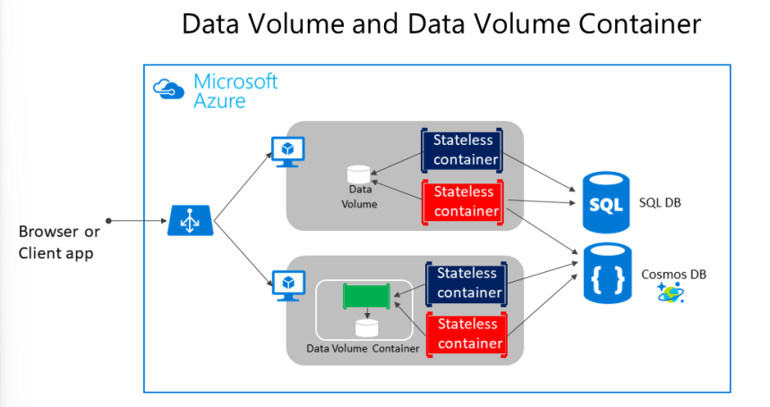
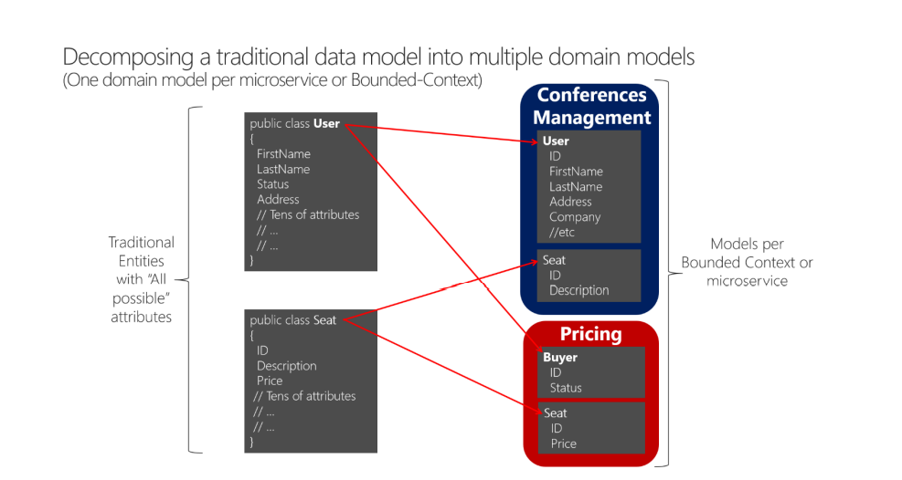

# Kaynaklar

- https://learn.microsoft.com/en-us/dotnet/architecture/microservices/
- https://learn.microsoft.com/en-us/training/modules/dotnet-microservices/
 
# Mikroservis Mimarisi

- Bu mimarinin hedefi, büyük yapıları daha küçük modülleri birleştirerek oluşturmaktır.

- Monolithic mimariler bir bütün olarak ölçeklendirilebilirken, mikroservis mimarisinde bütün modüller kendi içerlerinde bağımsız olarak ölçeklendirilebilir olurlar.

    Örnek olarak uygulamada çok fazla talep gelen bir modülün işlem gücünü ve ağ bant genişliğini arttırıp, beklenen boyutta talep gelen modüllerinkileri arttırmayabiliriz.

- Her modül kendi başına çalışabilir haldedir. Ayrıca modüller HTTP/HTTPS, WebSockets, AMQP gibi protokoller üzerinden birbirleri ile iletişim kurabilirler. Burada güzel tasarlanan API'ler de kullanılır.

- Her modül otomatik bir şekilde geliştirilebilmeli ve birbirlerinden bağımsız olarak deploy edilebilmelidir, birbirlerinden ayrı test edilebilmelidir, birbirlerinden ayrı olarka yönetilebilmelidir. 

    Bir modül güncellediğinde bütün uygulamayı rebuild ve redeploy etmek yerine sadece ilgili modül rebuild ve redeploy edilir.

- Her modülün codebase'i farklıdır. Böylece küçük takımlar tarafından yönetilebilirler.

- Her modül kendi verilerinin ve harici durumların sürdürülebilirliğinden sorumludur. Monolithic mimaride bütün modüllerin veritabanı ortak iken, mikroservis mimarisinde (ihtiyacı olan) her modülün kendi veritabanı vardır.

- Bu mimarinin en önemli bir özelliği de farklı diller ile geliştirmeler yapmaya olanak sağlamasıdır. Örnek olarka bazı modüller Java ile bazı modüller C# ile geliştirilebilir. Burada önemli olan bu modüller arasındaki iletişimleri düzgün kurabilmektir. 

<br>

# Mikroservisler ve Docker

- Hazırlanan modülleri mikroservis olarak kullanmamızı sağlayan teknoloji Docker'dır. Docker image ve container'ları sayesinde servisleri ayağa kaldırıp çalışır duruma getiririz.

- Hazırladığımız modülleri dockerize edebilmek için modüllerin içerisinde bir `Dockerfile` olmalıdır. Örnek bir `Dockerfile` dosyası hazırlama aşaması alt kısımdadır:

    

    <br>

    1. `mcr.microsoft.com/dotnet/sdk:6.0` image'ini çek ve `build` olarak adlandır.
    2. image içerisindeki çalışma klasörünü `/src` olarak ayarla.
    3. Yerelde bulunan `backend.csproj` dosyasını `/src` içerisine kopyala.
    4. Projede `dotnet restore` komutunu çalıştır.
    5. Yerel çalışma klasöründeki her şeyi image içerisine kopyala.
    6. Projede `dotnet publish` komutunu çalıştır.

    <br>

    
    
    <br>

    7. `mcr.microsoft.com/dotnet/aspnet:6.0` image'ini çek.
    8. Image içerisindeki çalışma klasörünü `/app` olarak ayarla.
    9. 80 port'unu aç (expose et).
    10. 443 port'unu aç.
    11. Build image'inin `/app` klasörü içerisindeki her şeyi bu image'in `/app` klasörüne kopyala.
    12. Image'in giriş entrypoint'i olarak `dotnet`'i ayarlar. Bu entrypoint'e bağımsız değişken olarak `backend.dll`'i iletir.

    <br>

    Dockerfile dosyaysının son hali alt kısımdaki gibi olur.
    <br>

    

    <br>

    Sonraki adımda Dockerfile dosyası ile aynı dizin içerisinde alt kısımdaki kodu çalıştırırız. Buradaki önemli nokta, proje üzerinde bir değişiklik yaptığımızda bu image'i tekrar build etmemiz gerekecektir.

    <br>

    

    <br>

    Build işleminden sonra `docker images` komutu ile bilgisayarımızda bulunan image'leri listeleyebiliriz. Bu liste içerisinde az önce build ettiğimiz image'in de yer aldığını görebiliriz.

    Backend projesini docker image'ı olarak çalıştırmak için yapmamız gereken son şey alt kısımdaki komutu çalıştırmaktır.
    
    <br>

    

    <br>

    Artık `http://localhost:5200/pizzainfo` adresi üzerinden projenin ayakta olduğunu test edebiliriz.
    
     Burada görüldüğü üzere Dockerfile dosyası içerisinde expose edilen 80 portunu, dışarıya 5200 portu ile açmak istediğimizi `--p` parametresi ile belirtmiş olduk.

<br>

# 1 - Introduction to Containers and Docker

- `Containerization` dediğimiz şey bir uygulamanın, bu uygulamanının bağımlılıklarının ve konfigürasyonlarının bir araya toplanıp bir paket haline getirilmesi diyebiliriz.

    Container haline getirilen bir uygulama kendi başına test edilebilir ve kendi başına deploy edilebilir.

    Gerçek hayattan örnek vermek istersek, yük gemilerinin taşıdığı konteynırlara bakabiliriz. Bir yerden bir yere, içerisi değişmeden taşınıyorlar. Yazılımda da benzer mantıkta konteynır hale getirilen bir uygulama farklı ortamlara, içerisi değişmeden taşınır ve çalıştırılır.

- Konteynırlar bizlere uygulamanın yaşam döngüsü boyunca izolasyon, taşınabilirlik, çeviklik, ölçeklenebilirlik ve kolay kontrol edilebilirliği sağlar. En önemli faydası olarak Dev. ve Ops. arasında sağlanan ortam izolasyonudur.

<br>

### Docker Containers vs Virtual Machines

- Docker Container'lar ile Virtual Machine'ler arasındaki farklar için alt kısımdaki görüntüyü inceleyebiliriz:

    

    - VMs:

        Sanal makinelerin içerisinde uygulamalar, kütüphaneler, binary dosyalar ve konuk işletim sistemi yer alır.

        Eğer tam anlamıyla sanallaştırma yapmak istersek, konteynırlaştırmadan çok daha fazla maliyetli olacaktır.

    - DCs:

        Konteynırlar uygulamayı ve onun bütün bağımlılıklarını içerir.

        İşletim sistemini diğer konteynırlar ile birbirlerinden izole olacak şekilde paylaşırlar.

    Konteynırlar daha az kaynak gerektirdiğinden daha hızlı bir şekilde deploy edilebilirler ve daha hızlı çalıştırılabilirler. Ayrıca aynı donanım ile daha fazla servis çalıştırabiliyor olmamızı da sağlarlar.

<br>

### Docker Terminology (Docker Terminolojisi)

- `Container image`: Container oluşturmak için gereken bütün bağımlılıkları ve bilgileri içeren pakettir. 

    Bazı durumlarda image'lar başka image'lardan oluşabilir.

    Bir kez oluşturulan image üzerinde değişiklik yapılamaz (immutable).

- `Dockerfile`: Bir Docker image'ını build edilebilmesi için gerken bilgileri içeren bir metin dosyasıdır. 

    Bir sürü komutu içeren bir dosya olarak düşünebiliriz.

    İlk satır base image'i belirtir. Sonraki kısımlarda yazılı olan komutlar ile gerekli olan programları yüklemek, dosyaları kopyalamak vb. işlemleri gerçekleştirir.

- `Build`: Image'leri oluşturabilmek için Dockerfile içerisinde yer alan komutların tetiklenmesidir.

    `docker build` şeklinde kullanılabilir.

- `Container`: Bir Docker image'inin örneğidir (instence). Container'lar tek bir uygulamanın, işlemin veya hizmetin yürütülmesini temsil eder.

    Ölçeklendirme yaparken aynı image'ı kullanarak bir çok container oluşturabiliriz (hepsine farklı değerler de gönderilebilir).

- `Volumes`: Container'ların kullanabileceği bir dosya sistemidir. Image'ler read-only'dirler. Container'lar ve volum'leri birlikte kullanarak veri yazabilme yeteneğini de kazandırmış oluruz.

- `Tag`: Farklı image'lerin veya aynı image'in versiyonlarının anlamlı bir şekilde tanımlanması için kullanılan işaret/etiket.

- `Multi-stage Build`: Son image'lerin boyutlarını küçültmeye yarar.
- `Repository (repo)`:Image sürümünü belirten bir etiketle etiketlenmiş ve ilgili (birden fazla olabilir) image'leri içeren koleksiyon.
- `Registry`: İçerisinde repo'lar barındıran bir kayıt defteridir.
- `Multi-arch image`: Çoklu mimari kullanılırken, Docker'ın çalıştığı platforma göre uygun image'leri seçmeyi kolaylaştıran bir özelliktir.
- `Docker Hub`: Image'leri yüklemek ve onları çalıştırabilmek için kullanılan bir registry'dir.
- `Docker Trusted Registry (DTR)`: Şirketlerin kendi ağında, kendi image'lerini yönetmek ve çalıştırmak için kullandığı sistemdir. 
- `Compose`: İçerisinde birden fazla container bulunduran uygulamaları ayağa kaldırmak için çalıştırılması gereken komutları içeren, YAML uzantılı dosyadır. 

    İçerisindeki komutlaru olması gerektiği gibi hazırladığımızda n tane container'dan oluşan bir uygulamayı sadece tek bir satır komut ile ayağa kalırabiliriz. 
    
    `docker-compose up`

    Bu komut Compose dosyasında tanımlanan her image için birer container oluşturur ve onları çalıştırır.

- `Cluster`: Docker ile birlikte kullanılan uygulamaları birden fazla instance'ını oluşturarak ölçeklendirebiliriz bu durumda ortaya **Cluster**'lar çıkmış olur. **Cluster**'ları oluşturmak için **Kubernetes, Azure Service Fabric, Docker Swarm ve Mesosphere DC/OS** kullanılabilir. 

- `Orchestrator`: Image'leri ve container'ları yönetimini basitleştiren bir araçtır. 

<br>

### Docker containers, images and registries

- Geliştirilen bir uygulamanın veya servisin kendisinin ve bağımlılıklarının hepsinin bir arada paketlenmiş haline **image** demiştik. Bu **image** dosyaları statik yapılıdır.

    Dockerize edilimiş bir uygulamayı çalıştırmak için uygulamanın **image**'inden bir instance (örnek) oluşturulur ve bu instanve Docker Host üzerinde çalıştırılır.

    Geliştiriciler **image**'leri **registry**'de tutmalıdır. **Registry**'ler hep **image** kitaplığı gibidir hem de deploy sırasında **production orchestrators** tarafından istenirler.


<br>

# 2 - Choosing Between .NET 6 and .NET Framework for Docker Containers

- İki tarafta dockerize edilebilir durumdadır. Kullanıcı ihtiyaçlarına ve bağımlılıklarına göre tercih edebilir.

<br>

### General guidance

- Bu tür ihtiyaçlarınız varsa **.NET 6** kullanabilirsiniz:

    - **Cross-platform** çalışmanız gerekiyorsa. Örnek olarak geliştirdiğiniz proje hem windows'ta hem de linux'ta çalışmalı ise .NET 6 kullanabilirsiniz.
    - Uygulamanızın mimarisi **mikroservis** tabanlı ise kullanabilirsiniz.
    - Container'ları daha hızlı çalıştırmak istiyorsanız, container başına oluşan **footprint**'in daha az olmasını istiyorsanız veya aynı donanım ile daha fazla container çalıştırabilmek istiyorsanız .NET 6 kullanabilirsiniz.

    Özetle eğer dockerize edilmiş bir .NET uygulaması geliştirmek istiyorsanız .NET 6'yı tercih etmeyi kesinlikle düşünmelisiniz.

    Ayrıca .NET 6 da aynı makine içersindeki uygulamalar için yan yana .NET sürümleri çalıştırabiliriz.

- Eğer alt kısımdaki maddeler sizin için geçerliyse **. NET Framework** kullanabilirsiniz:

    - Uygulama halihazırda .NET Framework ile çalışıyorsa ve güçlü windows bağımlılıkları varsa.
    - Uygulama içerisinde bir Windows API kullanmaya ihtiyacınız varsa ve bu API .NET 6 tarafından desteklenmiyorsa.
    - Kullanmanız gereken 3. parti kütüphaneler veya NuGet paketler .NET 6 da kullanılamıyorsa.

<br>

### .NET and Docker image optimizations for development versus production

- Microsoft geliştirme aşaması için ayrı bir **Image** ürünü canlıda çalıştırmak için ayrı **Image** sunmaktadır.

    Bunun amacı 2 işlemin farklı gereksinimlerinin olmasıdır. Bu ayrım sayesinde daha verimli ve hızlı işlem yapabiliyor oluyoruz.

<br>

# 3 - Architecting container and microservice-based applications

### Container design principles

- Container tasarlarken `Entrypoint` tanımıyla karşılaşırız.

    Bu şunu yapar, container'ın ömrünü takip eden process'in ömrünü belirtir. Process tamamlandığında container'ın yaşamdöngüsü tamamlanır.

    Eğer process başarısız olursa container sona erer ve orkestratör devralır. Eğer orkestratör hata alındığında başka container'ları çalıştıracak şekilde konfigure edildiyse, başarısız olan container yerine yeni bir container oluşturulur.

    Eğer bir container içerisinde birden fazla process çalıştırmamız gerekiyorsa bunu çözmenin farklı yolları vardır. Unutmamamız gerkene şey bir container'da bir adet entrypoint tanımlayabiliriz.

    Eğer birden fazla process çalıştırmamız gerekiyorsa bu işi bir script tanımlayarak yapmamız gerekecektir. 

<br>

### Containerizing monolithic applications


<br>

- Bu yaklaşımın dezavantajını proje büyüdüğünde be ölçeklendirilmesi gerektiğinde görürüz.

    Eğer tüm uygulama ölçeklenebiliyorsa, bu gerçekten bir sorun değildir. Genellikle uygulamanın sadece bazı kısımları ölçeklendirmede sorun yaşatabilir, yani sadece bazı kısımlar yüzünden ölçeklendirme yapılmak zorunda kalınabilir. Diğer kısımlar oldukça az kullanılan kısımlardır.

    Örnek olarak bir e-ticaret sitesini düşünelim. Ürün detay modülünü ölçeklendirebilmeliyiz, çünkü bir çok kullanıcı bir ürünü satın almaktansa, ürünün detayını inceler ve çıkar.

    Kullanıcılar sepet modülünü, ödeme modülünden daha fazla kullanır. Sepet modülünün ölçeklendirme gerektirmesi çok daha olasıdır.

    Yukarıdaki gibi bir çok örnek çıkartabiliriz. Burada odaklanmamız gerken nokta şudur: eğer Monolithic bir uygulamamız varsa ve uygulamadaki 10 modülden sadece 2 tanesini ölçeklendirmemiz gerekse bile biz 10 modülü de ölçeklendirmek zorunda kalıyoruz. Çok az kullanılan alanlar için de daha fazla kaynak ayırmış oluyoruz.

    Ayrıca Monolithic uygulamalarda bir bölümde değişiklik yaptığımızda bütün uygulamanın tamamen yeniden test edilmesi gerekecek ve uygulama daha önce nerelerde kullanılıyorsa oralara tekrar son hali gönderilecek.

- Peki bu kadar dezavantajı olduğu halde neden hala yaygın olarak Monolithic uygulamalar kullanılıyor?

    Çünkü uygulamanın geliştirilmesi başlangıçta mikro servislere göre daha kolaydır. Daha kolay geliştirilir.

    

<br>

### Deploying a monolithic application as a container

- Monolithic uygulamaları Docker ile deploy etmenin bazı avantajları vardır. Örnek olarak:

    - Container'ların instance'larını ölçeklendirmek, ilabe VM'lere göre çok çok daha hızlıdır ve kolaydır.
    - Yapılan güncellemeleri de container'lar ile deploy etmek daha hızlıdır ve network tarafı için daha verimlidir.
    - Önceden oluşturduğumuz bir Image'ı yok etmek çok kolaydır (`docker stop`). Bu işlemde saniyler içerisinde gerçekleştirilir.
    - Container'ları ve onların yaşam döngülerini bir orkestratör ile yönetmek te avantaj sağlar.

<br>

### Manage state and data in Docker applications

- Docker uygulamalarında verileri yönetmenin farklı yolları vardır. 

    Docker host ile **Docker Volume** olarak yönetmek:

    - **Volume**'lar host eden bilgisayarın dosya sisteminde, Docker'ın yönetiminde olan bir alanda tutulur.
    - **Bind Mount**'lar (bağlantı parçaları) ana bilgisayarın dosya sistemindeki herhangi bir klasöre eşlenebilir. 

        Docker tarafından kontrol edilemezler, bu nedenle güvenlik riski oluşturabilir.

    - **tmpfs Mount**'ları sadece ana bilgisayarın belleğinde bulunan ve hiçbir zaman dosta sistemine yazlmayan sanal klasörler gibi düşünebiliriz.

    Uzak depolama ile yönetmek:

    - Azure Storage coğrafi olarak dağıtılabilir depolama hizmeti sağlar. Container'lar için uzun vadeli kalıcılık çözümü sağlar.

    <br>

    Docker Container ile yönetmek:

    - **Overlay File System**. Bu Docker özelliği, güncelleştirilmiş bilgileri kabın kök dosya sistemine depolayan bir yazarken kopyala görevini uygular. Bu bilgi, kapsayıcının dayandığı orijinal görüntünün üstündedir.

    <br>

    Kapsayıcı sistemden silinirse, bu değişiklikler kaybolur. Bu nedenle, bir container'ın durumunu kendi yerel deposuna kaydetmek mümkün olsa da, bunun etrafında bir sistem tasarlamak, varsayılan olarak durum bilgisiz olan konteyner tasarımı öncülüyle çelişir.

    Yukarıdaki seçeneklerden **Volume** ile yönetmek önerilen-tercih edilen yöntemdir.


- **Volume**'lar ana işletim sisteminden container'lardaki klasörler ile eşleştirilen klasörlerdir.

    Docker ile çalıştırdığımız bir uygulamada bir kod eğer bir klasöre erişmek isterse aslında ana işletim sistemindeki bir klasöre erişir. 
    
    Bu klasör container'ın kullanım zamanına bağlı değildir. Klasör ana bilgisayardan izole edilmiş bir şekilde Docker tarafından yönetilir. Bu nedenle **volume**'lar contaier'a bağlı olmadan verileri sürdürebilecek şekilde tasarlanmıştır.

    Eğer bir container'ı veya image'ı silersek, volume içerisinde kalıcı olan veriler silinmez.

    Farklı Docker Host üzerinde olan container ve volume arasında veri alışverişi sağlanamaz.Fakat uzak sunucudaki ile sağlanabilir.

    

    <br>


- **Bind Mount**'lar uzun zamandır kullanılabilir durumdadır. **Volume**'lara göre daha çok limitlendirilmişlerdir ve bazı önemli güvenlik sorunları vardır. Bu nedenle önerilmeyen yöntemdir.

- **tmpfs Mount**'lar ise aslında ana bilgisayarın hafızasında tutulan soyut klasörlerdir ve hiçbir zaman dosya sistemine yazılmazlar.

    Hızlıdırlar ama hem hafızayı tüketirler hem de geçicidirler, sürdürülebilir veri sağlamazlar.

- Container'lar orkestratör tarafından yönetildiğinde, optimizasyondaki bağımlılıklara bağlı olarak farklı Docker Host'lara taşınabilirler.

<br>

### Service-Oriented Architecture (SOA)

- SOA, geliştireceğimiz uygulamayı alt sistemler veya alt katmanlar olarak adlandırılabilecek birden çok hizmete ayrıştırarak geliştirmeyi söyler.

- Docker container'ları olarak deploy edilen servisler ölçeklendirilebilir ve çevik durumda olur. Bu kısımda **Docker Clustering** ve **Docker Orchestrator** yardımcı olur.  

- Mikro servisler SOA'dan türetilmiştir, ama SOA mikro servis mimarisinden farklıdır. 

    SOA'da:

    - Merkezi broker'lar,
    - Kuruluş düzeyinde merkezi orchestrator'lar,
    - Enterprise Service Bus (ESB)'ler tipiktir. 
    
    Bunlar mikro servis mimarisine uygun olmayan yapılardır.

    Fakat sonuca vardığımızda eğer bir uygulamayı mikro servis mimarisi ile nasıl geliştirebileceğimizi biliyorsak, o uygulamayı SOA olarak geliştirmemiz daha kolay kolay olacaktır.

<br>

### Microservices Architecture

- Mikro servislerin boyutlarının ne kadar olacağı çok önemli değildir. 
    
    Amacımız olabildiğince küçük, kendi kendine çalışabilen ve deploy edilebilecek olan paketler çıkartmak olduğundan bunların boyutlarını tabiki elimizden geldiğince küçültmeye çalışacağız ama asıl hedeflememiz gereken nokta servislerin birbirleri ile ve ortam ile olan uyumlarıdır.

- Mikro servisleri tercih etmemizin başka bir nedeni ise, uzun dönemi düşündüğümüzde bize çeviklik sağlıyor olmasıdır.

    Mikro servisler sayesinde otonom yaşam döngüsüne sahip, her biri parçalı olan ve bağımsız olarak konuşlandırılabilen uygulamalar oluşturmamızı sağlar. Bu da karmaşık, büyük ve yüksek düzeyde ölçeklenebilir sistemlerde-uygulamalarda daha iyi bakım sağlar. 


<br>

- Mikro servis mimarisi ile geliştirilen bir uygulamada hızlı bir şekilde çalışan modüller görürüz. Yani bütün projeyi tamamlamadan modüller üzerinden projeyi geliştirme aşamalarını müşteriye gösterebiliyor oluruz.

- Mikroservis uygulamalarda başarı sağlamanın bazı noktaları:

    - Servis'lerin ve altyapının izlenmesi ve sağlık kontrollerinin yapılması.
    - Servis'ler için ölçeklenebilir bir altyapı'nın olması (Cloud ve Orchestrator).
    - Birden çok seviyede güvenlik tasarlanması be uygulanması (Oturum yönetimi, yetki yönetimi, güvenli iletişim vb.).
    - Genellikle farklı mikro servislere odaklanan farklı takımlar ile hızlı uygulama teslimi.
    - DevOps ve CI/CD uygulamaları ve altyapısı.

<br>

### Data Sovereignty Per Microservice (Mikro servis başına Veri Egemenliği)

- Mikro servis mimarisinin önemli bir kuralı da şudur: her mikro servisin kendisine ait olan bir domain data'sı ve logic'i olmalıdır.

    Mikro servislerin her biri kengi mantığına (logic) ve verilerine, kendi başına deploy edilebilme özelliğine ve otonom bir yaşam döngüsü altında olması gerekir.


<br>

- Geleneksel yaklaşımda bütün servisler sadece bir adet veritabanını kullanır. Mikro servis mimarisinde ise her servisin kendisine ait veri tabanı vardır.

- Geleneksel yaklaşımın tipik olarak 2 adet avantajı vardır:

    1. Tüm tablolarda ve verilerde çalışan ACID işlemleri.
    2. Tüm tablolarda ve verilerde çalışan SQL dili.

    Bu yaklaşım birden fazla tablodaki verileri birleştiren sorguları kolayca yazmayı sağlar.

    Mikro servis mimarisine geçildiğinde farklı tablolardan verileri birleştirme işlemi biraz daha zorlaşır. 

    Farklı servislerden verileri API endpoint'lerden alabiliriz veya asenkron kuyruk yapılarını kullanabiliriz.

- Verileri kapsüllememiz bize servislerin bağımlılıklarını azalatmamızı ve servisleri bağımsız olarak evriltebilmemizi sağlıyor.

<br>

### The Relationship Between Microservices and The Bounded Context Pattern

- Mikro servis'lerin konsepti **DDD** içerisindeki **Bounded Context (BC) Pattern**'den gelmektedir. 

    DDD, büyük modelleri bölerek ve sınırlarını kesinleştirerek ele alır. Her BC'nin kendisine ait model'i ve veritabanı olmalıdır.

<br>

### Challenges and solutions for distributed data management

### Challenge #1: How to define the boundaries of each microservice

Mikro servisleri oluştururken, her bir mikro servis için sınırları nasıl belirleyebiliriz bunları inceleyelim:

- İlk olarak uygulamanın mantıksal etki alanı modellerine (domain models) ve ilişkili verilere bakmamız gerekiyor.

- Veri içerisinde birbirinden ayrılmış alanları bulmaya ve uygulama içerisindeki farklı bağlamları bulmaya çalışmalıyız.

- Bağlamlar birbirinden bağımsız olarak tanımlanmalı ve yönetilmelidir.
- Her zaman servisler arasındaki bağlantıyı en aza indirmeye çalışmalıyız.

<br>

### Challenge #2: How to create queries that retrieve data from several microservices

Birkaç farklı mikro servisten veri alan sorgular nasıl oluşturulur? Bunun için alt kısımdaki çözümlere bakalım:

- Farklı mikro servislerden (onların kendi db'lerinden) veri almanın önerilen ve yaygın olan çözümü **API Gateway** mikro servisleridir.  

    Bu yöntemi kullanırken tıkanma noktaları oluşturmamaya (choke points) dikkat etmeliyiz. Bu sorunla karşılaşmayı azaltabilmek için her biri sistemin dikey dilimine veya işine odaklanan çok sayıda ayrıntılı API Gateway oluşturabiliriz.

- Diğer bir yöntem ise sorgu/okuma tabloları ile birlikte CQRS'tir (Command and Query Responsibility Segregation). 

    Bu yaklaşımda birden çok mikro servisin sahip olduğu verilerle salt okunur bir tablo oluşturulur. Tablo istemci uygulamasının gereksinimlerine uygun bir biçime sahiptir.

    Örnek olarak uygulamadaki bir ekran farklı servislerdeki verileri içeriyor olsun.

    Farklı bir veritabanında yalnızca sorgular için kullanılan bir tablo oluştururuz. Tablo uygulamanın ihtiyaç duyduğu alanlar ile sorgu tablosundaki sutunlar arasnda bire bir ilişki ile karmaşık sorgular için ihtiyaç duyulan verilere özel olarak tasarlanabilir. 

    CQRS farklı servislerdeki verileri birleştirme sorununu çözmekle kalmaz aynı zamanda da karmaşık join sorgularına göre çok daha performans avantajı da sağlar.

- Çözüm olarak düşünebilinecek son yöntem iste **Cold Data in central databases**.  

    Bu yaklaşımda, gerçek zamanlı veri gerektirmeyen karmaşık raporlar ve sorgular için şöyle bir yöntem kullanılır. Bu tarz veriler büyük veritabanlarına eklenir ve orada bekletilir. Rapor alınması gerektiğinde buradaki soğuk veriyi geri gönderir.

    Bu yöntemi kullanırken soğuk depo ile gerçek zamanlı verilerinizi senkronize tutabilmek için **olay güdümlü iletişim (event-driven communication)** veya farklı veritabanı araçları kullanılabilir.

    Son olarak servisler diğer servislerdeki verilere çok fazla ihtiyaç duyuyorsa burada mimari bir sorun olabilir. Öyle bir durumda gerekli adımları atarak servisler arasındaki veri bağımlılığı azaltılmaya çalışılır.

<br>

### Challenge #3: How to achieve consistency across multiple microservices

- Buradaki sorunumuz mikroservisler arasında veri bütünlüğünü nasıl sağlayacağmızdır. 

    Sorunu biraz daha açmak gerekirse, örnek olarka bir e-ticaret projesi düşünelim. Burada bir Sepet servisi ve Katalog servisinin var olduğunu varsayalım. 

    Kullanıcının sepetine eklediği bir ürünün fiyarı Katalog servisinde değiştiğinde Sepet Servisi'nin değişikliği uygulaması gerekecektir. Ekstra olarak mesela kullanıcıya sepetindeki bir ürünün fiyatının değiştiği belirten bir bildirim de gönderilmelidir, bu da bir servisin daha tetiklenmesi demektir.

    

    <br>

    Yukarıdaki görüntüden farkedildiği gibi, Katalog servisi direkt olarak gidip Ürün servisinin db'sini manipüle etmemelidir. 

    Bunun yerine Katalog ile Ürün servisi arasında asenkron olarak çalışan bir iletişim kurulmalı (mesaj ve event tabanlı iletişim) ve o iletişim üzerinden gerekli manipülasyonlar Ürün servisine yaptırılmalıdır.

- Uygulamalarda güçlü tutarlılığı ile yüksek ölçeklenebililik ve kullanılabilirlik arasında seçim yapmamız gerekiyor. 

    Mikro servislerin çoğunda kullanılabilirlik ve yüksek ölçeklenebilirlik ağır basmaktadır.

    Görev açısından kritik uygulamalar çalışır durumda kalmalıdır. Bu tarz uygulamalarda geliştiriciler zayıf tutarlılıkla çalışmak için teknikler kullanarak güçlü tutarlılık etrafında çalışabilirler.

- Veri tutarlılığını sağlayabilmek için genellikle event-driven iletişim kullanılır. Bunu da pub/sub yöntemi ile uygularız.

<br>

### Identify domain-model boundaries for each microservice

- Mikro servislerin sınırlarını ve boyutlarını belirlerken amacımız en ayrıntılı ayrımı elde etmek değildir ama mümkünse en küçük mikro servislere yönelmeliyiz.

    Bunun yerine hedefimiz en anlamlı ayrıma ulaşmaktır. Yukarıdaki boyut birim olarak değil, kabiliyet olarak en küçük olanı belirtmektedir.

- Servislerde aynı olduğunu düşündüğümüz modellerimiz olsa bile bunları birleştirmek yerine ayrı ayrı tutmalıyız. Örnek olarak alt kısımdaki görsele bakalım:

    

    <br>

    Daha detaylı olarak bir modelin içerisine bakalım:

    

    <br>

### The API gateway pattern versus the Direct client-to microservice communication

### Direct client-to-microservice communication

- İstemciden direkt olarak mikro servise iletişim kurabiliriz.

    

    <br>

- Bu yaklaşımda mikro servislerin public endpoint'leri vardır. Bu endpoint'ler bazen farklı port'lar ile erişilebilir olabilirler.
- Burada cluster içerisindeki bir load balancer client'tan gelen istekleri mikro servislere dağıtır. Ayrıca SSL sonlandırmayı da üstlenir.
- Bu yaklaşım bir nebze küçük projelerde kullanılabilir, fakat büyük bir proje geliştirmek istediğimizde bazı sorunlar yaratacaktır.

    Büyük projelerde tek bir UI üzerinden bircen çok mikro servise erişmeye çalışmak istek ve cevap sayısını oldukça arttıracaktır. Bu da UI tarafında gecikme süresini ve karmaşıklığı arttırır.

- Güvenlik ve Oturum Yönetimi gibi önemli işlevleri her servise eklemek gerçekten ciddi geliştirme maliyetine neden olur. 

   Bunun yerine bunları direkt olarak erişilir kılmadan Docker Host gibi veya dahili cluster içerisinde bulundurabiliriz ve bu işlevleri API Gateway gibi merkezi bir yerde uygulayabiliriz.


<br>

### Why consider API Gateways instead of direct client-to-microservice communication

- Mikro servis tabanlı uygulamalarda genellikle birden çok servis vardır ve kullanılır. Eğer client'lar mikro servislere direkt olarak erişiyor ise bir çok servisin endpoint'ine yapılan bir çok isteği yönetebiliyor olmalıdır. 

    Ayrıca uygulama evrildiğinde, yeni mikroservisler eklendiğinde veya var olan mikroservisler güncellendiğinde client'ın bunlar ile baş etmesi çok çok zor olacaktır.

    Bu nedenle orta düzeyde veya dolaylı bir katmana (Gateway) sahip olmamız mikroservis uygulamalarında avantaj sağlayabilir.

<br>

### What is the API Gateway pattern?

- Bu pattern birden fazla client'ı ve mikro serivisi olan büyük uygulamarda mikro servis grupları için tek bir giriş noktası sağlar.
- API Gatewat pattern bazen **BFF (backend for frontend)** olarak da bilinebilir.
- Gateway'ler mikro servisler ile client'lar arasında yer alır. Bir bakıma ters proxy olarak davranır, yani istekleri istemcilerden hizmetlere yönlendirir.

    Ek olarak Authentication, SSL sonlandırma ve cache gibi özellikleri de sağlayabilir.

    Örnek olarak alt kısmı inceleyebiliriz:

    

- Uygulamalar gateway üzerindeki bir endpoint'e bağlanır. Gateway bunları konfigüre eder ve istekleri mikro servislere yönlendirir.
- Eğer uygulamamız büyük çaplı bir proje ise tek bir gateway kullanmak sakıncalı olabilir. Çünkü gelen istekler gateway'in şişmesine neden olabilir.

    Bu nedenle Gateway'lerin de daha küçük gateway'lere bölünmesi ve ayrı ayrı kullanılması önerilir. Bölme işlemini iş sınırlarına ve istemci uygulamalarına göre ayırmalıyız.

    İlk ayrım noktası istemcilere göre olabilir.

    Örnek olarak alt kısımdaki görsele bakalım:

    

    <br>

    Gateway'lerin yukarıdaki gibi kullanılmasına **BFF Pattern** denir. Projenin büyüklüğüne göre daha çok gateway ihtiyacımız var ise o zaman ikinci ayrım noktası olarak, istemci ayrımını yaptıktan sonra iş sınırlarına göre ayrımları da yapıp yeni gateway'ler ekleyebiliriz.

<br>

### Main features in the API Gateway pattern

- **Reverse proxy or gateway routing.** Gateway'leri proxy gibi düşünebiliriz. Client'tan gelen istekleri mikro servislerdeki endpoint'lere iletir.

    Gelen istekler için tek bir giriş noktası oluşturur.

- **Requests aggregation.** Client'tan gelen birden çok isteği tek bir istemci isteğinde toplayabilir. Özellikle bir ekranda farklı mikro servislerden gelmesi istenen veriler varsa bu durum için çok uygun olur.

- **Cross-cutting concerns or gateway offloading.** Her bir mikro serviste tanımlanması gereken veya kendisine özgü olan bazı işlevler gateway'e aktarılır ve bir yerden diğer servislerin kullanması sağlanır. Bunlara örnek olarak bazı işlevler:

    - Authentication and authorization
    - Service discovery integragion
    - Response caching
    - Load balancing
    - Loggin, tracing, correlation
    - Headers, query strings, and claims transformation
    - IP allowlisting

<br>

### Azure API Management


<br>

- Azure ile API Gateway yönettiğimizde bize fayda olarak loglama, güvenlik ve ölçüm gibi yönetim ihtiyaçlarımızı da kolayca karşılayabiliyoruz. 

    Ayrıca API'leri filtreleyebilir ve bu API'lere yetkilendirmeler uygulayabilir. Raporlara erişmek istediğimiz bize kolaylık sağlar.

- API'lerin güvenliğini sağlamak için **API using key, token ve IP filtreleme** öğelerini kullanabiliriz.

    Bu özellikler esnekliği sağlar ve detaylı limit bilgileri sağlar. API'lerin özelliklerini ve davranışlarını değiştirebiliriz ve cevapları cache'leyerek performansı arttırabiliriz.

<br>

### Ocelot

- Ocelot daha basit yaklaşımlar için önerilen hafif bir API Gateway'dir.

    Hafif, hızlı, ölçeklenebilir ve diğer bir çok özelliği ile birlikte kimlik doğrulamada sağlar.


<br>

### Drawbacks of the API Gateway pattern

- API Gateway'lerin bir dezavantajı potansiyel bir hata noktası oluşturmasıdır.
- API'nin yaptığı ek network çağrıları yanıt süresinin artmasına neden olabilir.
- Eğer gateway'ler doğru şekilde ölçeklendirilmezse darboğaza dönüşebilirler.
- API Gateway'ler ekstra olarak geliştirme maliyeti demektir. Kendi logic'leri ve veri eklentileri vardır.

    Geliştiriciler her bir mikroservisin her endpoint'ini belirlemeli ve gatewayi güncellemelidir.
- API Gateway tek bir ekip tarafından geliştirilirse, geliştirme darboğazı oluşabilir. 


<br>

### Communication types

- Servisler ve client farklı şekillderde iletişim kurabilir. Bu iletişim türleri ilk olarak 2 eksene ayrılabilir.

    1. İlk eksen iletişimin senkronize mi yoksa asenkronize mi olacağını belirler.

       - Senkron iletişim. Örnek olarak HTTP protokolü senkron şekilde çalışan bir protokoldür. İstemci bir istek atar ve o isteğe servisten bir cevap gelmesini bekler.
       - Asenkrol iletişim. AMQP protokolü asenkron mesajlaşmaya örnek olarak verilebilir. İstemci broker'a bir mesaj gönderir ve o mesaja yanıt beklemeden işlerine devam eder. Broker gelen mesajı iletmekten kendisi sorumludur.

        Örnek olarak bir kayıt ekranında email onay işlemi yapılacak. Burada o email gönderme ve onayı alma işlemi eğer 'gönder' butonu altında senkron bir şekilde yapılacak olursa kullanıcı sayfada bir şey yapmadan beklemek zorunda kalırdı, çünkü sunucudan bir yanıt beklenecekti.

        Bunun yerine kullanıcı bilgilerini girdikten sonra 'gönder' butonuna bastığında email doğrulama mesjaı bir broker'a gönderilir ve kullanıcı başka bir sayfaya yönlendirilir ve bekletilmemiş olur. Broker uygun olduğunda gelen mesajı kullanıcının email'ine gönderir ve kullanıcı bir ekranda durdurulup bekletilmeden email onay işlemi çözülmüş olur.

    2. İkinci eksen iletişimde bir tane mi dinleyici var yoksa birden fazla mı dinleyici var bunu belirler.

        - Eğer tek dinleyici varsa her istek mutalaka sadece bir dinleyici veya servis tarafından işleniyor olmalıdır.
        - Birden fazla dinleyici olduğunda istek 0 veya N dinleyici tarafından işlenebilmelidir. Burada iletişim asenkron olmak zorundadır (Örnek olarak pub/sub mekanizmasını kullanarak Event-Driven Arch. ile olması gibi). Burada message broker sistemleri veya service-bus'lar kullanılabilir. Sistem içerisinde bir veride değişiklik meydana geldiğinde veya yeni bir veri eklenmesi gibi durumlarda broker'lar veya bus'lar tarafından sub halindeki mikroservislere bir event gönderilir ve mikro servisler bu event'leri işlerler. 

### Async microservice integration

- Bir mikro servis oluşturulduktan sonra sisteme dahil edilirken dikkat edilmesi gereken nokta bu mikro servisin diğer mikro servisler ile asenkron olarak iletişimde olmasıdır. Bir de mikro servisler arasındaki iletişimin-bağımlılığın olabildiğince az olmasını istediğimizi tekrar belirtmiş olalım.

    Burada mümkünse senkron iletişimden (request/response)(HTTP) uzak durmaya çalışalım.

    Her mikro servisteki amacımız otonom olması ve halihazırda iletişimde olduğu başka bir mikro serviste bir sorun olsa da yeni dinleyicilere cevap verebiliyor olmasıdır.

- Eğer başlangiç servisimiz ilk etapta diğer servislerden birisinden veri okumak zorundaysa, bunu senkron isteklerle gerçekleştirmek yerine, o verileri bir veritabanında tutup (data consistency'i sağlayarak) oradan yayına almak daha sağlıklıdır.

### Asynchronous message-based communication

- Microservice yapılanmalarında bir mikroservice içerisinde bir değişiklik meydana geldiğinde bunu handle edebiliyor olmamız gerekiyor. Değişik olduğunda diğer servislerin de gerekli işlemleri yapıp çalışmaya devam etmesi, bozulmaması gerekiyor. Bunu sağlamanın bir yolu *eventual consistenct* ve *Async Event-Driven Communication*'dır.

<br>

### Multiple-Receivers message based communication

- 
  
<br>

### Multiple-Receivers message based communication

- Mikro servisler arasındaki iletişim mesaj tabanlı olması, yani pub/sub yönetimi ile yapılıyor olması ölçeklendirilebilirlik açısından önemlidir. Bir servisin yayınladığı mesajı başka 2 servis tüketiyor olsun. Eğer 3. bi servisin de bu mesajı tüketmesini istersek yapılması gereken şey sadece mesajı yayınlayan servise sub olmak. Bu sayede `Open/closed prensibi`'ne de bağlı kalmış oluyoruz.

    

<br>

### Microservice APIs

- Mikro servislerde API'leri oluştururken API'ler kullanılan yönteme veya protokole bağımlı olarak geliştirilir. Örnek olarak HTTP ve RESTful bir yapı kullanıyorsanız API URL'lerden, JSON formatındaki istek ve cevaplardan oluşacaktır. Veya mesajlaşma yöntemini kullanıyorsanız, API mesaj tiplerinden oluşacaktır.

- API'leri oluşturduktan sonra üzerinde değişiklikler yapmamız gerekebilir. Böyle durumlarda bu API ile iletişimde olan diğer servislerin etkilenmemesi için API'leri versiyonlamaya başlarız. Burada API güncellendikçe, yeni versiyonları çıkmayada devam etse de eski versiyonların belirli bir süre hizmet vermeye devam ediyor olması önemlidir.

<br>

### Creating composite UI based on microservices

- Server tarafında microservice yapısına geçilse bile, UI tarafında monolith kalan projeler olabiliyor. Bunun yerine daha iyi bir yaklaşım olarak UI tarafını da microservice mimarisine çevirme durumuna **micro frontends** diyoruz.

    Monolith UI örneği:

    

    Composite UI örneği:

    

<br>

### Resiliency and high availability in microservices

- Dayanıklık (Resiliency) problemleri, uygulamanın güncellenmesi sırasında biraz daha karmaşık hale gelebilir. Dağıtım sistemleri ile birlikte çalışan bir microservice yeni bir sürüme geçip geçmeyeceğine, bir sorun olursa tutarlı olan önceki sürüme dönüp dönmeyeceğine karar vermelidir. Ayrıca yeni sürümlere geçerken kaynak olarak yeterli olunup olunmadığına ve microsevice'in önceki sürümlerinin nasıl işlem göreceğine de karar verilmelidir. Bunlar için microservice'in sağlık bilgilerini yayınlıyor olması gerekir, orchestrator'da bu bilgilere göre kararlar alır.

    Bir de dayanıklılık (Resiliency) bulut tabanlı sistemlerin davranışları ile de ilgilidir. Bu sistemler oluşan hataları otomatik tekrar deneme işlemleri ile kapatmaya çalışırlar. 

<br>

### Health management and diagnostics in microservices

- Şimdiye kadar ki kısımdan da anlaşılacağı üzere bir microservice'in sağlık durumunu (health) ve diagnostic verilerini dışarıya paylaşıyor olması gerekiyor.

    Sağlık bilgilerinin ve diagnostic olaylarının ortak bir yaklaşım ile aynı şekilde incelenmesi önemlidir, yani microservice'ler arasında bir ortak dil/yöntem olmalı ve hepsi bu 2 kategoride (health ve diagnostic) verilerini aynı şekilde paylaşmalıdır.

<br>

### Health checks

- Microservice'ler tarafından sağlanan sağlık durum bilgileri, bu microservice'in kullanıldığı yerlerde önemli rol oynar. Microservice'ler gerekli işlemleri yapıp yapamayacakları konusunda dışarıya bir statü bildirir.

    Örnek olarak güncelleme ve yayınlama yapılan bir proje içerisinde bir microservice kullanılıyor olsun. Eğer bu microservice'in health check mekanizması devrede değil ise, microservice bozulduğunda/durduğunda ana uygulama hatalı çalışabilir. Bu tarz durumların yaşanmaması için ilk önce microservice'lerin sağlık kontrolleri yapılır, her şeyin olması gerektiği durumda olduğuna karar verildiğinde microservice'ler kullanılmaya başlanır.  

    Temel anlamda 2 tip health check vardır:

    - **Liveness:** Microservice'in ayakta olup olmadığını kontrol eder. Eğer ayaktaysa request alıp response dönebiliyor mu bunu kontrol eder.
    - **Readiness:** Microservice'in bağımlılıklarının (database, queue servisleri vb.) hazır durumda olup olmadığını, microservice'in kendisinden beklenen operasyonu gerçekleştirip gerçekleştiremeyeceğini kontrol eder.

<br>

### Using diagnostics and logs event streams

- Monolitik uygulamalarda logları bir dosya içerisinde tutmak ve analiz etmek biraz daha kolaydır. Fakat microservice mimarisinde bu iş biraz daha kompleks halie gelir. Microservice'ler bir orchestrator cluster'da birden fazla node içerisinde dağınık halde çalışırlar. Bu dağınık microservice'lerin yayınladığı loglardan ilişkili olanları bir arada tutmak/biraraya getirmek ekstra bir efor gerektirir.

    Microservice'ler loglarını kendileri yönetmemelidir. Her microservice üzerinde/içerisinde çalıştığı ana uygulamanın output'larına/log'larına yazmalıdır. Bu ana uygulama içerisindeki ekstra tool'lar ile bu loglar yönetilirse çok daha temiz ve anlaşılır bir işlem yapılmış olunur.

<br>

### Orchestrators managing health and diagnostics information

- Microservice mimarilerinde az sayıda microservice varken çok sorun yaşanmasa da, sayı arttıkça yönetebilirlik zorlaşacaktır. Bu yönetim development takımları tarafından sağlanmaya çalışılırsa çok fazla ekstra maliyet oluşur, takımlar servis bazında business sorunları ile uğraşmalı ve geliştirmeler yapmalı. Bunun yerine **microservice cluster** veya **orchestrator** olarak isimlendirilen uygulamalar ile microservice'leri yönetmek çok daha mantıklı ve avantajlıdır. Bu yaklaşım ile microservice mimarisindeki karmaşıklığı azaltmış oluruz.

<br>

### Orchestrate microservices and multi-container applications for high scalability and availability

- **Clusters and orchestrators:** Birçok Docker host'unda uygulamaları ölçeklendirmemiz gerektiğinde, büyük microservice yapılanmalarında olduğu gibi temel platformdaki karmaşıklıkları soyutlayarak tüm host'ları tek bir cluster olarak yönetmek oldukça önemlidir. Cluster'lar ve Orchestrator'lar bu hizmeti sağlarlar.

<br>

# 4 - Development process for Docker-based applications

### Development workflow for Docker apps

- Docker ile entegre bir uygulama geliştirmeye başladığımızda bu uygulamayı local'imizde bir container olarak sürekli test eder durumda oluruz. Her container'ın sahip olduğu şeyler şunlardır:

    - İşletim sistemi seçimi, bu bir Linux dağıtımı olabilir, Windows Nano Server olabilir veya Windows Server Core olabilir.
    - Development sürecinde eklenen dosyalar, örnek olarak projenin kaynak kodları vb.
    - Configuration bilgileri, Environment settings ve bağımlılıklar gibi.

<br>

### Workflow for developing Docker container-based applications

- Bir geliştiricinin local'inde container-based bir projeyi oluşturuken ilerleyeceği adımlar alt kısımda örneklendirilmiştir:

    


    1. Start coding and create your initial application or service baseline:

        VS ile container-based bir uygulama geliştirmek istiyorsak ilk olarak **Docker Desktop** bilgisayarımızda kurulu olmalıdır (windows). Ayrıca VS 2022 17.0 versiyonunda veya üzerinde olmalıdır. 

        Sonraki kısımlarda artık projeyi normal bir şekilde geliştirebiliriz.
    
    2. Create a Dockerfile related to an existing .NET base image:

        Deploy etmek istediğimiz her custom image ve container için bir **dockerfile** oluşturmamız gerekir. Eğer microservice mimarisinde çalışıyorsak ve birden fazla servisimiz varsa her servis için birer **dockerfile** oluşturmamız gerekir. 

        Oluşturulan bu **dockerfile** dosyaları servislerin root klasöründe yer almalıdır. İçerik olarak servisin nasıl setup edileceği ve nasıl run edileceği bilgilerini içerir. Örnek bir **dockerfile** içeriği:

        ```cs
        FROM mcr.microsoft.com/dotnet/aspnet:6.0
        ARG source
        WORKDIR /app
        EXPOSE 80
        COPY ${source:-obj/Docker/publish} .
        ENTRYPOINT ["dotnet", " MySingleContainerWebApp.dll "]
        ```

        Multi-stage builds in Dockerfile

        **Dockerfile** içerisinde yer alan her satır çalıştığında, önceki katmandaki değişiklikler ile birlikte yeni bir katman oluşur. En son satırdaki komut ile oluşan katman ile elde edilen katmanlar bütünü nihai dosya sistemini oluşturur. 
        
        Örnek bir **dockerfile** ve içeriğinin detaylı açıklamaları:

        ```cs
        1 FROM mcr.microsoft.com/dotnet/aspnet:6.0 AS base
        2 WORKDIR /app
        3 EXPOSE 80
        4
        5 FROM mcr.microsoft.com/dotnet/sdk:6.0 AS build
        6 WORKDIR /src
        7 COPY src/Services/Catalog/Catalog.API/Catalog.API.csproj ...
        8 COPY src/BuildingBlocks/HealthChecks/src/Microsoft.AspNetCore.HealthChecks ...
        9 COPY src/BuildingBlocks/HealthChecks/src/Microsoft.Extensions.HealthChecks ...
        10 COPY src/BuildingBlocks/EventBus/IntegrationEventLogEF/ ...
        11 COPY src/BuildingBlocks/EventBus/EventBus/EventBus.csproj ...
        12 COPY src/BuildingBlocks/EventBus/EventBusRabbitMQ/EventBusRabbitMQ.csproj ...
        13 COPY src/BuildingBlocks/EventBus/EventBusServiceBus/EventBusServiceBus.csproj ...
        14 COPY src/BuildingBlocks/WebHostCustomization/WebHost.Customization ...
        15 COPY src/BuildingBlocks/HealthChecks/src/Microsoft.Extensions ...
        16 COPY src/BuildingBlocks/HealthChecks/src/Microsoft.Extensions ...
        17 RUN dotnet restore src/Services/Catalog/Catalog.API/Catalog.API.csproj
        18 COPY . .
        19 WORKDIR /src/src/Services/Catalog/Catalog.API
        20 RUN dotnet build Catalog.API.csproj -c Release -o /app
        21
        22 FROM build AS publish
        23 RUN dotnet publish Catalog.API.csproj -c Release -o /app
        24
        25 FROM base AS final
        26 WORKDIR /app
        27 COPY --from=publish /app .
        28 ENTRYPOINT ["dotnet", "Catalog.API.dll"]
        ```
        1: Stage'e **base** ismiyle küçük bir image'i tanımlayarak başlar.<br> 
        2: Image içerisinde **/app** klasörü oluşturur.<br>
        3: 80 Portunu açık hale getirir.<br>
        5: Yeni bir Stage'e başlar ve burada **building/publishing** işlemleri için kullanılacak büyük bir image tanımlar ve bu image'i **build** olarak isimlendirir.<br>
        6: Image içerisinde **/src** klasörü oluşturur.<br>
        7 - 16: Bu aralıkta daha sonrasında restore edebilmek için **.csproj** dosyalarının kopyalarını alır.<br>
        17: Catalog.API ve referans aldığı projelerin paketlerini restore eder.<br>
        18: **/src** klasörünün içerisine (dockerignore dosyasında belirtilen dosyalar hariç) solution içerisindeki bütün her şeyi kopyalar.<br>
        19: Current klasörü **Catalog.API** olarak günceller.<br>
        20: Projeyi build eder (bağımlılıkları ile birlikte) ve sonrasında **/app** klasörüne çıktı alır.<br>
        22: Yeni bir Stage'e başlar ve **build**', **publish** olarak değiştirir.<br> 
        23: Projeyi publish eder (bağımlılıkları ile birlikte) ve **/app** klasörüne çıktı alır.<br>
        25: Yeni bir Stage'e başlar ve **base**'i **final** olarak değiştirir.<br>
        26: Current klasörü **/app** olarak günceller.<br>
        27: Publish Stage'i içerisindeki **/app** klasörünü current klasöre kopyalar.<br>
        28: Container başlatıldığında çalıştırılacak komutu tanımlar.<br>

        Burada docker'ın cache mekanizmasından faydalanılabilir. Daha önce çalıştırılan bir komut tekrar çalıştırılacağı zaman, bu komutu tekrar çalıştırmaz önceki katmanı kullanır. Bu sayede zamandan kazanç elde etmeyi sağlar.

        Eğer **7-16** arasındaki kısımları **COPY . .** olarak değiştirirsek biraz daha optimizasyon yapmış oluruz. Çünkü kopyalama işlemi sadece ilk sefer de çalıştırılır ve diğer tüm servisler için önceki katmanlar kullanılır (cache).

        Sonraki optimizasyon için **17.** satırdaki restore işlemini düzenleyebiliriz. Eski hali ile paketleri 15 kez restore eder. Onun yerine orada **RUN dotnet restore** komutu olsaydı sadece 1 kez restore işlemi yapılırdı. Burada şöyle bir işlem daha yapılması gerekiyor: bu komut sadece tek bir proje veya solution varsa çalışacaktır. Bu nedenle alt kısımdaki gibi **dockerignore** dosyası içerisine ekleme yapmamız gerekir:

        ```cs
        *.sln
        !eShopOnContainers-ServicesAndWebApps.sln // sadece 1 sln kalmış olacak.
        ```
         Bir de restore komutuna **/ignoreprojectextensions:.dcproj** ifadesini de dahil edersek **docker-compose** projesini de ignore'lamış oluruz ve sadece üst kısımda bıraktığımız sln restore edilir.

         Son optimizasyon olarak **20.** satır gereksizdir. Burayı da kaldırdıktan sonra **dockerfile**'ın son hali alt kısımdaki gibi olur:

        ```cs
        1 FROM mcr.microsoft.com/dotnet/aspnet:6.0 AS base
        2 WORKDIR /app
        3 EXPOSE 80
        4
        5 FROM mcr.microsoft.com/dotnet/sdk:6.0 AS publish
        6 WORKDIR /src
        7 COPY . .
        8 RUN dotnet restore /ignoreprojectextensions:.dcproj
        9 WORKDIR /src/src/Services/Catalog/Catalog.API
        10 RUN dotnet publish Catalog.API.csproj -c Release -o /app
        11
        12 FROM base AS final
        13 WORKDIR /app
        14 COPY --from=publish /app .
        15 ENTRYPOINT ["dotnet", "Catalog.API.dll"]
        ```
   
    3. Create your custom Docker images and embed your application or service in them:

        Eğer uygulamamız birden fazla servisten oluşuyorsa, her servisin image'ini oluşturmalıyız. Eğer uygulama tek parça ise o zaman bir image'yeterlidir.

    4. Define your services in docker-compose.yml when building a multi-container Docker application:

        **Docker-compose.yml** dosyası içeriside ilişkili olan servisleri ve bunların bağımlılıklarını tanımlarız. Örnek olarak:

        ```cs
        version: '3.4'

        services:
            webmvc:
                image: eshop/web
                environment:
                - CatalogUrl=http://catalog-api
                - OrderingUrl=http://ordering-api
                ports:
                - "80:80"
                depends_on:
                - catalog-api
                - ordering-api

            catalog-api:
                image: eshop/catalog-api
                environment:
                - ConnectionString=Server=sqldata;Port=1433;Database=CatalogDB;...
                ports:
                - "81:80"
                depends_on:
                - sqldata

            ordering-api:
                image: eshop/ordering-api
                environment:
                - ConnectionString=Server=sqldata;Database=OrderingDb;...
                ports:
                - "82:80"
                extra_hosts:
                - "CESARDLBOOKVHD:10.0.75.1"
                depends_on:
                - sqldata

            sqldata:
                image: mcr.microsoft.com/mssql/server:latest
                environment:
                - SA_PASSWORD=Pass@word
                - ACCEPT_EULA=Y
                ports:
                - "5433:1433"
        ```

        Yukarıdaki compose dosyası birden fazla container için statik konfigürasyonları içeriyor. İlerleyen kısımlarda bu tür compose dosyalarını nasıl nasıl parçalara ayırabileceğimizi göreceğiz.

        Hazırladığımız compose dosyası sayesinde birbirine bağlı/bağsız servisleri sadece **docker-compose up** komutu ile çalıştırabiliriz.

    5.  Build and run your Docker application:
        
        Eğer tek bir container'dan oluşan bir uygulamamız varsa, bu uygulamayı **docker run** komut ile aşağıdaki örnekteki gibi çalıştırabiliriz:

            docker run -t -d -p 80:5000 cesardl/netcore-webapi-microservice-docker:first

        Yukarıdaki komut belirtilen image'den yeni bir instance oluşturur. Var olan bir container'ı sonrasında kolayca tekrar çalıştırmak için *--name* parametresi ile bu instance'lara isim verebiliriz (container Id'lerini veya otomatik verilen isimleri de kullanabiliriz, *--name* parametresi kullanılmazsa otomatik olarak random bir isim atanacaktır).

        Eğer uygulama birden fazla container'dan oluşuyorsa, docker-compose.yml dosyası hazırlanmalı ve **docker-compose up** komutu çalıştırılmalı.

    6. Geliştirdiğimiz uygulamaya bağlı olarak, çalıştırdığımız docker container'ları üzerinden uygulamanın kendisinden istenenleri yerine doğru bir şekilde getirip getirmediğini test ederiz.

<br>

# 5 - Designing and Developing Multi-Container and Microservice-Based .NET Applications

### Benefits of a microservice-based solution

- Developer'ların servisleri daha kolay anlamasını ve hızlı bir başlangıç yapmasını sağlar.
- Container'lar hızlı bir şekilde başlarlar, bu sayede developer'ın üretkenliği artar.
- IDE'ler küçük olan projeleri/servisleri hızlı yüklerler.
- Her servis birbirinden bağımsız olduğundan servisin tasarlanması, geliştirmesi, deploy edilmesi, yeni versiyonlarının çıkartılması daha kolaydır.
- Uygulama içerisindeki belirli servislerin ölçeklendirilebiliyor olması da avantajdır. Örnek olarak X servisi daha çok kullanıldığı için bütün uygulamayı veya X servisi ile ilgisi olmayan servislerin instance'larını da arrtırmak yerine sadece X servisinin instance'larını arttırabiliriz.
- Eğer yeterli developer kaynağımız varsa, servislerin hepsini ayrı takımlara dağıtabiliriz.
- Bir sorun oluştuğunda sorunun bulunması ve çözülmesi daha kolaydır. Ayrıca diğer servisler bu sorundan etkilenmeden çalışmalarına devam edebilirler.

<br>

### Downsides of a microservice-based solution

- Developer'ların daha kompleks işlemler yapması gerekecektir. Diğer servislerle olan entegrasyonları başarılı bir şekilde kurabilmeli, kuyruk sistemlerini iyi yönetebilmeli, test aşamalarında ve exception handling alanlarında daha ileri çalışmalar yapmalı.
  
- Çok çok fazla servis olduğunda, bu servislerin deploy edilmeleri ve ölçeklendirilmeleri de daha kompleks hale gelecektir. Burada IT operasyonlarında ve bu servislerin yönetiminde ekstra çalışmalara ihtiyaç duyulabilir. 
- Microservice'ler arasında atomik işlemler mümkün değildir. Servisler birbirlerindeki değişiklikleri takip edebilmelidir.
- Tek parça olan bir uygulama microservice tabanlı bir uygulamaya dönüştürüldüğünde kaynak tüketiminde artış olacaktır. Burada bir dezavantaj oluşur fakat uygulama genelinde microservice yapısının getirdiği diğer avantajlara bakıldığında kaynak tüketiminde ki bu artış genellikle kabul edilebilir düzeydedir.
- Bir uygulamayı servislere ayırmak da ayrıca bir sorun olabilir. Servislerin kapsamlarını belirlemek dikkat ve çalışma isteyebilir. Servisler belirlenirken bir çok şeye bakılır fakat temel anlamda olabildiğince az ve hafif bağımlılık olacak şekilde hem de en küçük boyutta kendi başına çalışabilecek şekilde oluşturulmalıdır.

<br>

### Docker-compose File

- Basit düzeyde uygulamalar için tek bir compose dosyası kullanabiliriz fakat bu önerilmez. Default olarak compose 2 dosyayı okur, **docker-compose.yml** ve **docker-compose.override.yml**.

    **docker-compose.yml** dosyası mikroservisleri oluşturmak için kullanılır. 

    **docker-compose.override.yml** dosyası mikroservislerin environment'larını detaylı bir şekilde konfigüre etmek için kullanılır.    

- Compose dosyasını farklı amaçlara yönelik kullanabiliriz. Örnek olarak:

    

- Birden fazla compose dosyayını çalıştırmak istersek alt kısımdaki gibi bir komut çalıştırabiliriz:

        docker-compose -f docker-compose.yml -f docker-compose.prod.yml up -d

- Compose dosyalarında environment variable'lardan yararlanabiliriz. Bunları hem okuyabilir, hem de override edebiliriz. Genelde bu variable'lara erişim **.env** dosyası üzerinden sağlanır. Örnek bir kullanım:

    ```cs
    IdentityUrl=http://${ESHOP_PROD_EXTERNAL_DNS_NAME_OR_IP}:5105    
    ```
    ```cs
    # .env file
    ESHOP_EXTERNAL_DNS_NAME_OR_IP=host.docker.internal
    ESHOP_PROD_EXTERNAL_DNS_NAME_OR_IP=10.121.122.92    
    ```

<br>

### Implementing event-based communication between microservices (integration events)

- Event-based communication kullandığımızda, servisler diğer servisleri ilgilendiren işlemler yaptığında bu işlemleri ilişkili oldukları servisler ile paylaşırlar. Örnek olarak servis içerisindeki bir şey değişirse/güncellenirse bu işlem diğer servislere bir **event publish edilerek** bildirilir. Bu sayede diğer servisler de kendi içlerinde gerekli operasyonları gerçekleştirirler. Bu sırada bir çok servisten arka arkaya event'lar publish edilebilir. 

    Yukarıdaki açıklama aslında **Eventual Consistency Concept** kavramının özetidir.

- Event'lerin paylaşması message broker'lar ile veya event bus'lar ile yapılabilir. Örnek olarka alt kısımı inceleyebiliriz:

    

    Development için message broker'lar yeterlidir fakat ürün aşamasında veya kritik işlemlerin yapıldığı uygulamalarda event bus'ların kullanılması daha uygundur. Bu bus'lar da kendi aralarında seviye olarak farklılık gösterirler. İhtiyacımıza göre içlerinden uygun gördüğümüzü tercih edebiliriz.

- Integration event'ler mikroservislerin veya dışarıdaki sistemlerin senkron duruma getirilebilmesi/gelebilmesi için paylaşılan event'lerdir. Bu event'ler her mikroservisin kendi içerisinde tanımlanmalıdır. Ortak bir yerden/kütüphaneden aynı event class'ın kullanılması önerilmez çünkü mikroservisler tamamen bağımsız/özerk durumda olmalıdır.

- Pub/Sub pattern'i ile Observer pattern'i arasında şöyle bir fark vardır. Observer pattern'de iki taraf (Observable/Observers) birbirlerinden haberdardır ve direkt olarak iletişim kurarlar. Pub/Sub pattern'de ise iki taraf arasında (publisher/subscriber) ekstra olarak bir aracı (message broker, event bus vb.) vardır. Bu iki taraf birbirlerini tanımazlar, direkt olarak iletişime geçmezler. İkiside bu aracıyı tanır ve bu aracı üzerinden iletişime geçerler.

- Bu tarz çalışmalarda karşımıza çıkabilecek bir sorun var. Örnek olarak bir fiyat güncellemesi geldiğinde, database'i güncelledikten hemen sonra ve güncelleme işlemi ile ilgili olan eventi publish etmeden hemen önce uygulama kırılırsa ne olur? Database'de güncel veri var evet fakat diğer servisler hala eski veriyi kullanıyor olacaklar, yani bir tutarsızlık meydana gelir. Böyle durumlara uygun olarak **Event Sourcing** yaklaşımını kullanabiliriz.

    Event Sourcing basit anlamda gerçekleştirilen eventlerin database'de tutularak uygulamanın çalışmasıdır. Normal veriler yerine gerçekleşen event'leri database'e kaydederiz ve gerektiği zamanlarda bu event'leri analiz ederek sorunları çözebiliriz. Bu yöntem sorunları çözmek için uygundur fakat uygulaması kolay değildir, ekstra efor gerektririr.

    Dengeli bir yaklaşım olarak transactional database'i ve event sourcing'i birlikte kullanabiliriz. Örnek olarak yayınlanan bir event'ın durumunu database'de "*ready*" olarak tutarken, publish işlemi başarılı döndüğünde "*already published*" olarak değiştirebiliriz. Tanımlanan bir job ile, durumu "*ready*" olan event'lar tekrar denemeye alınır. Yukarıdaki fiyat güncelleme örneğindeki soruna tekrar baktığımızda, event'ın durumu "*already published*" durumuna geçmeyeceğinden bu evet job tarafından sonrasında tekrar publish edilmeye çalışılacak. 

<br>

### Implement background tasks in microservices with IHostedService and the BackgroundService class

- Uygulamamıza arka planda çalışacak bazı işler tanımlamak için **IHost** veya **IWebHost** interface'lerini kullanabiliriz.

    

    Yukarıdan da görüldüğü gibi bu iki interface arasında HTTP ile ilgili işlemleri gerçekleştirme ve MVC yapıları için hazırlanan özellikleri kullanabilme açısından farklılıklar vardır.

- WebHost veya Host yapılarına yeni **IHostedService**'lerini eklemek için **AddHostedService<>()** extension fonksiyonundan faydalanabiliriz. Örnek olarak:

    

- Eğer istersek yukarıdaki gibi bir extension fonksiyonu kullanmadan da background thread'i çalıştırabiliriz. Aralarındaki fark uygulama kapanırken thread'in düzgün bir şekilde öldürülmesi ilgili işlemlerdir.

- IHostedService ile kendi servislerimizi oluştururken kullanılan yapının diagramı alt kısımdaki gibidir:

    

<br>

### Implement API Gateways with Ocelot

- Uygulamamıza Ocelot entegrasyonu yaparken bir configurasyon dosyası tanımlamak zorundayız (configuration.json). Bu dosya 2 ana kısımdan oluşur:

    ```cs
    {
        "ReRoutes": [],
        "GlobalConfiguration": {}   
    }
    ```
    
    **ReRoutes:** Ocelot'a upstream isteklerini nasıl yönlendirileceğini belirten nesneleri içerir.
    **GlobalConfiguration:** Genel konfigürasyonları içerir.

    Örnek olarak:

    ```cs
    {
        "ReRoutes": [
            {
                "DownstreamPathTemplate": "/api/{version}/{everything}",
                "DownstreamScheme": "http",
                "DownstreamHostAndPorts": [
                    {
                        "Host": "catalog-api",
                        "Port": 80
                    }
                ],
                "UpstreamPathTemplate": "/api/{version}/c/{everything}",
                "UpstreamHttpMethod": [ "POST", "PUT", "GET" ]
            },
            {
                "DownstreamPathTemplate": "/api/{version}/{everything}",
                "DownstreamScheme": "http",
                "DownstreamHostAndPorts": [
                    {
                        "Host": "basket-api",
                        "Port": 80
                    }
                ],
                "UpstreamPathTemplate": "/api/{version}/b/{everything}",
                "UpstreamHttpMethod": [ "POST", "PUT", "GET" ],
                "AuthenticationOptions": {
                    "AuthenticationProviderKey": "IdentityApiKey",
                    "AllowedScopes": []
                }
            }
        ],
        "GlobalConfiguration": {
            "RequestIdKey": "OcRequestId",
            "AdministrationPath": "/administration"
        }
    }
    ```

<br>

### Using Kubernetes Ingress plus Ocelot API Gateways

- Uygulama içerisinde Kubernates kullanılıyorsa, genellikle tüm HTTP isteklerini **Nginx** tabanlı **Kubernates Ingress** olarak isimlendirilen katman aracılığı ile birleştiririz.

    Eğer Kubernates ile birlikte bu **Ingress** katmanını kullanmazsak, servisler sadece cluster network'ü tarafından yönlendirilebilir duruma gelirler. Eğer **Ingress** katmanını kullanırsak, bu katman internet ile uygulamamızın servisleri arasında ters proxy olarak çalışan bir middleware oluşturmuş oluruz.

- **Ingress** aslında gelen istekler için oluşturulmuş kuralları içeren bir şeydir. Bu kurallara uyan istekler gerekli şekilde işlenirler. Örnek olarak alt kısımdaki modellemeye bakabiliriz:

    

<br>

# 6 - Tackle Business Complexity in a Microservice with DDD and CQRS Patterns

### Apply simplified CQRS and DDD patterns in a microservice

- CQRS'i basit anlamda sistemdeki işlemleri ikiye ayırır:

    1. Query'ler: Sistem'de herhangi bir değişikliğe neden olmazlar, var olanı okurlar.
    2. Command'lar: Sistemde değişikliğe sebep olurlar.

-  İleri seviye CQRS çalışmalarında fazlaca detaylar bulunur en basitinden Query'lerin çalıştığı database ile Command'ların çalıştığı database'in ayrılması gibi. Bu şekilde bir çalışma yapılacağı zaman data consistency için de ekstra olarak çalışmalar yapılmalı. Ama basit anlamda kullanımlarda sadece Query ve Command modellerin ayrılması da bir yaklaşımdır. Ortak database içerisinden farklı modeller ile işlemler yürütülür. Örnek olarak alt kısımdaki modellemeye bakabiliriz:

    

- Query'lerde çalışırken 2 şekilde çalışabiliriz. Örnek olarak query'ler için **Dapper** kullanıyorsak ekstra olarak bir model tanımlamadan query sonuçlarını döndürebiliriz:

    ```cs
    return await connection.QueryAsync<dynamic>(
        @"SELECT 
            o.[Id] as ordernumber,
            o.[OrderDate] as [date]
        FROM [ordering].[Orders] o");
    ```

    Yukarıdaki işlemde görüldüğü gibi **dynamic** ile bir model tanımlamadan, sorgu neticesinde dönen değerler kullanılabilir. Avantaj olarak ekstra class'lar tanımlamamıza gerek kalmaz, değişiklikler için sadece sorguyu değiştirmek yeterlidir. Dezavantaj olarak uzun dönemde client'lar ile iletişimde netliği sağlamakta zorlanabilir. Ekstra olarak bazı middleware yazılımları için uyuşmazlık oluşturabilir.

    ```cs
    return await connection.QueryAsync<OrderSummary>(
        @"SELECT 
            o.[Id] as ordernumber,
            o.[OrderDate] as [date]
        FROM [ordering].[Orders] o");
    ```

    Bu şekilde model kullanarak da aynı işlemi yapabiliriz. Model kullanımının avantajı olarak client-service iletişimlerinde netlik sağlar. Dezavantajı olarak sorgu değiştiğinde class'ın da değiştirilmesi gerekir.

    Ayrıca ek olarak API'lerin geri dönüş değerlerini dışardaki kullanıcılarına belirtirken kullanılan 

    ```cs
    // Diğer attribute'ler    
    [ProducesResponseType(typeof(IEnumerable<OrderSummary>),(int)HttpStatusCode.OK)]
    public async Task<IActionResult> GetOrders()
    {
    var userid = _identityService.GetUserIdentity();
    var orders = await _orderQueries
    .GetOrdersFromUserAsync(Guid.Parse(userid));
    return Ok(orders);
    }
    ```

    **ProducesResponseType** attribute'unu kullanabilmek için de geri dönüş tipi açık (explicit type) olarak  belirtilebiliyor olmalıdır. Eğer **dynamic** türünde dönüş yapıyor isek bu attribute'u kullanamayız.

<br>

### Design a DDD-oriented microservice

- DDD sorunlarımızı domainler'e ayırarak işlemeyi savunur. Problemleri **Bounded Context (Sınırlı Bağlamlar)**'ler olarak ayırarak problem alanları oluşturur. Ek olarak da ayrıştırılan bu problemleri birbirleri ile aynı dilde konuşmalarını/iletişim kurmalarını sağlar.

- Ana problemi olabildiğince küçük parçalara ayırarak microservice'ler şeklinde çözmek istiyoruz, bu BC ayrımları bizim bu microservice'leri oluşturmamızı sağlar.

- Eğer iki microservice'in birbirleri ile çok fazla iş birliği yapması gerekiyorsa büyük ihtimalle o ikisi birleşip tek bir microservice olmalıdır.

    Ayrıca bir microservice'in bir isteğe cevap verirken başka bir servise bağlı olması gerekiyorsa o servis gerçekten özerk değildir.

<br>

### Layers in DDD microservices


- Domain katmanın hiçbir katmana bağımlı olmaması gerekir.


- Domain Model Layer:

    - İş kavramlarını, iş durumu hakkındaki bilgileri ve iş kurallarını
    temsil eder.

    - Bir class library olarak domain entity'lerini içerecek şekilde geliştirilir.

    - Veri kalıcılığını ilgilendiren herhangi bir şey yapılmaz. Bu konudan sorumlu olan katman **Infrastructure** katmanıdır. Domain katmanı direkt olarak **Infrastructure** ile bağlantılı olmamalıdır. Yani önemli bir kural olarak domain model entity'leri POCO olmalıdırlar.

    - Domain entity'leri ayrıca EF gibi NGibernate gibi veri erişim framework'lerine de direkt bağımlı olmamalıdır. Yani kısaca domain entity'leri **Infrastructure** altında tanımlanan herhangi bir class'tan türetilmemeli ve uygulanmamalıdır.

- Application Layer:

    - Yazılımın yapması gereken işleri tanımlar. Ayrıca Expressive Domain nesnelerini sorunları çözmeleri için yönlendirir.

    - Bu katman çok yoğun olmayacak şekilde hazırlanır. Herhangi bir iş kuralı vs. içermez. Sadece görevleri koordine eder ve sonraki katmanın domain modelleri ile ilgili olan işleri delege eder. 
    - Genellikle .Net Core Web API olarak geliştirilir.
    - CQRS yaklaşımı kullanılıyorsa query'leri, mikro servis tarafından kabul edilen command'ları ve bazen mikro servisler arasındaki event-driven communication'ı (integration event'ler) içerebilir.

-  Infrastructure Layer:

    - Infrastructure katmanı bellekte tutulan verilern veritabanlarında veya başka bir kalıcı depoda nasıl tutulduğu ile ilgilenir.

- Katmanların birbirleri arasındaki bağımlılıkları:

    

<br>

### Rich domain model vs. anemic domain model

- Anemic modeller içerlerinde fonksiyon olmayan, sadece property'lerden oluşan modellerdir.

    Servis eğer basit bir seviyedeyse (CRUD gibi) anemic modeller kullanılabilir.

    Eğer servis basit değilse, fazlaca iş kuralı içeriyorsa anemic model kullanımı anti-pattern'e dönüşecektir. Bu tarz servislerde bu modellere fonksiyonellik katarak onları rich model şekline dönüştürebiliriz. Bu sayede DDD'nin diğer pattern'leri ile birlike faydalı bir şekle bürünebilir.

<br>

### The Value Object pattern

- Bir entity var ise bir kimlik olmalıdır ama sistemde Value Object pattern'i gibi kimlik gerektirmeyen bir çok nesne vardır. Bir değer nesnesi (value object), etki alanı yönünü tanımlayan ve kavramsal kimliği olmayan bir nesnedir. 

    Bu objeler sadece geçici olarak ilgilenmemiz gereken tasarım öğelerini temsil etmek için somutlaştırılan objelerdir.

- Value obje'leri ilişkisel veri tabanlarında ve ORM'lerde yönetmek biraz zordur (EF Core ile gelen *Owned Entities* yapısı ile biraz daha kolaylaştırma sağlanmıştır). Bunun yerine document-oriented veritabanlarını kullanmak çok daha kolay olacaktır.

<br>

### The Aggregate pattern

- Uyumlu bir birim olarak ele alınabilecek olan entitiy'lerin ve davranışların kümesini/grubunu tanımlayan DDD birimlerine **Aggregate** denir.

- *Aggregate*'leri genellikle ihtiyaç duyduğumuz işlemlere/transaction'lara göre tanımlarız. Örnek olarak bir sipariş (order) içerisinde sipariş edilen ürünleri içerir (order items). Burada order item bir entity olacaktır. Order aggregate'i içerisinde ise child-enity olarak tanımlanır. Order Item içerisinde de Order root entity olarak tanımlanır ve buna **Aggregate Root** denir.

- Aggregate'leri tanımlarken kafamıza göre nesneleri birleştirmeyiz. İki nesne domain içerisinde işlevsel olarak birlikte olmak zorunda mı bunu iyice düşündükten sonra birleştirme yaparız.

-  

    Yukarıdan da görüldüğü gibi bir agregate içerisinde child'lara erişim nav-property'ler ile sağlanabilirken, farklı bir aggregate'e direkt olarak erişim yoktur. Sadece foreign key bilgisi vardır, bu direkt erişimi engellemek için uygulanan bir güvenliktir.

<br>

### Implement a microservice domain model with .NET

-   

     Yukarıdaki örnekte domain model içerisinde tanımlanan aggregate modelleri görebiliriz. Aggregate'ler içerisinde root entity ve child entity'lerin birlikte olduğunu, root entity ile yapılacak işlemlerin tanımlandığı bir repository interface'i olduğunu görebiliriz. Burada dikkat edilmesi gereken nokta interface'ler burada tanımlanır fakat bu interface'lerin uygulanması Infrastructure katmanında olacaktır. Aggregate içerisinde sadece hangi işlevlerin olması gerektiği tanımlanır.

    

- Örnek root entity'e bakalım:

    ```cs
    public class Order : Entity, IAggregateRoot
    {
        private DateTime _orderDate;
        public Address Address { get; private set; }
        private int? _buyerId;

        public OrderStatus OrderStatus { get; private set; }
        private int _orderStatusId;

        private string _description;
        private int? _paymentMethodId;

        private readonly List<OrderItem> _orderItems;
        public IReadOnlyCollection<OrderItem> OrderItems => _orderItems;

        public Order(
            string userId, 
            Address address, 
            int cardTypeId, 
            string cardNumber,
            string cardSecurityNumber,
            string cardHolderName,
            DateTime cardExpiration,
            int? buyerId = null,
            int? paymentMethodId = null)
        {
            _orderItems = new List<OrderItem>();
            _buyerId = buyerId;
            _paymentMethodId = paymentMethodId;
            _orderStatusId = OrderStatus.Submitted.Id;
            _orderDate = DateTime.UtcNow;
            Address = address;
            // ...Additional code ...
        }

        public void AddOrderItem(
            int productId,
            string productName,
            decimal unitPrice,
            decimal discount,
            string pictureUrl,
            int units = 1)
        {
            //...
            // Domain rules/logic for adding the OrderItem to the order
            // ...
            var orderItem = new OrderItem(productId, productName, unitPrice, discount,
            pictureUrl, units);
            _orderItems.Add(orderItem);
        }
        // ...
        // Additional methods with domain rules/logic related to the Order aggregate
        // ...
    }
    ```

    Yukarıdaki sınıfın kalıtım aldığı **IAggregateRoot** interface'i içerisi boş olan, sadece işaretleme amaçlı kullanılan bir interface'dir.

<br>

### Encapsulate data in the Domain Entities

- Entity modellerinde navigation property'lerin public bir şekilde bırakılması, başka bir developer'ın o navigation property'nin ilişkili olduğu tabloda/koleksiyonda değişiklik yapabilmesine izin veriyer olmak demektir. Bunun yerine bu property'leri sadece class içerisindeki fonksiyonlar ile manipüle edilebilecek şekilde oluşturursak, developer bizim belirlediğimiz kurallar çerçevesinde hareket edebiliyor olacaktır.

    Örnek olarak, yapılmaması/yapılamaması gereken bir işlemi alt kısımdan inceleyebiliriz:

    ```cs
    OrderItem myNewOrderItem = new OrderItem(
        orderId,
        productId,
        productName,
        pictureUrl,
        unitPrice,
        discount,
        units);

    myOrder.OrderItems.Add(myNewOrderItem);
    ```
    Bu örnekte developer `myOrder` nesnesi üzerinden `OrderItems` navigation property'sini kullanarak **OrderItems** koleksiyonuna direkt olarak yeni bir item ekliyor. Bunun yerine daha korunaklı bir şekilde yeni bir item eklemesini alt kısımdaki gibi sağlayabiliriz:

    ```cs
    myOrder.AddOrderItem(productId, productName, pictureUrl, unitPrice, discount, units);
    ```

    Yukarıdaki şekilde ekleme yapılmasını sağladığımızda **OrderItems** koleksiyonu ile direkt olarak bağlantı kurmadan yeni bir item eklenmesini sağlamış oluyoruz. 

    Ayrıca yukarıdaki doğru kullanım örneğinde, mantıksal işlemlerin ve ilgili işlemi ilgilendiren validasyonların/doğrulama işlemlerinin çoğu aggregate root içerisinden tek bir yerden sağlanmış olur. Aggregate root pattern'inin nihai amacı budur.

<br>

### Seedwork (reusable base classes and interfaces for your domain model)

- Solution içerisinde **SeedWork** isimli bir klasör bulunur. Bu klasör içerisinde özel olarak tanımlanan base class'lar bulunur.

    

    Bu class'lar domain class'larında gereksiz kod yazılmasının önüne geçer. Interface'ler ise neylerin implement edilmesi gerektiği hakkında bilgiler verir, ayrıca application layer tarafında DI için kullanılırlar.

    Örnek bir base entity class'ına bakalım:

    ```cs
    public abstract class Entity
    {
        int? _requestedHashCode;
        int _Id;
        private List<INotification> _domainEvents;

        public virtual int Id
        {
            get { return _Id; }
            protected set { _Id = value; }        
        }
    
        public List<INotification> DomainEvents => _domainEvents;
        
        public void AddDomainEvent(INotification eventItem)
        {
            _domainEvents = _domainEvents ?? new List<INotification>();
            _domainEvents.Add(eventItem);
        }

        public void RemoveDomainEvent(INotification eventItem)
        {
            if (_domainEvents is null) return;
            _domainEvents.Remove(eventItem);
        }

        public bool IsTransient()
        {
            return this.Id == default(Int32);
        }

        public override bool Equals(object obj)
        {
            if (obj == null || !(obj is Entity)) return false;
            if (Object.ReferenceEquals(this, obj)) return true;
            if (this.GetType() != obj.GetType())return false;
            Entity item = (Entity)obj;
            if (item.IsTransient() || this.IsTransient()) return false;
            else return item.Id == this.Id;
        }
        
        public override int GetHashCode()
        {
            if (!IsTransient())
            {
                if (!_requestedHashCode.HasValue) _requestedHashCode = this.Id.GetHashCode() ^ 31;
                return _requestedHashCode.Value;
            }
            else return base.GetHashCode();
        }

        public static bool operator ==(Entity left, Entity right)
        {
            if (Object.Equals(left, null)) return (Object.Equals(right, null));
            else return left.Equals(right);
        }

        public static bool operator !=(Entity left, Entity right)
        {
            return !(left == right);
        }
    }    
    ```

<br>

### Repository contracts (interfaces) in the domain model layer

- Repository contract'ları her aggregate içerisindeki repository'lerin neleri içermesi gerektiğini belirtirler.

- Repository'ler herhangi bir domain modeldeki bir class'ı implement etmemelidir. Sadece domain model içerisindeki interface'leri implement edebilirler.

    Örnek olarak alt kısımdaki interface, `OrderRepository` class'ının Infrastructure katmanında neleri implement etmesi gerektiğini tanımlar.

    ```cs
    public interface IOrderRepository : IRepository<Order>
    {
        Order Add(Order order);
        void Update(Order order);
        Task<Order> GetAsync(int orderId);
    }

    public interface IRepository<T> where T : IAggregateRoot
    {
        IUnitOfWork UnitOfWork { get; }
    }
    ```
<br>

### Implement value objects

- Bazen sadece veri tutmak tutmak için objeleri kullanırız. Örnek olarak bir **Person** class'ındaki **Address** property'si düz bir metine göre daha karmaşık bir yapı olduğundan, genellikle *string* vb. değil ayrı bir obje olarak tutulur.

- Value objelerinin 2 temel özelliği vardır:

    - Kimlikleri (identity) yoktur,
    - Değişmezler (immutable)

    Buradaki değişmezleri şöyle açıklayabiliriz: value obje'leri oluşturulurken gerekli değerler verilir ve objenin lifecycle'ı boyunca değişmezler, buna izin verilmemelidir.