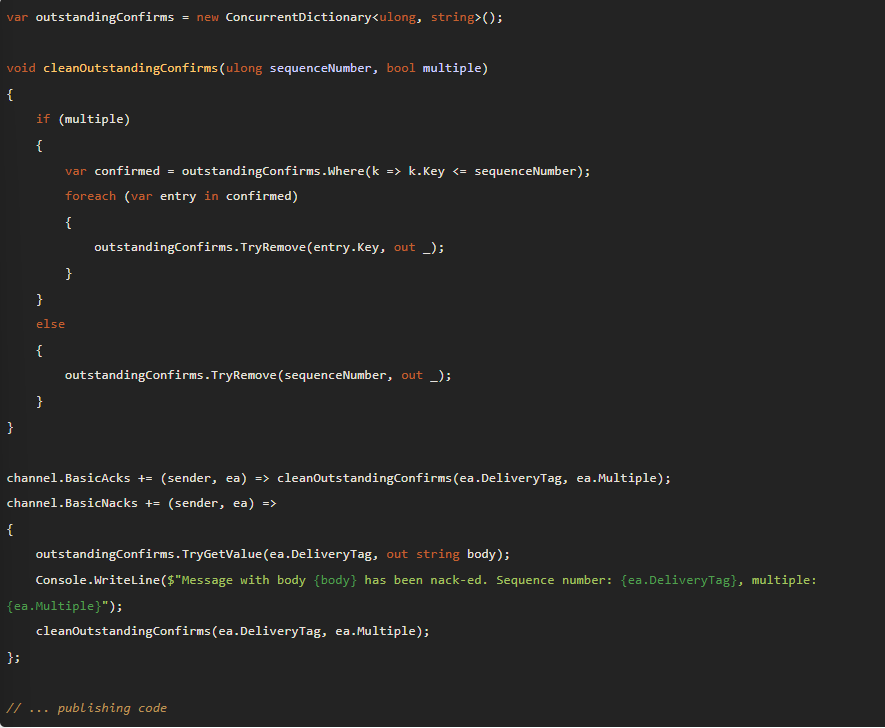

# Kaynak

- https://www.rabbitmq.com/getstarted.html

 

# Tutorial 1

### Notes

- RabbitMQ'yu bi posta ofisi olarak düşünebiliriz. Yaptıkları işlemler hemen hemen aynıdır. Sadece kağıt yerine byte array'leri kullanır.

- Normal hayatta posta kutusu olarak adlandırdığımız şey RabbitMQ'da karşımıza `queue` olarak çıkıyor.

    Queue yapısı sadece host yapılan cihazın bellek ve disk limitleri ile sınırlıdır.

- `Producing:` Kuyruğa mesaj gönderme işlemi demektir. Mesajları gönderen programa ise `Producer` deriz.

- `Consuming / Receiving:` Kuyruktaki bir mesajı alma işlemi demektir. Mesajı alan programa ise `Consumer` deriz.

- Producer, Consumer ve Broker'ın aynı host üzerinde olması gerekmez. Çoğu uygulama da bu şekildedir.

- Bir uygulama hem **producer** hem de consumer olabilir.

- Connection olarak belirtilen şey aslında soket bağlantısı kurma işleminin soyutlaştırılmış halidir.

- RabbitMQ üzerinde bir mesaj yayınlayacaksak bu mesajın formatı `byte array (byte[]?)` olmalıdır.

- Queue'dan okuma işlemini yapabilmek için queue'nun var olduğundan emin olmalıyız.

- Okuma işlemi sırasında alacağımız mesajlar `byte array (byte[]?)` olarak geleceği için onları tekrar `string` tipe çevirmemiz gerekecektir.

 

# Tutorial 2

### Work Queue

- `Work Queue` olarak adlandırılan kuyruk yapılarının amacı ağır işleri bir anda yapmaktan ve bu işin tamamlanmasını beklemekten kaçınmaktır.

    Örnek olarak 2 adet consumer servis olsun ve 1 adet producer servis olsun. Producer 6 adet mesaj yayınladığında, RabbitMQ bu 2 consumer'ın ortalama olarak aynı sayıda mesaj tüketmesini sağlamaya çalışır. Yani beklenen durum 2 consumer'ın da 3'er adet mesajı okumalarıdır.

 

### Message acknowledgment

- Eğer bir consumer aldığı task'ı tamamlamadan yok olursa, normal şartlarda üzerinde çalıştığı task ve o consumer'a atanmış olan task'ler silinecektir.

    Yukarıdaki durum istenmeyen bir durumdur. Bir consumer yok olduğunda-öldüğünde, onun task'larını başka bir consumer'ın devam ettirmesini isteriz. Bunu sağlayabilmek için `message acknowledgments` dediğimiz sistem vardır. RabbitMQ bir mesajın kaybolmayacağından emin olmak için, mesajı alan consumer'dan bir yanıt bekler. Gelen yanıta göre task'i siler veya silmez.

- Eğer bir consumer geriye ackn. bilgisi döndürmeden ölürse (kanal kapanabilir, bağlantı kapanabilir vb.) RMQ bu mesajın doğru bir şekilde tam olarak tamamlanamadığını anlar ve mesajı tekrar kuyrağa alır. Tam bu sırada uygun (boşta olan) başka bir consumer varsa bu mesajı o consumer'a gönderir.

    Yukarıdaki mekanizma, consumer'lar öldüğünde bile mesajların kaybolmayacağından emin olmamızı sağlar.

- Bazı durumlarda bazı consumer'lar sıkışabilir (ölmezler) ve mesajları alamıyor durumda olabilir. Böyle durumları tespit edebilmek için message ackn.'larda bir zaman aşımı sınırı vardır. Bu süre default olarak 30 dakikadır. 

    Zaman aşımı meydana geldiğinde bu consumer'ın kanalı kapatılır ve özel bir exception fırlatılır ve bu exception kayıt altına alınır (loglanır). Sonrasında bu consumer üzerindeki bütün mesajlar tekrar kuyruğa taşınır.

    Message ackn. bilgisi otomatik olarka veya manuel olarak verilebilir. 
    
    Message ackn. bilgisi mesaj alınan aynı kanal üzerinden geri gönderilmelidir. Eğer farklı bir kanal üzerinden göndermeye çalışırsak ilgili exception fırlatılacaktır (channel-level protocol exception).

 

### Message durability

- Aksini belirtmediğimiz sürece, RMQ suncusu çöktüğünde veya kapandığında mesajlarımız ve kuyruklarımız kaybolacaktır. Bunu engellemek için iki yapının da `durable = true` olarak işaretlendiğinden emin olmalıyız. 

    Ayrıca ekstra olarak mesajı göndermeden önce `channel.CreateBasicProperties()` ile aldığımız property'lerden `Persistend = true` olarak ayarlamalıyız (Bu durumda mesajın kesinlikle kaybolmayacağını garanti edemez. RMQ'ya mesajı diske kaydetmesini söylese bile, bu işlem gerçekleşene kadar bir açıklık vardır).

 

### Fair Dispatch

- Mesajların her zaman consumer'lara dengeli olarak (iş yükü bakımından) dağıtılacağından emin olamayız. 

    Örnek olarak 1 queue ve 2 consumer olsun. Bu iki consumer eşit sayıda mesajı tüketse bile (örnek olarak ikisi de 10 - 10 mesaj tüketsinler) bir tanesindeki mesajların iş yükü çok fazla olabilir, diğerinin iş yükü çok az olabilir. Böyle bir durumda şöyle bir şey oluşur, bir consumer çok fazla çalışırken diğer consumer çok çok az çalışabilir. Eğer buraya müdahele edilmez ise RMQ mesajları bu iki consumer'a eşit şekilde vermeye devam eder ve yoğun olarak çalılan consumer tamamen yük altında kalmış olur.

    Burada RMQ'nun böyle çalışmasının nedeni default çalışma şeklinde, kuyruğa bir mesaj geldiğinde o mesajı direkt olarak consumer'a atamasıdır. Burada atama yaparken hangi consumer kaç adet ackn. bilgisi göndermiş, mesajı ona göre göndereyim kontrolünü yapmaz. 

    Bu durumu şu şekilde değiştirebiliriz:

    `channel.BasicQos(prefetchSize: 0, prefetchCount: 1, global: false);`

    Burada `BasicQos` metodunun `prefetchCount` parametresini `1` olarak set ettiğimizde aslında RMQ'ya şunu söylemiş oluyoruz: Bir consumer işini bitirmeden ona başka bir iş verme. O işi, şuanda meşgul olmayan bir sonraki consumer'a ver.

    Şuna dikkat etmeyi unutmamalıyız. Eğer tüm consumer'lar meşgulse kuyruk dolmaya başlar, hatta dolabilir. Bu süreci güzel yönetmek için farklı stratejiler uygulanabilir. Bunlardan bir tanesi consumer sayısını arttırmaktır.

 

# Tutorial 3

### Publish / Subscribe

- Bir önceki adımda 1 consumer'a sadece 1 mesaj verilmesi gerektiğini belirtmiştik. Burada farklı bir yaklaşım olarak 1 mesajın 1'den fazla consumer'a dağıtılmasını göreceğiz.

    Bunu şu şekilde sağlayabiliriz: 

    1 producer 1 mesajı yayınlar (publish). N tane oluşturulan consumer bu producer'a abone olur (subscribe). Bir producer'a abone olan consumer'lar artık o producer'ın yayınladığı mesajları dinlemeye başlar. Abone durumundaki consumer'ların hepsi mesajları alır ama hangisinin ne yapacağı kendisine kalmıştır.

### Exchanges

- Bir producer bir mesaj yayınladığında o mesja direkt olarak kuyruğa eklenmez. Burada arada görev alan bir varlıklar vardır, bu varlıklara `exchange` deriz. 

    Exchange varlıkları gönderilmek istenen mesajı producer'lardan alıp kuyruğa gönderir. Burada mesajın kuyruğa nasıl ekleneceğini belirleyen şeyler `exchange type`'lardır. 

- Uygulamalar birbirleri ile direkt olarak iletişim kurmak yerine, kuyruklar üzerinden iletişim kurabilirler. Bu asenkron olarak iletişim kurmayı sağlar.

- Exchange Types:

    - Direct

    - Topic    
    - Fanout
    - Headers
    - Default (nameless)

- Direct Type:

    Mesajları, verilen `routing key` ile birebir aynı isimde olan kuyruğa taşır.

     

    

     

- Topic Type:

    Mesajları routingKey ile kuyruğun sahip olduğu `routing pattern`'e eşleştirdiği kuyruklara gönderir. Yani gelen mesajın routingKey'inin, routing paternleri ile eşleştiği bütün kuyruklara gönderilmesini sağlar (bir veya birden fazla olabilir).

    RoutingKey'ler '.' karakteri ile ayrılarak tanımlanır. 

     
    
    
    
     

- Fanout Type:

    Elindeki bütün mesajları kopyalayara, bildiği kuyruklara gönderir. Mesaj ile birlikte gönderilen routingKey ve kuyrukların routingPattern'leri gözardı edilir.

     
    
    
    
     

- Headers:

    Mesajları yönlendirirken mesajın header alanında gelen `optional values` değerlerine göre yönlendirme yapar.

    Çalışma şekli <b>Topic Type</b> ile aynıdır. Mesajları kontrol ettiği değerlerin eşleştiği kuyruklara gönderir.

    Burada `x-match` keyword'ü ile eşleşme kontrolü yönetilebilir. Eğer `x-matches:any` olarak tanımlanırsa, kontrol edilen değerlerden herhangi birisi eşleştiğinde, kuyruğa gönderme yapılır.

    `x-matches:all` olarak tanımlarsa, mesajın bir kuyruğa gönderilmesi için kontrol edilen değerlerin hepsinin eşleşmesi gerekmektedir. Default olarak `all` değeri kullanılır.
    
      
     
     
     
      

- Default Type (nameless):

    Mesajı yayınlarken `exchange:""` şeklinde belirttiğimizde aslında exchange tipinin default olması gerketiğini söylemiş oluyoruz. 

    Default tipin çalışma şekli şu şekildedir. Mesajı `routingKey:"test"` şeklinde belirtilen routingKey parametresi ile aynı isimde olan kuyruğa gönderir (eğer kuyruk mevcut ise). 

      
     
     
     
      

- Dead Letter Type:

    Kuyruklar bazı kurallara uymayan mesajları almayı kabul etmeyebilir. Eğer bir mesaj herhangi bir kuyruk ile eşleşemezse yok edillir. Eğer bu gibi durumalrda mesajın kaybolmasını istemiyosak ve sonrasında tekrar işlenebilmesini istiyorsak `Dead Letter Type`'ı kullanırız.

      
     
     
     
 

### Temporary Queues

- Bir loglama senaryosunu düşünelim. Amacımız sadece anlık olarak akan bütün log mesajlarını görmek olsun. Bu gibi senaryolarda geçici olarak kuyruklar oluşturabiliriz. Bu senaryoda 2 şeye ihtiyacımız vardır:

    1. Temiz bir boş kuyruk. 
    2. Consumer'ın bağlantısı kapandığında kuyruğun otomatik olarak silinmesi.

    Yukarıdaki gibi işlemler için kuyruk oluştururken, kuyruk ismini rastgele oluşturmak isteyebiliriz. Bunu da sunucuya Alt kısımdaki gibi yaptırabiliriz:

    `var queueName = channel.QueueDeclare().QueueName;`

    Burada `QueueDeclare()` metodunu parametre vermeden kullanırsak <b>non-durable, exlusive, autodelete</b> özellikli ve ismi rastgele oluşturulmuş bir kuyruk elde ederiz.

 

### Bindings

- Kendimizin tanımladığı bir **exchange**'e mesajları hangi kuyruğa iletmesini söylemek için yaptığımız işleme `binding` deriz. Bir örnek olarak:

    `channel.QueueBind(queue: queueName, exchange: "logs", routingKey: "");`

 

### Putting it all together

- Bir mesajı bütün consumer'lara göndermek için `Fanout` tipinde bir exchange tanımlayıp mesjaı bu exchange ile yayınlamamız yeterlidir. 
 
    İşlemin örnek bir görüntürü alt kısımdadır:

    

 

# Tutorial 4

- Biz bir publisher'dan gelen mesajlardan sadece bır kısmını almak isteyebiliriz. Bunu şöyle sağlayabiliriz.
 
    `QueueBind()` metodunun aldığı `routingKey` parametresine kuyruğun kabul etmesini istediğimiz keyword'u yazarız.  

    Bir önceki örnekte exchange tipi olarak **fanout** kullanmıştık. Belirttiğimiz case'i gerçekleştirebilmemiz için bu tipi değiştirmemiz gerekecektir. Çünkü **fanout** gönderilen routing key'leri görmezden geliyordu.

    Fanout yerine **direct** kullanarak istedğimiz case'i sağlayabiliriz. Direct tipi sayesinde gönderilen routingKey, aynı key'i kabul eden bütün kuyruklara gönderilir.

     

    

     

    Yukarıdaki örnekte C1 consumer'ı sadece `orange` key'ini kabul ediyor. Yani routingKey olarak `orange` bind edilmiştir.

    C2 consumer'ı ise sadece `black` ve `green` key'lerini kabul ediyor. Bir mesaj bu key'ler ile publish edilirse bu kuyruklara yönlendirilecektir.

    Farklı bir örnek olarak aynı key'i kabul eden birden fazla kuyruk da olabilir. Bu durumda mesaj eşleştiği bütün kuyruklara götürülüyor olacaktır. Örnek olarak alt kısımdaki görüntüyü inceleyebiliriz:

     

    

     

 

# Tutorial 5

- Farklı bir case olarak yayınlanan mesajları daha gelişmiş bir kural setine göre almak isteyebiliriz. Örnek olarak: **cron**'dan gelen log'lardan sadece **error** tipte olanları, **kern**'den gelen mesajların ise hepsini almak isteyebiliriz.
  
    Önceki kısımda kullandığımız **direct** tipi birden fazla kurala göre yönlendirme yapamaz. Bu gibi kompleks kuralları **topic** tipi ile işletebiliriz.

    **Topic** ile çalışırken **routingKey**'ler keyfi olarak verilemez. Geçerli olabilmesi için key'lerin '.' ile birleştirilmiş olması gerekir. 
    
    Örnekler:

    `"quick.orange.rabbit"` - `"nyse.vmw"` - `"stock.usd.nyse"`

    Buradaki yapı aslında **direct** ile benzer. Gelen key'ler, aynı key'leri kabul edel kuyruklar ile eşleştirilirler. Farklı olan 2 önemli durum vardır:

    - '*' -> Bir kelimenin yerine geçebilir.
    - '#' -> Sıfır veya daha fazla kelime yerine kullanılabilir.

    Aşağıdaki örneği inceleyelim:

    

     

    Yukarıdaki görüntüde hayvanları tanımlamak için kullanılan kalıp şu şekildedir: `<speed>.<colour>.<species>`. 
    
    O zaman şu çıkarımları yapabiliriz:

    - Q1, rengi turuncu olan bütün hayvanları kabul ediyor.
    - Q2, bütün tavşanları ve yavaş olan bütün hayvanları kabul ediyor.

    Gelen mesajın key'lerine göre mesajlar birden fazla kuyruk ile eşleşebilir. Örnek olarak:

    - Mesajda gelen key `quick.orange.rabbit` veya `lazy.orange.elephant` gibi bir şey gelirse iki kuyruk ile de eşleştirilecektir.

    - Gelen mesajın key'leri hiçbir kuyruk ile eşleşmeye de bilir, böyle durumlarda mesaj herhangi bir kuyruğa yönlendirilmez ve mesaj kaybolur.

- **Topic** tipi diğer tipler gibi de kullanılabilir. Örnek olarak:

    - Eğer kuyruk '#' ile bağlanırsa **fanout** şeklinde davranır.

    - Eğer key'lerde '#' ve '*' kullanılmazsa **direct** gibi davranır.

 

# Tutorial 6

 

### RPC

- Work Queue olarak öğrendiğimiz yapı, kuyruktaki mesajları consumer'lar arasında paylaştıran bir sistemdi.

     Tekrar böyle bir sistemde olduğumuzu düşünelim. Bir consumer'ın işlemi tamamlayabilmesi için uzaktaki bir bilgisayara istek göndermesi ve o isteğin cevabını beklemesi gerekiyor olsun. Bu pattern RPC (Remote Procedure Call) olarak bilinen bir pattern.

     RPC pattern'inde dikkat etmemiz gerken bir nokta vardır. Bazı durumlarda programcı fonksiyona yapılan isteğin yerelden mi geldiğini yoksa bir RPC'mi olduğunu anlamaya bilir. Böyle durumlar spagetti kod oluşmasına neden olabilir.

     Bu problem için yapılan öneriler aşağıdaki gibidir:

     - Fonksiyon çağrılarının yerelden mi yoksa uzaktan mı geldiğine emin olun.
     - Sistemi güzel bir şekilde dökümante edin. Component'ler arasındaki bağımlılıkları temiz bir şekilde kurun.
     - Oluşabilecek hataları yönetebiliyor olun. Örnek olarak RPC server'i uzun süreli olarak durdurulursa istemci nasıl davranacak? Bu gibi durumları düşünmeliyiz.

    RPC pattern'ini RMQ ile uygularken, remote'a mesajı alma isteği gönderirken bir `callback` kuyruk adresi de göndermeliyiz. Bunu şu şekilde yapabiliriz:

    `var props = channel.CreateBasicProperties();`

    `props.ReplyTo = replyQueueName;`

    RPC sisteminin çalışma şekli alt kısımdaki gibidir:

    

     

    Yukarıdaki görseli adım adım açıklamak gerekirse:

    - İstemci çalıştırıldığında, anonim ve özel bir callback queue oluşturur. 

    - Yapılacak olan RPC istekleri için mesaj ile birlikte 2 adet property'de set edilerek yapılır. Bir tanesi **ReplyTo** parametresi (geri dönüş kuyruğunu belirtmek için), diğeri ise **CorrelationId**'dir (döndürülecek yanıt ile gönderilen istek arasındaki bağlantıyı sağlayabilmek için).

    - İstek `rpc_queue` kuyruğuna gönderilir.
    - RPC worker (server) istek gelmesi için bu kuyrukta bekler. Bir istek yapıldığında, yapması gereken işi yapar ve sonucu **ReplyTo**'da tanımlanan kuyruğa geri döndürür.
    - İstemci bu sırada callback kuyruğunda bir yanıt bekliyordur. Buraya bir yanıt geldiğinde bu yanıt ile yapılan isteğin **CorrelationId**'lerini karşılaştırır ve eşleşiyorlarsa yanıtı uygulamaya döndürür.

    Uyguladığımız pattern'in iki avantajı vardır:

    - Eğer RPC server bir nedenden dolayı çok yavaş çalışıyorsa bir tane daha server oluşturarak kolayca ölçeklendirebiliriz.
    - RPC sadece 1 adet mesaj alır ve geri döndürür. Yani sadece 1 adet network üzerinden çalışır.

 

### Message Properties

- Oluşturulan bir mesajın 14 adet property'si olur. Çokça kullanılan bazı property'ler alt kısımdadır:

    - **Persistent**: `true` değeri verilir ise mesajı kalıcı olarak işaretler. Bunun dışındaki değerlerde mesaj geçici olarak işaretlenir. 

    - **DeliveryMode**: **Persistent** ile aynı işlemi yapar.
    - **ContentType**: Encoding yapılan **mime-type**'ı tanımlar. Çokça kullanılan bir örnek: `application/json`.
    - **ReplyTo**: Genel olara geri dönülecek olan kuyruğu temsil eder. 
    - **CorrelationId**: RPC'den gelen yanıtları istekler ile ilişkilendirmek için kullanılır.
    
 

### CorrelationId

- Üst kısımda her RPC isteği için bir geri dönüş kuyruğu tanımlamayı görmüştük. Bu oldukça verimsiz bir yöntemdir. Bunun yerine her istemci için bir geri dönüş kuyruğu oluşturabiliriz.

    Yukarıdaki senaryoda da bir sorun var. Böyle bir durumda elimizdeki cevapların hangisinin hangi isteğe ait olduğunu bilemeyeceğiz. Bu durumu çözmek için **CorrelationId** property'sini kullanacağız.

    Gönderdiğimiz her istek için unique bir değer üreteceğiz ve bu değeri property'e set edeceğiz. Cevaplar geri geldiğinde yapılan istekler ve gelen cevapları bu unique değerlerini kullanarak eşleştireceğiz.

    Eğer gelen cevaplar içerisinde tanımadığımız bir CorrelationId görürsek mesajı güvenli bir şekilde silebiliriz çünkü o mesaj bizim isteklerimize ait değil.

 

# Tutorial 7

### Publisher Confirms

- Yapacağımız işlemlerde `Publisher Confirms` özelliğini kullanmak istiyorsak, oluşturduğumuz kanalda bunu bir kez ayarlamamız yeterlidir. 
  
    Bu özelliği açmak için uygulanan yönteme bakalım:

    `var channel = connection.CreateModel();`

    `channel.ConfirmSelect();` 

    Uygulama olarak farklı uygulama stratejileri vardır. Burada birkaç tanesini inceleyeceğiz.

 

### Strateji 1 - Publishing Messages Individually (Mesajları Tek Tek Yayınlamak)

- Bu yöntemde bir mesaj yayınlanır ve eşzamanlı olarak o mesajın onayı beklenir.

- Bu yöntem oldukça basittir ama önemli bir dezavantajı vardır. Publishing'i önemli ölçüde yavaşlatır. Çünkü bir mesajın onaylanması, sonraki bütün mesajların yayınlanmasını engelleyecektir. Saniyede birkaç yüz mesajdan fazlasını büyük ihtimalle desteklemeyecektir.

 

### Strateji 2 - Publishing Messages in Batches (Mesajları Toplu Olarak Yayınlamak)

- Mesajları gruplayarak yayınlayabiliriz ve grubun onaylanmasını bekleyebiliriz. Örnek olarak alt kısımdaki kod'a bakalım:

    

     

    Bu yöntem bize üstteki yönteme göre neredeyse 20-30 kat hız kazandırır.

    Dezavanataj olarak şöyle bir durum vardır. Eğer bir sorun oluşursa tam olarak nerede hata oluştuğunu bilemeyiz. Bu yüzden mesajları tekrar yayınlayabilmek için veya hata oluştuğunda anlamlı bir log mesajı kaydedebilmek için grupları bellekte tutmamız gerekebilir.

    Ayrıca grupça yayınlama yöntemi avantaj sağlasa bile hala senkron olarak yayınlama yapıyor, yani diğer mesajların yayınlanmasını engelliyor.

 

### Strateji 3 - Handling Publisher Confirms Asynchronously

- Broker yayınlanan mesajlar asenkron olarak (eş zamanlı bir şekilde) onaylayabilir. Yapmamız gereken tek şey bir **callback** adresi kaydetmektir.

    Mesajlara göre 2 durum oluşur. Geriye **onaylandı bilgisi** dönme veya **onaylanmadı** bilgisini dönme durumları.

    Bu 2 durumu şu şekilde yönetebiliriz:

    

     

    2 durumda şu şekilde parametreleri vardır:

    - `Delivery Tag`: Onaylanan veya onaylanmayan mesajı tanımlayan bir sıra numarasıdır.
    - `Multiple`: **Boolean** değer alır. Eğer **false** ise yalnızca 1 mesaj onaylanır / yayınlanır. Eğer **true** ise düşük sıra numaralı veya eşit sıra numaralı tüm mesajlar onaylanır / yayınlanır. 

    Bahsedilen **sıra numarasını** mesaj yayınlanmadan önce şu şekilde elde edebiliriz:

    `var sequenceNumber = channel.NextPublishSeqNo;`

    `channel.BasicPublish(exchange, queue, properties, body);`

- Mesajların sıra numaralarını takip etmenin kolay yolu bir **dictionary** kullanmaktır. Örnek olarak:

    

    Sözlük kullandığımızda, mesajlar onaylandığında sözlüğü temizlememiz ve bir **nack** geldiğinde uyarı mesajı loglamamız gerekir. Örnek olarak:

    

- Özet olarak, onaylama işlemlerini asenkron olarak yapabilmek için şu adımları takip ederiz:

    - Mesaj ile yayınlama sıra numarası arasında bir ilişki kurulur.
    - Kayıt onaylama dinleyicileri publisher'dan ack / nack bilgisi geldiğinde bunu loglayarak veya bir yayınlama yaparak bildirmeleri gerekir. Bu aşamada bazen sıra numarası ile mesaj arasında temizlik gerekebilir.
    - Mesajı yayınlamadan önce **sıra numarasını takip etmeliyiz.** 

- Yukarıdaki 3 yöntem ile yayınlanan mesajların işlenme sürelerini alt kısımdan inceleyebiliriz:

    

