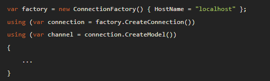
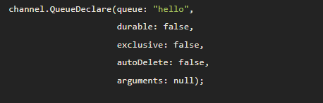
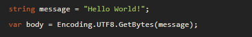
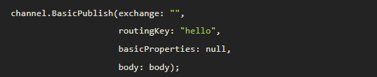
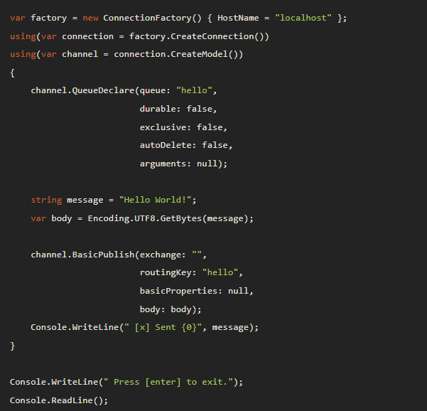
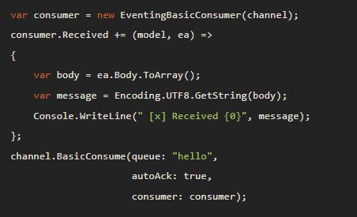
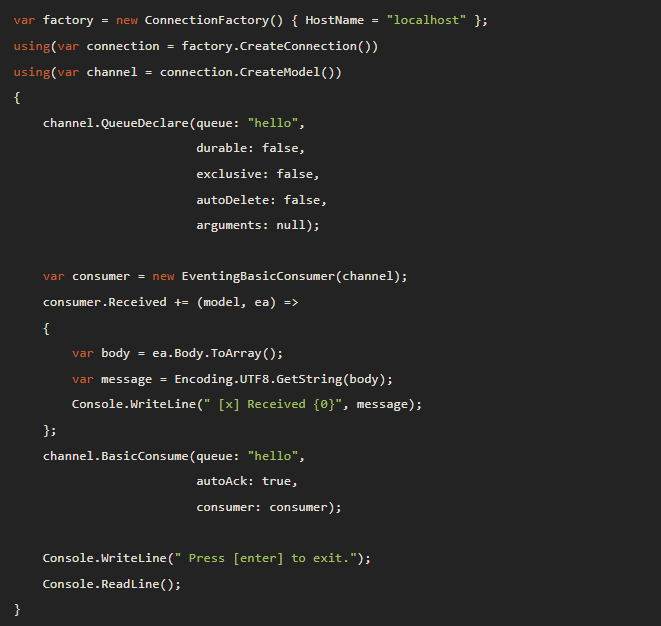

- Basit bir bağlantı kurma örneğini alt kısımdan takip edebiliriz.

    İlk olarak RabbitMQ için NuGet paketini kurmamız gerekiyor. 
    Sonrasında uygulama içerisinde RabbitMQ'yu kullanacağımız sınıfın içerisinde kodları yazmaya başlayabiliriz. 

    Öncelikle RabbitMQ sunucusu ile bir connection kurmamız gerekiyor. Bunun için alt kısımdaki örneğe bakabiliriz:

     

    

     

    Burada connection olarak belirttiğimiz şey aslında soket bağlantısı kurma işleminin soyutlaştırılmış halidir.

    Bağlantıları kurarken bağlanmask istediğimi sunucuları örnekte `Hostname = "localhost"` şeklinde olduğu gibi tanımlayabiliriz. Burada kendi makinemizdeki bir sunucuya bağlanıyoruz ama uzaktaki bir sunucuya da gerekli parametreleri vererek bağlanabiliriz.

- Oluşturduğumuz kanalda bir mesaj yayınlamak istersek alt kısımdaki örneğe bakabiliriz (Bu örnekler giriş seviyesinde. İleri seviyede bu işlemler farkl şekilde yapılabilir).

    Yukarıda gösterilen şekilde bir bağlantı kurup, kanalı oluşturduktan sonra artık adım adım mesaj göndermeye başlayabiliriz.

    Bir mesaj yayınlayabilmek için öncelikle oluşturduğumuz kanal üzerine bir queue tanımlamamız gerekecektir. Bunu şu şekilde yapabiliriz:

     

    

     

    Queue tanımlarken kullandığımız parametrelere bir bakalım:

    - `queue`: Oluşturulacak olan queue'nun adını belirtir. Eğer boş bir metin gönderirsek, sunucu kendisi bir isim üretir.

    - `durable`: Oluşturulan queue nun, broker restart edildiğinde kurtarılması gerekip gerekmediğini belirtir. 
    - `exclusive`: Oluşturulan queue içerisinde bulunduğu bağlantı ile sınırlı mıdır bunu belirtir. Sınırlı olan queue bağlantı kapandığında silinir.
    - `autoDelete`: Bu queue'nun son consumer'ı abonelikten çıktığında otomatik olarak silinip silinmemesi gerektiğini belirtir.
    - `arguments`: Opsiyonel olarak verilmek istenen argumanlar burada belirtilir.

    Queue tanımlaması yaptıktan sonra artık yayınlamak istediğimiz mesajı hazırlamalıyız. RabbitMQ üzerinde bir mesaj yayınlayacaksak bu mesajın formatı `byte array (byte[]?)` olmalıdır.
    
     

    

     

    Yukarıdaki gibi mesajı da hazırladıktan sonra geriye sadece bu mesajı yayınlamak kalıyor.

    Mesajı yayınlama işlemini de queue tanımlamasında olduğu gibi, oluşturduğumuz channel üzerinden yapabiliriz. Alt kısımı inceleyelim:
    
     

    

     

    Yukarıda yaptığımız gibi burada kullanılan parametreleri inceleyelim:

    - `exchange`: Mesajın hangi şekilde alınıp yönlendirilmesini belirtir. Boş bırakılırsa default type kullanılır.

    - `routingKey`: Mesajın nereye gideceğini belirten adrestir.
    - `basicProperties`: Ekstra parametreleri içerir.
    - `body`: Göndermek istediğimiz mesajı alır (byte array olarak) alır.

    Artık mesajı yayınlamış olduk. Burada şunu bilmeliyiz. Eğer yayınlanmak istenen mesaj zaten mevcut ise, tekrar yayınlama yapılmayacaktır.

    Mesaj yayınlamak için izlediğimiz adımların son hali alt kısımdadır.
        
     

    

     

- Eğer sunucudan mesaj okumak istiyorsak, ilk önce aynı sunucuya bağlanmalıyız (mesaj yayınlarken bağlandığımız gibi olabilir).

    Sonrasında aynı şekilde bir channel oluşturmalı ve bu channel'da mesajı okumak istediğimiz queue'yu tanımlamalıyız. Bu kısımlar mesaj yayınlamada ki ile aynı olduğu için tekrar yazmaya gerek yok.

    Burada dikkat edilmesi gereken yer, mesajları okuman istediğimiz queue'nun var olup olmamasıdır. Okuma işlemini yapabilmek için queue'nun var olduğundan emin olmalıyız.
            
     

    

     
     
    Yukarıda olduğu gibi, daha öncesinde oluşturduğumuz channel'ı kullanarak bir consumer tanımlarız. Bu consumer'a ait olan `Received` eventi sayesinde mesajları okuyabiliriz.

    Okuma işlemi sırasında alacağımız mesajlar byte array olarak geleceği için onları tekrar string tipe çevirmemiz gerekecektir. Burayı unutmayalım. 

    Mesajları alma işlemi tamamlandıktan sonra artık channel üzerinden tamamlandı bilgisini geri gönderebiliriz. Bunu da `channel.BasicConsume` da oluğu gibi yaparız. 

    BasicConsume içerisinde verdiğimiz parametrelere bakalım:

    - `queue`: Mesajı okuduğumuz queue.
    - `autoAck`: Mesajı okuma durumu.
    - `consumer`: Mesajı okuyan consumer bilgisi.

     

    Mesaj okuma işleminin de eklenmiş ve kodların son hali alt kısımdadır.

     

    

     

