# Redis Nedir?

- Açılımı *Remote Dictionart Service*'tir.

- Redis'in desteklediği veri türleri şunlardır:

    - String
    - Hash
    - List
    - Set
    - Sorted Set
    - Geospatial Index
    - HyperLogLog

- Redis içerisinde verileri `:` ile gruplayabiliriz.

- Redis kullanılırken dikkat edilmesi gereken en önemli noktalardan birisi, Redis üzerinde bir sorun oluştuğu zaman projenin ayakta kalması, çalışmaya devam etmesidir. Redis çalışmıyorsa db'den veri getirerek veya db'ye veri götürerek programın çalışmaya devam etmesi sağlanmalıdır.

- Redis normalde asenkron olarak çalışmaz. Gönderilen işlemleri sırayla tamamlayarak devam eder. Eğer Redis içerisindeki *Pipelined* özelliği aktif edilip kullanılırsa Redis'in işemleri tamamlama hızı ortalama 3 kat artar. Pipelined özelliği ise şunu yapar: Gönderilen işlemleri toplar ve  hepsini bir anda yapar.

- Eğer Redis üzerinde *Durability* aktif edilmemiş ise, sunucu kapandığı anda veriler silinir. *Durability* aktif edilmiş ise sunucu kapandığında RAM içerisindeki veriler disk'e yazılır.

- Programımıza veri geldiğinde, silindiğinde veya güncellendiğinde Redis içerisindeki verileri güncellemeyi unutmamalıyız. Örnek olarak daha öncesinde güncellenen bir veriyi redis içerisinde güncellememişsek, sonraki sorgularda veriyi redis üzerinden getirdiğimiz zaman yanlış veri getirmiş olacağız.

- Temel olarak `Key:Value` olacak şekilde hazırlanan bir `NoSQL` veri tabanıdır diyebiliriz.

- NoSQL Veri Tabanı: 

- In Memory Database yaklaşımını benimseyerek çalışır, eğer tercih edersek opsiyonel olarak disk üzerine yazılabilme özelliği de vardır.

- Oluşturulan instance'lardan bir tane **Master** olarak ayarlanır. Geriye kalan diğer instance'lar **Slave** olarak kalır ve bunlar *Master*'in kopyalarıdır.

- Slave instance'ler default olarak sadece okuma işlemi yaparlar. Eğer yazma işlemi yapılacak ise Master instance kullanılır.

- Redis'i kullanıcak olan client bu instance'lardan (slave ya da master farketmez) birisine bağlanır.

 

# Redis Ne İçin Kullanılır?

- Redis'in amacı db'den yükü alıp client'a verileri hızlı vermektir.

- Redis'in en çok kullanıldığı alanlardan birisi `Caching` işlemleridir. Bunun önemli bir nedeni Redis'in bize sunmuş olduğu hızdır.

- Eğer istenilirse *RabbirMQ* gibi veya *Apachi Kafka* gibi `Messsage Broker` olarak kullanılabilir.

- Redis sakladığı verileri disk üzerine yazabildiği için db olarak kullanılabilir fakat asıl amacı bu değildir.

- Oturum kontrollerinde kullanılabilir.

- Filtreleme işlemleri yapan bir servis içerisinde kullanılabilir.

 

# Redis'in avantajları nelerdir?

- Redis'i öne çıkartan özelliği hızlı çalışmasıdır.

- Veri akışının istenmeyen bir şekilde kesilme durumlarında devreye giren sistemleri vardır. Bunlar:

    - Manuel 
    - Redis Sentinel
    - Redis Cluster

- RDB (Redis Database Snapshots): Db'nin direkt olarak kopyası alabiliriz.

 

# Redis'in dezavantajları nelerdir?

- Anlık verilerimiz çok fazla değişiyorsa Redis ile cache işlemi tercih edilmeyebilir. Bunun yerine daha stabil veri setleri için kullanılır.

 

# Redis'i Kullanmak

1. Redis'i *Docker* ile de kullanabiliriz, sonraki başlığın içeriği o konu hakkında.

    İlk olarak *Windows* içerisinde *Ubuntu* ile işlemler yapabilmek için bir düzenleme yapmamız gerekecek. Alt kısımda gösterilen alandan *Winodws Subsystem for Linux* seçeneğini açalım.

    | Turn Windows Features | Subsystem |
    |-|-|
    |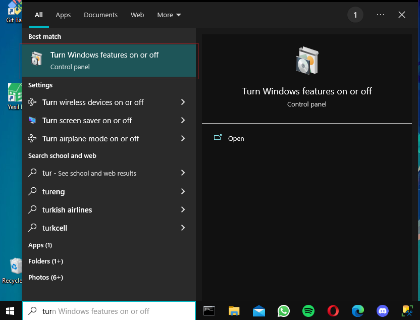| 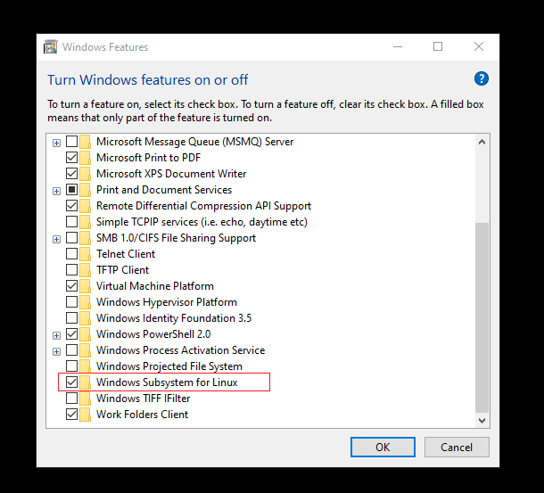|
    
2. Microsoft Store'dan *Ubuntu* uygulamasını indirelim.

    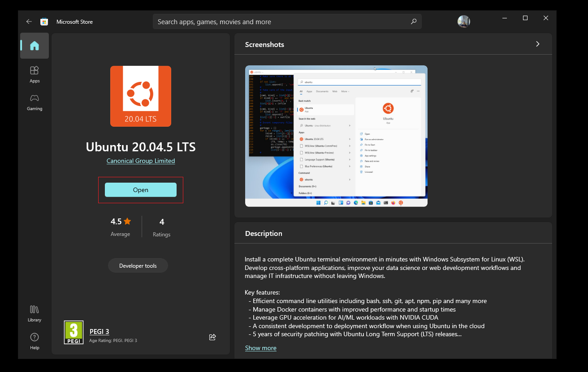

    *Ubuntu*'yu indirdikten sonra uygulamayı açtığımızda karşımıza bir CLI açılacak.
    
     Karşımıza çıkan ekranda biraz beklememiz istenecek ve daha sonrasında *Ubuntu*'yu kullanırken giriş yapacağımız bir hesap için *user name* ve *password* alanlarını girmemiz istenecek.

     Bilmeyen arkadaşlar olursa diye belirtmek istiyorum, bu alanda gireceğiniz şifre CLI ekranında görünmeyecektir. Şifrenizi girdikten sonra `Enter` ile ilerlediğinizde şifrenizi onaylatıp sonraki aşamalara geçebilirsiniz.

     Son olarak artık *Ubuntu* içerisinde işlem yapabilir hale geleceğiz. Örnek olarak olarak alt kısımdaki gibi bir CLI ekranı görüyor olmalıyız.

     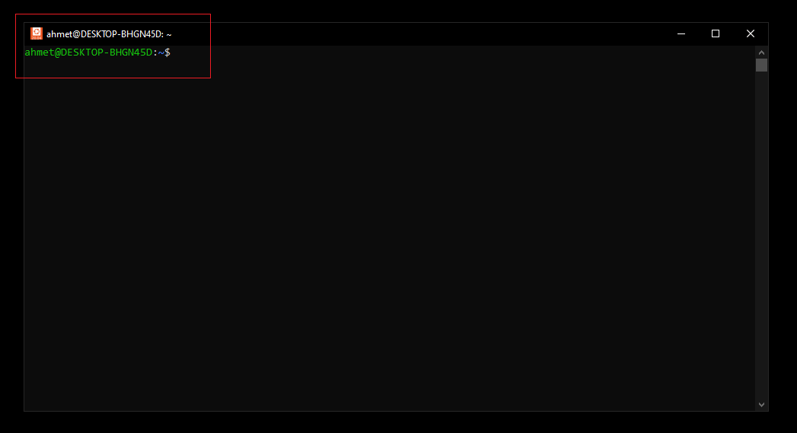 

3. *Ubuntu* içerisinden, Redis'i kullanabilmek için bazı paketler yüklememiz gerekecek. İlk olarak *Redis Labs* içerisinden *redis* repository'sini indirelim.

    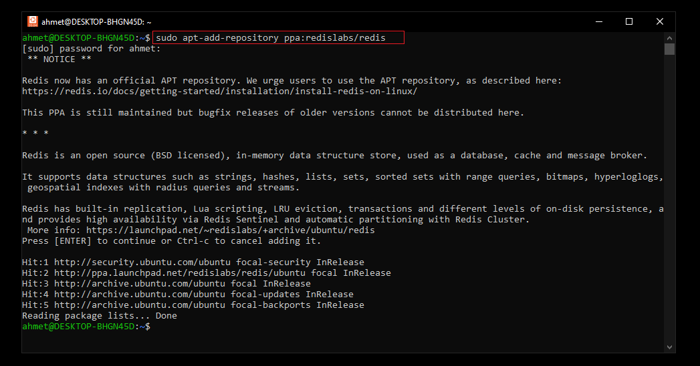

4. Repo yüklendikten sonra *Ubuntu* içerisinde *Update* ve *Upgrade* komutları ile versiyonların güncelliğini kontrol edelim.

    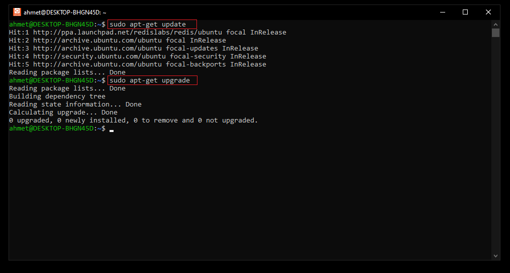

5. Güncelleme işlemlerinden sonra artık *Redis Server* paketini ekleyebiliriz.

    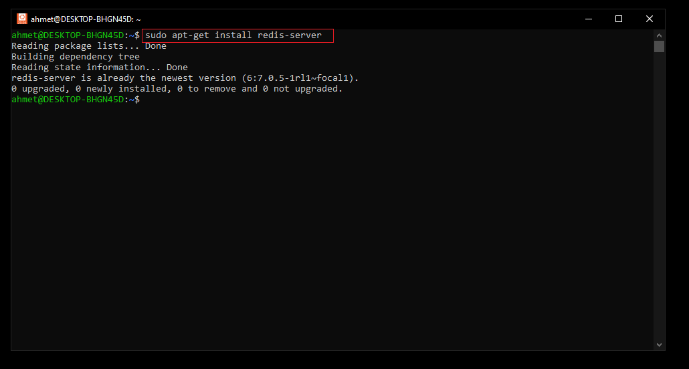

    İndirme işleminden sonra alt kısımdaki gibi *Redis Server* için versiyon kontrolü yaparak bir sorun olmadığını kontrol edebiliriz.

    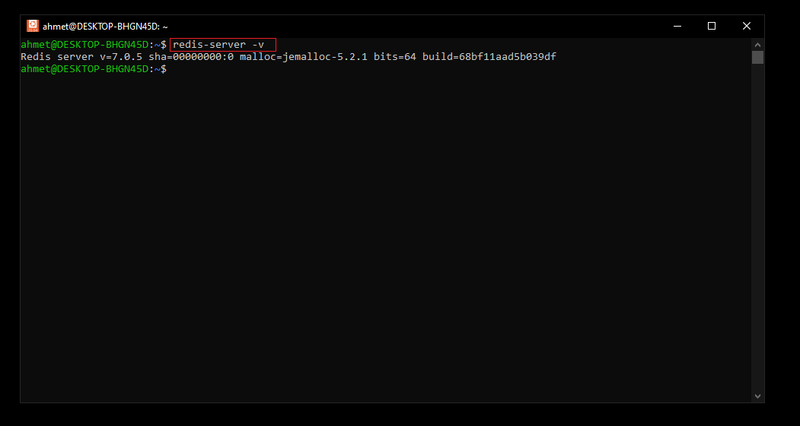

6. Bu aşamaya kadar bir sorun ile karşılaşmadıysak alt kısımda olduğu gibi *Redis Server*'ı aktif hale getirip kullanabiliriz.

    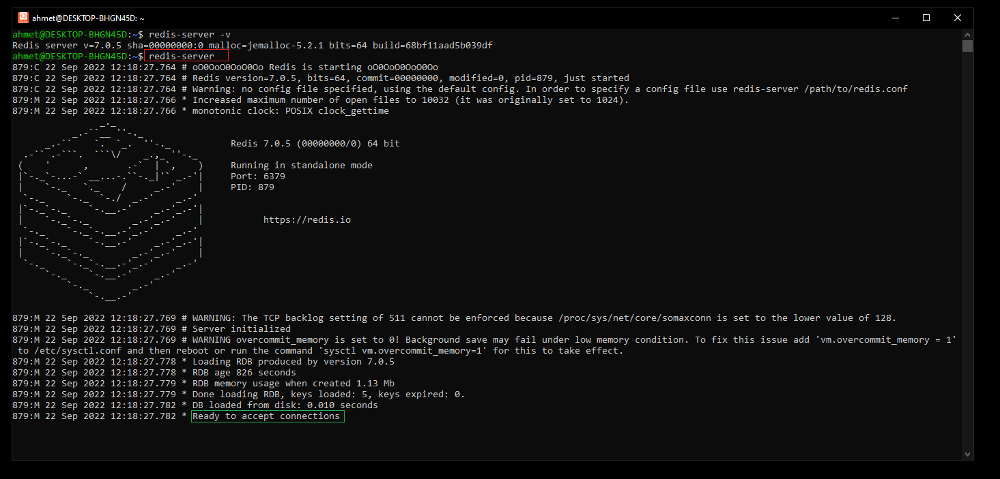

    Yukarıdaki ekran görüntüsünün alt kısmında yeşil olarak gösterilen alanda server'ın bağlantılar için hazır olduğu bilgisini görebiliriz. 

7. *Redis Server* çalışırken yeni bir Ubuntu CLI açıp server ile iletişim kuralım.

    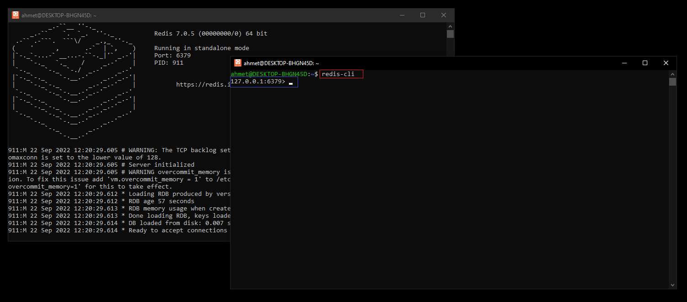

    Server aktif olduğu için Redis CLI'a erişim sağlayabildik. Artık Redis'e ait olan komutlar ile istediğimiz işlemleri buradan gerçekleştirebiliriz. 

    Peki *Redis Server*'ı kapatmak istersek veya server'ın kapalı olduğunu anlamak istersek ne yapabiliriz? 

    İlk olarak server'ı kapatmak istersek bunun farklı yolları var. Alt kısımda verilen örnekte bütün server'ları kapatmak istediğimizi kırmızı olarak işaretlenen komut ile söylüyoruz.

    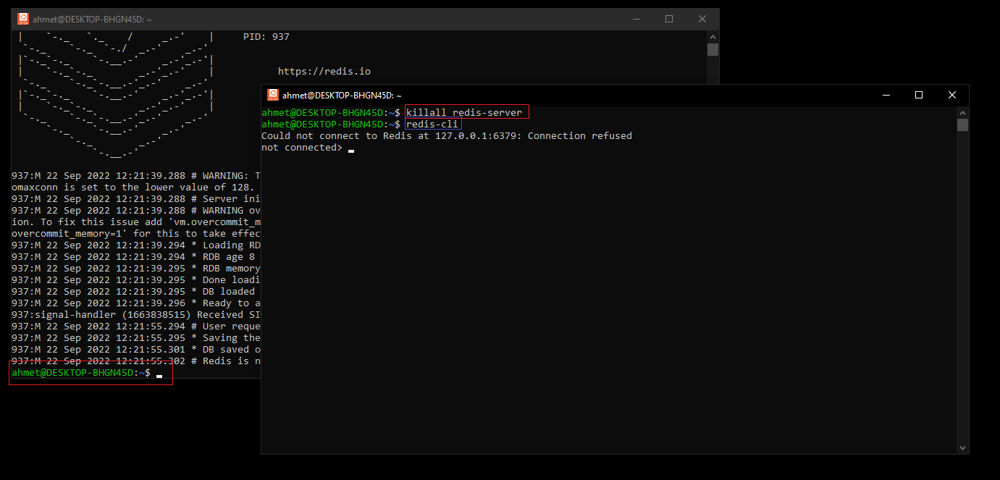

    Server'ları kapatma komutu ile arka planda *Redis Server*'ın durdurulduğunu sol altta kırmızı olarak işaretlenen alandan görebiliriz. Server'ın çalıştığı *Ubuntu CLI* artık bizden komut alabilir hale geldi.

    Biz server kapalı haldeyken Redis CLI'a bağlanmak istersek sağ taraftaki Ubuntu CLI'da gördüğümüz gibi bize server'a bağlanamadığımız ile ilgili bir hata gönderecektir.

    Server'ın aktif olup olmadığını öğrenmenin başka bir yolu da alt kısımdaki kırmızı olarak işaretlenen komuttur.

    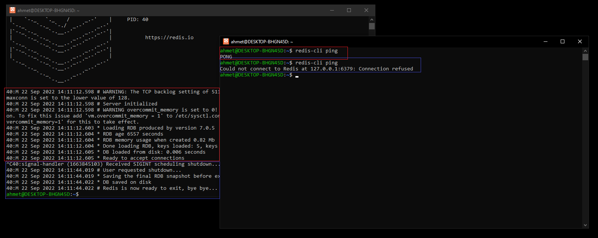 

    Eğer server aktif ise `ping` komutumuzda bize `PONG` yanıtı gelecektir. Eğer serfer aktif değil ise mavi olarak işaretlenen kısımlarda görüldüğü gibi bağlantı olmadığına dair yanıt dönecektir.

 

# Docker İle Redis Kullanmak

 

# Çok Kullanılan Redis CLI Komutları

- `KEYS *`: Var olan Key'leri listeler.

- `SET name Ahmet`: name isimli bir key oluşturur ve değer olarak Ahmet atar. 
- `GET name`: name isimli key'in içerisindeki değeri getirir.
- `EXISTS name`: name isimli key mevcut ise 1 (int), mevcut değil ise 0 (int) döndürür. 
- `DEL name`: name isimli key'i siler ise 1 (int), silemezse (örnek olarak name key'i mevcut değilse) 0 (int) döndürür.
- `APPEND name Ahmet`: name isimli key mevcut değilse içerisinde Ahmet verisi olan name isimli bir key oluşturur. Eğer name isimli key mevcut ise, key'in içerisindeki değerin sonuna Ahmet değerini ekleyerek birleştirir. Geriye oluşan yeni değerin karakter uzunluğunu döndürür.
- `HSET kedi cins tekir`: kedi isimli bir nesne üretmemizi, kedi nesnesinin içerisinde cins property'si üretmemizi ve property'e tekir değerini atamamızı sağlar. Bu şekilde nesneler tanımlayıp tutabiliriz.
- `HGET kedi cins`: Oluşturulan kedi nesnesinin cins property'sinde tutulan değeri getirir.
- `HGETALL kedi`: Oluşturulan kedi nesnesinin bütün property'lerini property ismi ve içerisindeki değer şeklinde sıralayarak getirir.
- `SET geciciKediIsmi maya EX 5`: 5 saniye sonra otomatik olarak yok olacak bir geciciKediIsmi key'i oluşturur. 5 saniye sonra key otomatik olarak silinir.
- `PUBLISH HufflePuff "redis ogreniyoruz"`: HufflePuff kanalının üyelerine "redis ogreniyoruz" mesajı gönderir.
- `SUBSCRIBE HufflePuff`: HufflePuff kanalına abone oluruz. Kanal içerisinde mesaj yayınlandığında aboneler tarafından mesaj görüntülenir.

 

# Redis ile örnek proje:

 

# Kaynak

- (Kablosuz Kedi)[https://www.youtube.com/watch?v=JLS9gg-oJPQ]
- (Bora Kaşmer)[https://www.youtube.com/c/borakasmer]
- (Redis Kurmak)[https://www.youtube.com/watch?v=_nFwPTHOMIY]
- (Redis)[https://redis.io/]
